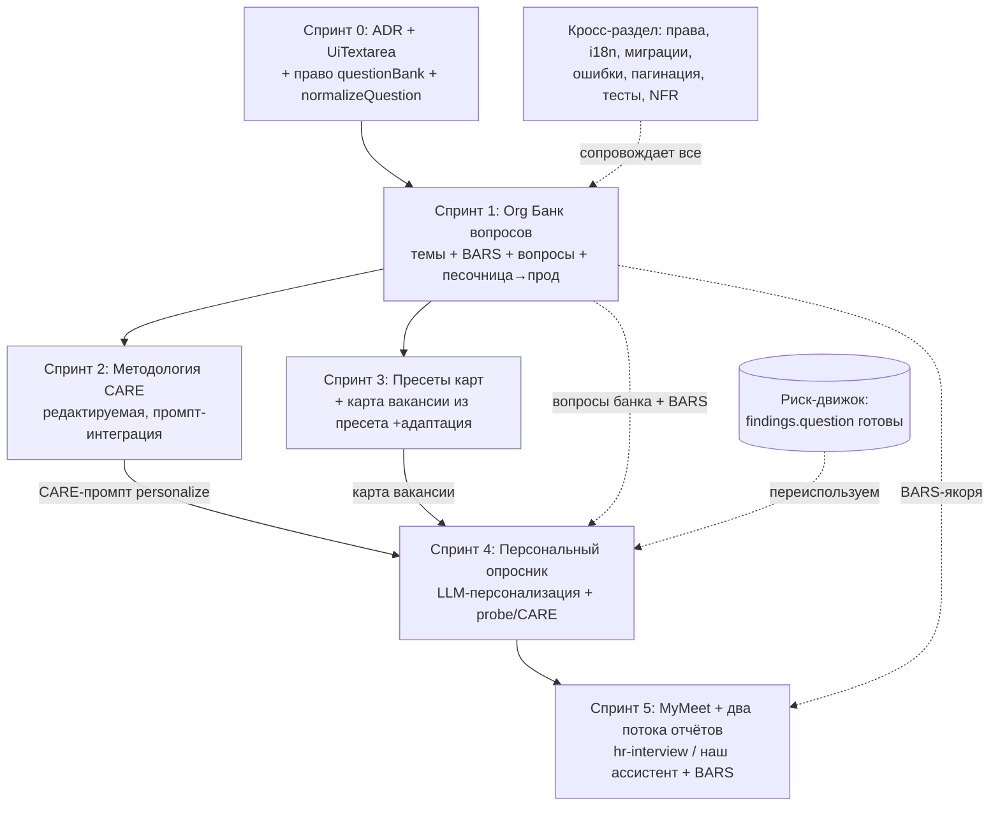

# Мастер-план: Модуль вопросов — от корпоративного стандарта до персонального опросника кандидата

> **Статус:** черновик на согласование
> **Тип:** мастер-план (вариант 2 — короткий обзор + отдельные ТЗ по спринтам)
> **Связанные документы:**
> - `tz-questions-01-org-bank.md` — Спринт 1: Org-level Банк вопросов
> - `tz-questions-02-care.md` — Спринт 2: Методология CARE
> - `tz-questions-03-presets-vacancy.md` — Спринт 3: Пресеты + карта вакансии
> - `tz-questions-04-candidate-questionnaire.md` — Спринт 4: Персональный опросник
> - `tz-questions-05-mymeet-reports.md` — Спринт 5: MyMeet-связка + генерация отчётов
> - `tz-questions-90-cross-cutting.md` — Права, i18n, миграции, тесты, NFR
> - `docs/PLAN-brief-questions-risk-mymeet.md` — исходный план (источник контекста)
> - `docs/plan-prompt-bank.md` — существующая песочница промптов
> - `docs/plan-ui-unification.md` — design-system (`app/components/ui/Ui*`, токены)
> - `docs/rbac-v2-master-plan.md` — ролевая модель проекта

---

## 1. Цель и ценность

Построить сквозную цепочку структурированного интервью по компетенциям: от
**корпоративного стандарта** (org-банк вопросов + методология CARE) до
**персонального опросника под конкретного кандидата**, который рекрутёр берёт на
HR-интервью.

**Главная ценность модуля** — максимально качественная подготовка рекрутёра к
интервью: точечный набор вопросов под кандидата с чёткой структурой (CARE, от
общего к частному), учитывающий выявленные риски резюме и требования вакансии.

Отчёт по результату интервью формируется **двумя способами на выбор**: (а) в
**MyMeet** (шаблон `hr-interview`) или (б) **нашим ИИ-ассистентом** из транскрипта
MyMeet + опросника + BARS-якорей + шаблона отчёта (сильнее модель, наша методология).

### Направление процесса (ВАЖНО: риски — ДО интервью)

Риск-анализ резюме выполняется **до** встречи с кандидатом. Его назначение —
дать рекрутёру понять, **куда копнуть глубже** и **какие факты верифицировать** на
интервью. Отчёт — это уже **пост-интервью** артефакт. Направление строго:

```
Резюме → Риск-анализ (ДО) → findings[].question/listenFor
       → Персональный опросник (ДО) → Подготовка рекрутёра
       → HR-интервью (+ запись MyMeet) → Отчёт (ПОСЛЕ: MyMeet или наш ассистент)
```

### Цепочка наследования (образ результата)

```
Тема оценки (org) ── BARS-якоря темы (шкала интерпретации ответов)
  └─ Вопрос банка (org, с CARE-структурой)
       └─ Пресет опросной карты (org, опубликованная карта)
            └─ Карта вопросов вакансии (адаптация под описание + бриф, LLM)
                 └─ Персональный опросник кандидата (snapshot, LLM-персонализация)
                      └─ Интервью в MyMeet → отчёт (hr-interview ИЛИ наш ассистент)

  Риск резюме (per-version) ──merge──► Персональный опросник (risk-derived вопросы)
```

Каждый переход хранит ссылку на источник и версию. Изменение верхнего уровня не
переписывает нижние молча — показывается баннер «данные обновились».

---

## 2. Что уже реализовано (ground truth, не переделываем)

Проверено по коду. Строим **поверх**, а не с нуля:

| Слой | Статус | Где |
|---|---|---|
| Банк интервью-вопросов вакансии (Этап 2) | Готов | `jobInterviewQuestion` `app.ts:569`; `server/api/jobs/[id]/interview-questions/*`; `generateInterviewQuestions.ts` |
| Риск-движок резюме (Этап 3) | **Готов, с per-finding `question`+`listenFor`** | `resumeRisk` `app.ts:1901`; `assessRisk.ts:22-39`; `timeline.ts`; `risk/worker.ts`; pg-boss |
| Персональный набор (Этап 4, детерминированный) | Готов, но **без LLM-персонализации** | `applicationQuestionSet`/`Item` `app.ts:1965`; `buildCandidateQuestions.ts`; `question-set/*` |
| MyMeet MCP-клиент | Готов, ключ введён и синхронизирован | `mymeet/mcp.ts` (3 tool-а), `account.ts`, `worker.ts`; `meetingReport` `app.ts:2031`; `MeetingReportCard.vue`; настройки `settings/integrations.vue` |
| Бриф вакансии (Этап 1) | Готов | `jobBrief` `app.ts:534`; `useJobBrief.ts` |
| AI-инфра | Готова | `loadAiConfig(orgId,{purpose})` (`analysis`/`structuring`); `generateStructuredOutput` |
| Промпт-песочница (тест-харнесс) | Готова, per-user | `promptSandbox` `app.ts:3081`; `prompts/sandbox/*` (SSE-тест) |

**Вывод:** нижние этажи (риски → вопросы, детерминированная сборка, MyMeet-импорт)
работают. Новая работа — это **надстройка org-уровня** (банк, CARE, пресеты),
**адаптация карты вакансии из пресета** и **LLM-персонализация опросника** с
probe/CARE-структурой, плюс **обогащение MyMeet-связки** (шаблон `hr-interview`,
отчёт рядом с опросником).

---

## 3. Ключевые архитектурные решения (зафиксированы с заказчиком)

1. **Полный продуктовый путь (вариант Б):** реализуем всё видение несколькими
   крупными спринтами. Токены не экономим агрессивно, но каркас/отбор/структуру
   делаем детерминированно; LLM — на генерации/адаптации/персонализации.
2. **Две сущности вопросов — разные, не дубль.** `jobQuestion` = поля публичной
   формы отклика (candidate-facing). `jobInterviewQuestion` = интервью-вопросы.
   Роут/UI формы отклика **переименовываем** в `application-form-questions`
   (устраняем путаницу), но **не удаляем** — иначе ломается публичная форма.
   Фиксируется ADR (по образцу `docs/adr-job-description-sections.md`).
3. **Org-level Банк вопросов** с песочницей → прод-вопросами → пресетами карт.
   Модерация **лёгкая**: черновик в песочнице → публикация в прод (без тяжёлого
   SLA-workflow первой версией). Пресеты тянутся в вакансии. Точка входа —
   **отдельный ярлык «Банк вопросов»** в настройках (НЕ «Оценка кандидатов» —
   чтобы не путать со скринингом). На уровне вакансии остаётся вкладка «Вопросы».
   Подразделы Банка: Обзор · Вопросы · Темы оценки (+ BARS) · Методология CARE ·
   Шаблоны отчётов · Песочница.
4. **CARE — редактируемая методика в БД** на уровне org. Редактируют **только
   owner/admin**. Текст методики + промпты становятся частью промпта
   структурирования/персонализации вопросов.
4b. **BARS-якоря — фундамент для отчётов, на уровне ТЕМЫ.** Шкалы оценки
   (`assessment_scale`) и поведенческие якоря (`bars_anchor`) — переиспользуемые
   сущности, привязанные к теме оценки (не к каждому вопросу). Используются НЕ для
   ручного выставления баллов (проведение интервью — вне scope), а как
   **методологический каркас генерации отчёта** нашим ИИ-ассистентом. Вопрос может
   локально переопределить якоря, но по умолчанию наследует от темы.
4c. **Библиотека шаблонов отчётов (org).** Несколько именованных шаблонов отчёта по
   интервью (напр. «Стандартный», «Для руководителей»), один помечен
   **активным по умолчанию** (рекрутёр генерит отчёт без обязательного выбора).
   Редактируют owner/admin. Подраздел рядом с CARE. Тестируются через существующую
   `promptSandbox`. «Коробка + под себя».
5. **Карта вопросов вакансии** = импорт пресета + адаптация под описание вакансии
   и бриф (1 LLM-проход, есть аналог в `generateInterviewQuestions.ts`).
6. **Персональный опросник — с probe/CARE-структурой сразу** (не плоский список).
   Ключевая ценность: основной вопрос + уточнения Context/Action/Result/Evaluate,
   от общего к частному. LLM-персонализация формулировок под кандидата поверх
   детерминированного каркаса; risk-вопросы приходят готовыми из `findings[]`.
7. **Один опросник на отклик** (HR-интервью). Внутри карточки отклика. Рядом —
   отчёт (MyMeet или наш).
8. **Snapshot-иммутабельность** персонального опросника: подтверждённый набор —
   слепок на момент генерации (для аудита решений). Regenerate создаёт новую
   версию, не затирая ручное.
9. **MyMeet + два потока отчётов:**
   - **Поток А (MyMeet):** шаблон `hr-interview` (strengths, concerns, key answers),
     импорт готового отчёта — уже частично реализован.
   - **Поток Б (наш ассистент):** генерация отчёта из транскрипта MyMeet
     (`get_transcript`) + персонального опросника + BARS-якорей тем + выбранного
     шаблона отчёта, через `loadAiConfig(purpose:'analysis')` с более сильной
     моделью. Даёт качество выше слабых отчётов MyMeet.
   - Матчинг «вопрос ↔ ответ» из транскрипта → автозаполнение `answerNote` в
     опроснике (в потоке Б — часть генерации; отдельно — пост-MVP).
10. **UI на design-system.** Новые страницы/вкладки строятся ТОЛЬКО на `Ui*`
   (`app/components/ui/`: `UiButton`, `UiInput`, `UiSelect`, `UiBadge`, `UiCard`,
   `UiModal`, `UiDrawer`, `UiSegmented`), токенах `app/design/tokens.ts`, табах
   `DetailTabs.vue`, тостах `useToast`, подтверждениях `useConfirm`. Никакого
   сырого `<button>`/`<input>` с инлайн-Tailwind (правило `plan-ui-unification.md`).

---

## 4. Карта спринтов и зависимости



> S2 и S3 (голубые) идут **параллельно** после S1; **оба** входят в S4.

**Критический путь (уточнено):** `S0 → S1 → (S2 ∥ S3) → S4 → S5`.
- **S4 зависит от S2** (CARE-промпт персонализации `personalize_questionnaire`) —
  значит S4 **не стартует, пока S2 не завершён**, даже если S3 готов раньше.
- S2 и S3 можно вести **параллельно** после S1: S2 — методика/промпты; S3 —
  пресеты/карта вакансии (S3 работает и без CARE — CARE в S3 опциональна).
- S5 зависит от S4 (опросник = источник повестки и вход генерации отчёта) + от
  BARS (S1) + уже готового MyMeet-импорта.

> Уточнение против прежней формулировки «S3 может идти без учёта S2»: параллелизм
> S2∥S3 допустим, но **оба должны завершиться до S4** (S4 тянет и банк/карту, и
> CARE-промпт). Ранее ошибочно подразумевалось, что критпуть идёт через S3 в обход
> S2 — это не так (ревью №20).

**Параллелизация агентами:** после S1 — S2 ∥ S3; кросс-раздел (S90) сквозняком;
S5 — поверх готового MyMeet, но после S4.

---

## 5. Верхнеуровневая модель данных (новые сущности)

Детали полей — в ТЗ спринтов. Здесь — карта таблиц и связей.

```
ORG-УРОВЕНЬ (Спринты 1-3, 5)
  assessment_topic         тема оценки (компетенция/ценность/мотивация/риск/фактчек)
    ├─ assessment_scale     шкала оценки темы (numeric_5, verify_3, level_5, custom…)
    └─ bars_anchor          поведенческие якоря по баллам шкалы (BARS) — уровень ТЕМЫ
  bank_question            org-вопрос банка (CARE-структура, draft|published|archived)
    └─ bank_question_probe  probe-уточнения по CARE (Context/Action/Result/Evaluate)
  question_preset          пресет опросной карты (опубликованная карта)
    └─ preset_section       раздел пресета (1 тема) с вопросами
  care_methodology         редактируемая методика CARE (версионируемая, owner/admin)
  report_template          библиотека шаблонов отчёта по интервью (Спринт 5,
                           один isDefault, редактируют owner/admin)

ВАКАНСИЯ (Спринт 3) — расширяем существующее
  jobInterviewQuestion     + поля связи с банком (source_bank_question_id, link_mode)
                           + criterion_id (связь с scoringCriterion, матрица покрытия)
  job_questionnaire        карта вопросов вакансии из пресета (адаптированная)  [опц.]

ОТКЛИК (Спринт 4) — расширяем существующее
  applicationQuestionSet   + snapshot-версионирование, source_snapshot(jsonb)
  applicationQuestionItem  + probe-структура (parent_item_id / care_element),
                           + priority (must_ask|should_ask|optional)

MYMEET + ОТЧЁТЫ (Спринт 5) — расширяем существующее
  meetingReport            уже есть; + template, + source (mymeet|assistant),
                           + reportTemplateId, + questionAnswerMap(jsonb: вопрос↔ответ)
```

**Принципы:** всё org-scoped по `organizationId`; версионирование через
новые версии (иммутабельность опубликованного); нет физического удаления для
сущностей, участвовавших в оценке кандидата (soft-archive).

---

## 6. Граница «детерминированно / LLM» (экономика токенов)

| Действие | Слой | LLM? | Частота |
|---|---|---|---|
| Структурирование вопроса по CARE | org-банк | Да (по кнопке) | Редко, вручную |
| Генерация вопросов темы | org-банк | Да (по кнопке) | Редко |
| Импорт пресета в вакансию | вакансия | Нет (правила) | На вакансию |
| Адаптация карты под бриф+описание | вакансия | Да (1 проход) | На вакансию, есть аналог |
| Отбор из банка (N на категорию/тему) | кандидат | Нет | На отклик |
| Risk-вопросы | кандидат | Нет (готовы в `findings[]`) | 0 (переиспользование) |
| Каркас/приоритеты/бюджет/дедуп/структура | кандидат | Нет | На отклик |
| **Персонализация формулировок + probe (CARE)** | кандидат | **Да (1 проход)** | На отклик |
| Импорт отчёта MyMeet (`hr-interview`) | пост-интервью | Нет (MyMeet считает) | На интервью |
| **Генерация нашего отчёта (транскрипт+опросник+BARS+шаблон)** | пост-интервью | **Да (1 проход)** | По кнопке |
| Матчинг вопрос↔ответ | пост-интервью | Да (в потоке Б; отдельно — пост-MVP) | На интервью |

**Итог:** тяжёлый LLM отрабатывает заранее (риски резюме, адаптация карты) и
переиспользуется; на уровне кандидата — один осмысленный проход персонализации
поверх готового детерминированного каркаса.

---

## 7. Основные риски реализации

Полный разбор — в `tz-questions-90-cross-cutting.md`. Топ:

1. **Путаница двух сущностей вопросов.** Митигация: ADR + переименование в
   Спринте 0 до любого другого кода.
2. **Скачок на org-level модель данных** (сейчас всё job-scoped). Митигация:
   строгий org-scoping во всех новых запросах; тесты изоляции тенантов;
   агрегатные запросы (матрица покрытия) — под особым контролем.
3. **Snapshot без баннера «устарело»** опаснее отсутствия snapshot. Митигация:
   баннер «данные обновились → перегенерировать» — часть Definition of Done S4.
4. **Хрупкость LLM на богатых схемах** (CARE + probe + флаги). Митигация:
   `.catch().default()`-гарды, `wrapBareArray`, recovery в `generateStructuredOutput`;
   деградация до детерминированного каркаса при отказе LLM.
5. **Дедуп-логика продублирована в 3 местах.** Митигация: вынести
   `normalizeQuestion` в общий util в Спринте 1.
6. **MyMeet tool-resolution покрывает 3 tool-а из 11.** Для S5 нужны
   `get_meeting_status`, `search`, `record`/`regenerate_template` — расширяем
   `TOOL_CANDIDATES` или хардкодим имена после discovery.
7. **Over-engineering.** Митигация: модерация лёгкая; BARS/калибровка/проведение
   интервью (раздел из ТЗ-референса) — вне scope (это делает MyMeet + рекрутёр).

---

## 8. Что вне scope (делает MyMeet или отложено)

- Интерфейс **проведения** интервью, фиксация свидетельств «вживую», выставление
  оценок по BARS, калибровка интервьюеров — вне scope (MyMeet + рекрутёр).
- Полный тяжёлый workflow модерации (SLA, эскалации, автораспределение) — later.
- Межорганизационный обмен банками, публичный маркетплейс шаблонов — нет.
- Полный timeline-движок рисков (gaps/overlaps/inflation) — отдельный слой later
  (в MVP рисков только job-hopping, уже реализовано).
- Автоматическое решение по кандидату — нет (human-in-the-loop).

---

## 9. Порядок поставки

| Спринт | Содержание | Даёт ценность |
|---|---|---|
| 0 | ADR, устранение путаницы терминов, право `questionBank`, вынос `normalizeQuestion` | Чистая база |
| 1 | Org Банк: темы + BARS/шкалы, вопросы, песочница→прод, навигация, права | Корпоративный справочник |
| 2 | Методология CARE (редактируемая) + probe + промпт-интеграция | Стандарт формулировок |
| 3 | Пресеты карт + импорт/адаптация в вакансию + `criterion_id` + матрица покрытия | Карта вакансии как инструмент |
| 4 | Персональный опросник: LLM-персонализация + probe/CARE + snapshot + приоритеты | **Ядро ценности для рекрутёра** |
| 5 | MyMeet-связка + библиотека шаблонов отчётов + генерация нашего отчёта (BARS) | Замыкание контура, качество отчётов |

Каждый спринт самодостаточен и деплоится независимо, не ломая существующий контур
(скрининг, hh-sync, дедуп, скоринг, риски).
