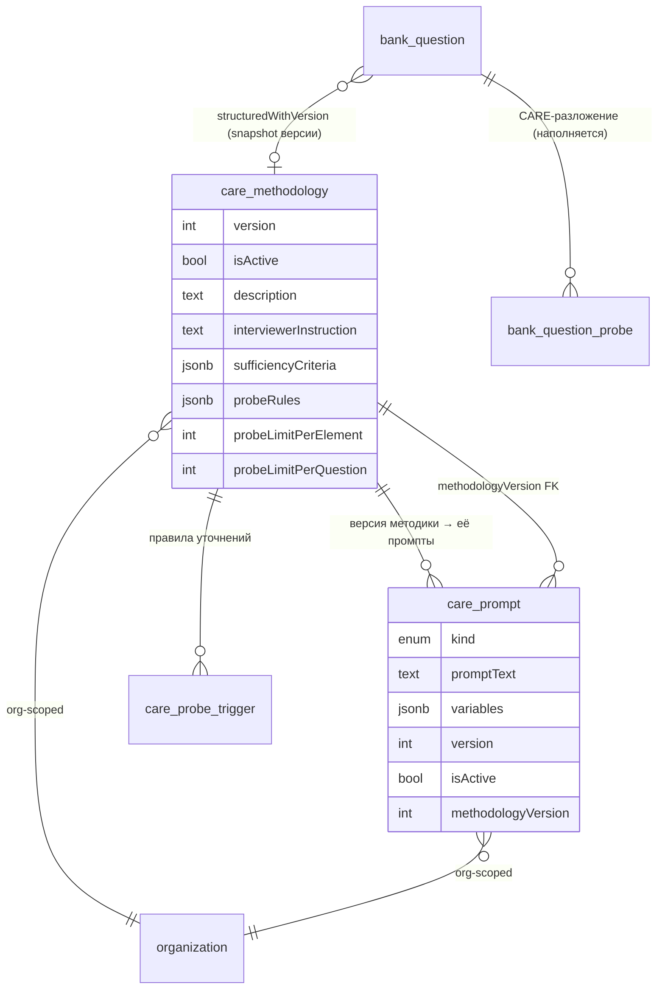
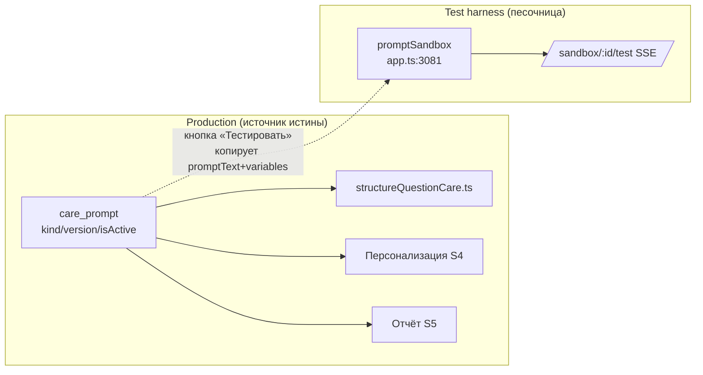
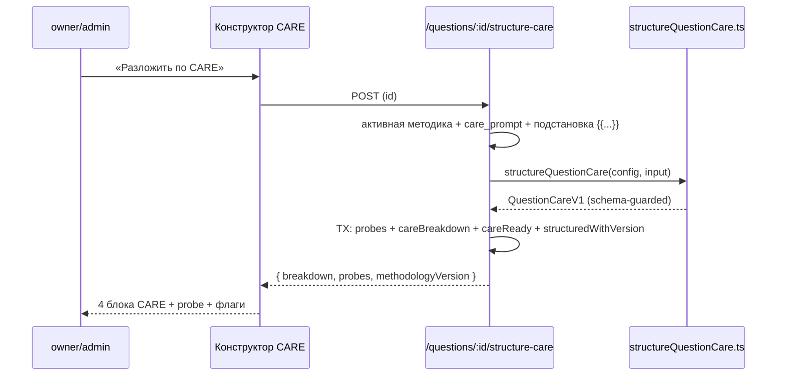
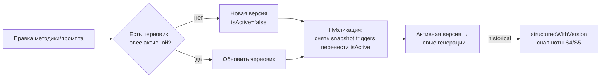

# ТЗ · Спринт 2 · Методология CARE (редактируемая, org-level, промпт-интеграция)

> **Часть:** мастер-план `tz-questions-00-master-plan.md`
> **Зависит от:** Спринт 1 (`tz-questions-01-org-bank.md`) — таблицы `bank_question`,
> `bank_question_probe`, `assessment_topic`, `assessment_scale`, `bars_anchor`,
> право-ресурс `questionBank`, `careElementEnum`.
> **Даёт для:** Спринт 4 (LLM-персонализация опросника — CARE-каркас + probe),
> Спринт 5 (генерация отчёта — промпт отчёта + BARS-интерпретация).
> **Статус:** черновик на согласование

Спринт 2 наполняет **логикой и методологией** каркас, заведённый в Спринте 1.
Таблица `bank_question_probe` уже существует (пустая по данным) — здесь появляется
**AI-структурирование вопроса по CARE**, которое её наполняет; методика CARE
становится **редактируемой сущностью в БД** и **источником истины для промптов**
Спринтов 4 и 5.

---

## 2. Цель

Дать организации **редактируемый корпоративный стандарт формулирования и
структурирования интервью-вопросов** — методику **CARE** (Context · Action ·
Result · Evaluate) — которая:

1. **Живёт в БД** на уровне org, версионируется и редактируется **только
   owner/admin** (HM/recruiter — read-only просмотр).
2. **Встраивается в промпты** трёх ключевых генераций контура:
   - **(a)** структурирование вопроса банка по CARE (Спринт 2, этот документ);
   - **(b)** персонализация опросника кандидата (Спринт 4);
   - **(c)** генерация отчёта по интервью (Спринт 5).
3. **Наполняет `bank_question_probe`** результатом AI-разложения вопроса на
   4 CARE-блока: по 2–3 probe-уточнения на блок + признак достаточного ответа +
   ожидаемые свидетельства + зелёные/красные флаги.
4. Несёт **справочник probe-триггеров** — редактируемые правила «когда задавать
   уточнение» (напр. кандидат говорит «мы» без разделения вклада → probe «Что
   именно сделали вы лично?»). Триггеры — часть методики, часть промпта.

**Ценность:** формулировки и структура вопросов перестают быть «вкусом
конкретного рекрутёра» — становятся управляемым корпоративным активом. Одна
правка методики влияет на все последующие генерации (через версию), исторические
артефакты остаются воспроизводимыми (ссылка на версию, действовавшую в момент).

**Что НЕ входит** (см. мастер-план §8): проведение интервью, ручное выставление
баллов по BARS, калибровка интервьюеров — это MyMeet + рекрутёр. Тяжёлый workflow
модерации методики (SLA/эскалации) — later. Межорганизационный обмен методиками —
нет.

### Граница «детерминированно / LLM» (мастер-план §6)

| Действие | LLM? | Частота |
|---|---|---|
| Редактирование методики/промптов/триггеров | Нет | Редко, вручную (owner/admin) |
| Версионирование, активация, rollback | Нет | Редко |
| **AI-структурирование вопроса по CARE** | **Да (по кнопке)** | Редко, вручную на вопрос |
| Тест CARE-промпта в песочнице | Да (SSE) | При настройке |
| Применение методики к персонализации/отчёту | Да | Спринты 4/5 |

Тяжёлый LLM отрабатывает **заранее и вручную** (структурирование вопросов банка) и
**переиспользуется** ниже по контуру. Редактирование методики — чистый CRUD.

---

## 3. Термины

| Термин | Определение |
|---|---|
| CARE | Методика структурирования ответа: **C**ontext (ситуация) · **A**ction (действия лично кандидата) · **R**esult (результат) · **E**valuate (выводы/рефлексия) |
| CARE-элемент | Один из четырёх блоков; `careElementEnum: context\|action\|result\|evaluate` (заведён в Спринте 1, `app.ts` careElementEnum) |
| Методика CARE | Редактируемая org-сущность: текст модели + инструкция интервьюеру + критерии достаточности + probe-правила + лимиты. Версионируется |
| CARE-промпт | Редактируемый шаблон промпта, привязанный к версии методики; три вида: `structure_question`, `personalize_questionnaire`, `generate_report` |
| Probe | Уточняющий вопрос внутри CARE-элемента (`bank_question_probe`, наполняется здесь) |
| Probe-триггер | Правило «сигнал в ответе → рекомендуемый probe» (напр. «говорит "мы"» → «Что именно сделали вы лично?»). Часть методики |
| Признак достаточного ответа | Критерий, по которому элемент CARE считается раскрытым (sufficiency criterion) |
| Признак ухода от ответа | Сигнал, что кандидат уклоняется/обобщает (evasion signal) |
| Активная версия | Версия методики/промпта, применяемая к **новым** генерациям (`isActive`) |
| Структурирование по CARE | AI-разложение конкретного вопроса банка на 4 блока + probe + признаки; наполняет `bank_question_probe`, выставляет `bank_question.careReady=true` |
| Конструктор CARE | UI-редактор разложения одного вопроса (live через `structure-care`), доступный в карточке вопроса банка и в подразделе методики |

**Отношение к Спринту 1:** `careElementEnum` и таблица `bank_question_probe` уже
существуют. Спринт 2 **не меняет** их схему полей (кроме одного добавляемого столбца
`probeSource`, см. 4.6) — он добавляет **логику наполнения** и **новые таблицы
методики/промптов/триггеров**.

---

## 4. Модель данных

Схема в `server/database/schema/app.ts` (новая секция «CARE Methodology»). Все
таблицы org-scoped по `organizationId` (как `promptSandbox` `app.ts:3081` и
`orgSettings` `app.ts:676`). Стиль полей — как в Спринте 1: `text` PK
(`crypto.randomUUID()`), FK на `organization`/`user` через `references(...)`,
`jsonb().$type<...>()` для структурированных полей, партиал-уникальные индексы для
`isActive`.

### 4.1. Связь сущностей (карта)



**Ключевой принцип источника истины:** `care_prompt` — **production-источник**
промптов, которые Спринты 4 и 5 читают из БД (не хардкод в коде). `promptSandbox`
(`app.ts:3081`) — **тест-харнесс**: туда можно скопировать текст `care_prompt` для
прогонки SSE-теста, но прод-генерации читают именно `care_prompt`. См. 4.7.

### 4.2. `care_methodology` — редактируемая методика (версионируемая)

Одна org имеет **N версий** методики; **ровно одна** активна (`isActive=true`).
Изменение любого содержательного поля создаёт **новую версию** (см. §9), старые —
иммутабельны.

```
care_methodology
  id                     text pk (crypto.randomUUID())
  organizationId         text notNull FK organization cascade
  version                int notNull            -- 1,2,3… монотонно в рамках org
  isActive               boolean notNull default false  -- активная версия для новых генераций
  title                  text notNull default 'CARE'    -- имя методики (обычно "CARE")
  description            text                   -- описание модели CARE (что понимаем под C/A/R/E), markdown-текст
  interviewerInstruction text                   -- инструкция интервьюеру (как вести по CARE, от общего к частному)
  sufficiencyCriteria    jsonb notNull default '{}'  -- критерии достаточности по КАЖДОМУ элементу CARE (см. тип ниже)
  probeRules             jsonb notNull default '[]'  -- snapshot probe-триггеров на момент версии (см. тип ниже)
  probeLimitPerElement   int notNull default 3  -- макс. probe на один CARE-элемент
  probeLimitPerQuestion  int notNull default 6  -- макс. probe суммарно на вопрос
  changeNote             text                   -- «что изменилось» (для истории версий)
  createdById            text FK user set-null
  publishedAt            timestamp with tz      -- момент активации версии (null для черновика)
  createdAt, updatedAt   timestamp
  indexes:
    (organizationId)
    (organizationId, version) unique
    partial-unique (organizationId) where isActive   -- ровно одна активная на org
```

**Тип `sufficiencyCriteria` (jsonb):** объект по 4 элементам CARE — что считаем
достаточным раскрытием и что считаем уходом.

```ts
type SufficiencyCriteria = Record<
  'context' | 'action' | 'result' | 'evaluate',
  {
    sufficientSignal: string   // признак достаточного ответа
    evasionSignal: string      // признак ухода от ответа
    minEvidence?: number       // мин. число конкретных свидетельств (напр. 1)
  }
>
```

**Тип `probeRules` (jsonb, массив):** snapshot справочника триггеров, «вшитый» в
версию (чтобы промпт был воспроизводим даже после правки живого справочника
`care_probe_trigger`).

```ts
type ProbeRule = {
  trigger: string            // сигнал в ответе кандидата
  recommendedProbe: string   // рекомендуемое уточнение
  careElement?: 'context' | 'action' | 'result' | 'evaluate' | 'any'
}
```

> **Почему snapshot и живой справочник одновременно?** `care_probe_trigger` (4.5) —
> удобный редактируемый справочник в UI. При **публикации версии** методики его
> строки копируются в `probeRules` (jsonb) — так исторические генерации ссылаются
> на неизменяемый набор правил своей версии (§9), а редактор работает со строками.

### 4.3. `care_prompt` — редактируемые промпты (привязаны к версии методики)

**Источник истины** для промптов, которые применяются в структурировании (Спринт 2),
персонализации (Спринт 4) и отчёте (Спринт 5). Каждый `kind` версионируется вместе
с методикой: `methodologyVersion` связывает промпт с конкретной версией
`care_methodology.version`.

```
care_prompt
  id                 text pk (crypto.randomUUID())
  organizationId     text notNull FK organization cascade
  kind               enum notNull    -- carePromptKindEnum: structure_question | personalize_questionnaire | generate_report
  promptText         text notNull    -- шаблон системного промпта с {{плейсхолдерами}} (до 16 000 симв., как promptSandbox SYSTEM_PROMPT_MAX)
  variables          jsonb notNull default '[]'  -- декларация плейсхолдеров (см. тип ниже; формат совместим с promptSandbox.variables)
  version            int notNull     -- версия самого промпта (может расти чаще методики)
  isActive           boolean notNull default false  -- активный промпт данного kind
  methodologyVersion int notNull     -- FK-логическая связь на care_methodology.version (в рамках org)
  changeNote         text
  createdById        text FK user set-null
  publishedAt        timestamp with tz
  createdAt, updatedAt
  indexes:
    (organizationId)
    (organizationId, kind, version) unique
    partial-unique (organizationId, kind) where isActive   -- ровно один активный промпт на (org, kind)
```

`carePromptKindEnum`: `structure_question | personalize_questionnaire | generate_report`.

**Тип `variables` (jsonb, массив)** — совместим с `promptSandbox.variables`
(`app.ts:3090`), чтобы «Тестировать» переносило переменные в песочницу без
конвертации:

```ts
type CarePromptVariable = {
  name: string          // напр. "question_text"
  description: string
  required: boolean
  example?: string
}
```

**Плейсхолдеры по видам промпта** (подстановка `{{name}}` — как
`substituteVariables` в `sandbox/[id]/test.post.ts:144`):

| kind | Обязательные переменные | Где применяется |
|---|---|---|
| `structure_question` | `question_text`, `topic`, `goal`, `scale_type` | Спринт 2, `structureQuestionCare.ts` |
| `personalize_questionnaire` | `candidate_summary`, `job_context`, `questions_json`, `risk_findings` | Спринт 4 |
| `generate_report` | `transcript`, `questionnaire_json`, `bars_anchors`, `report_template` | Спринт 5 |

> **`methodologyVersion` как обычный int, не FK-констрейнт на другую таблицу по
> составному ключу.** Drizzle/PG проще держать это логической ссылкой в рамках org
> (`(organizationId, methodologyVersion)` соответствует `care_methodology
> (organizationId, version)`), т.к. FK на неуникальную по одному столбцу версию
> невозможен. Целостность гарантируется в сервисном слое (нельзя опубликовать
> промпт на несуществующую версию методики).

### 4.4. Связь `bank_question` с версией структурирования (snapshot)

Чтобы исторические разложения были воспроизводимы, `bank_question` фиксирует, какой
**версией методики** он был структурирован. Добавляемые поля к таблице Спринта 1
(`app.ts` bank_question):

```
bank_question  (+ поля Спринта 2)
  structuredWithVersion  int             -- версия care_methodology на момент structure-care (null если не структурирован)
  structuredAt           timestamp       -- когда выполнено AI-структурирование
  structuredById         text FK user set-null
  -- careReady boolean (уже есть в Спринте 1) выставляется в true после структурирования
```

> `careReady` (Спринт 1, `app.ts` bank_question) — булев флаг «CARE-структура
> заполнена». Спринт 2 выставляет его `true` при успешном `structure-care` и хранит
> `structuredWithVersion` для аудита «по какой методике разложен».

### 4.5. `care_probe_trigger` — редактируемый справочник probe-триггеров

Живой справочник для UI-редактора (см. 4.2 про snapshot в `probeRules`). Не
версионируется отдельным столбцом — «снимок» уходит в `care_methodology.probeRules`
при публикации версии.

```
care_probe_trigger
  id             text pk (crypto.randomUUID())
  organizationId text notNull FK organization cascade
  trigger        text notNull    -- сигнал в ответе кандидата
  recommendedProbe text notNull  -- рекомендуемое уточнение
  careElement    enum            -- careElementEnum | null (null = любой элемент)
  isBuiltin      boolean notNull default false  -- пришёл из seed-набора (можно скрыть, но не удалить бесследно)
  isActive       boolean notNull default true
  displayOrder   int default 0
  createdById    text FK user set-null
  createdAt, updatedAt
  indexes: (organizationId), (organizationId, displayOrder)
```

**Seed-набор по умолчанию** (создаётся при первой активации методики org или
миграцией, `isBuiltin=true`) — 9 правил из требований заказчика:

| # | trigger | recommendedProbe | careElement |
|---|---|---|---|
| 1 | Говорит «мы» без разделения вклада | Что именно сделали вы лично? | action |
| 2 | Нет конкретной ситуации | Приведите конкретный случай из последнего года | context |
| 3 | Теоретический ответ | А как это было в вашей практике? | action |
| 4 | Пропущен результат | Чем закончилась история? | result |
| 5 | Нет показателей | Как измеряли результат? | result |
| 6 | Не объяснено решение | Какие варианты рассматривали и почему выбрали этот? | action |
| 7 | Присвоение результата подразделения | Какая часть результата зависела от ваших решений? | action |
| 8 | Уход от вопроса | Повторить вопрос в другой формулировке | any |
| 9 | Нет выводов | Что бы сделали иначе? | evaluate |

Лимиты по умолчанию: **3 probe на элемент**, **6 probe на вопрос** (см.
`care_methodology.probeLimitPerElement/probeLimitPerQuestion`).

### 4.6. `bank_question_probe` — добавляемое поле `probeSource`

Таблица заведена в Спринте 1 (`app.ts` bank_question_probe: `careElement`, `text`,
`sufficientSignal`, `displayOrder`). Спринт 2 добавляет один столбец, чтобы
различать probe, сгенерированные AI, от ручных:

```
bank_question_probe  (+ поле Спринта 2)
  probeSource   enum notNull default 'manual'   -- probeSourceEnum: ai_structured | manual | trigger
  triggerId     text FK care_probe_trigger set-null  -- если probe возник из триггера
```

`probeSourceEnum`: `ai_structured | manual | trigger`.

> **Расширенные поля разложения** (ожидаемые свидетельства, зелёные/красные флаги,
> признак ухода) хранятся на уровне **вопроса**, не probe: они логически относятся к
> элементу CARE в целом. Заводим на `bank_question` компактное jsonb-поле
> `careBreakdown` (см. ниже), а `bank_question_probe` остаётся плоским списком
> уточнений (как в Спринте 1).

```
bank_question  (+ поле Спринта 2, дополнение к 4.4)
  careBreakdown  jsonb   -- полный результат разложения (см. Zod-схему 5.2): по 4 элементам
                         -- { sufficientSignal, evasionSignal, expectedEvidence[], greenFlags[], redFlags[] }
                         -- + revisedQuestion?, scaleAnchors? — для отображения в Конструкторе CARE
```

`bank_question_probe` наполняется probe-строками (по `probeLimitPerElement`),
`careBreakdown` — остальными полями разложения. Оба пишутся атомарно в одной
транзакции `structure-care` (§7, `structure.post.ts`).

### 4.7. Отношение `care_prompt` ⇄ `promptSandbox` (production vs test-harness)



- **`care_prompt`** — что реально применяется в проде (читается сервисами S2/S4/S5).
- **`promptSandbox`** (`app.ts:3081`, `prompts/sandbox/*`) — существующий per-user
  тест-харнесс с SSE (`sandbox/[id]/test.post.ts`). Кнопка «Тестировать» в
  редакторе `care_prompt` создаёт/обновляет запись `promptSandbox` (category
  `'care'`) с тем же `systemPrompt` и `variables` и открывает SSE-тест. Это **не**
  делает песочницу источником истины — только прогоняет черновик промпта на живой
  модели без риска для прод-версии.
- Формат `variables` в обеих таблицах идентичен (`{name, description, required,
  example}`), поэтому перенос без конвертации.

---

## 5. AI-util: `server/utils/ai/structureQuestionCare.ts`

По образцу `generateInterviewQuestions.ts` (`generateInterviewQuestions.ts:71`):
чистый util поверх `generateStructuredOutput` (`provider.ts:367`), Zod-схема с
`.catch().default()`-гардами и `wrapBareArray`, `loadAiConfig` для конфигурации.

### 5.1. Сигнатура и контур

```ts
// server/utils/ai/structureQuestionCare.ts
import { z } from 'zod'
import { generateStructuredOutput, type ProviderConfig } from './provider'

export interface StructureQuestionCareInput {
  questionText: string       // {{question_text}}
  topic: string              // {{topic}} — name/definition темы
  goal: string               // {{goal}} — цель оценки
  scaleType: string          // {{scale_type}} — тип шкалы темы (numeric_5 и т.п.)
  systemPromptOverride?: string  // активный care_prompt(kind='structure_question').promptText
  probeLimitPerElement?: number  // из методики (default 3)
  probeLimitPerQuestion?: number // из методики (default 6)
}

export async function structureQuestionCare(
  config: ProviderConfig,
  input: StructureQuestionCareInput,
): Promise<QuestionCareV1>
```

**Резолвинг конфига (в API-хендлере, не в util):**
`loadAiConfig(orgId, { purpose: 'structuring' })` — структурирование = аналитическая
разбивка текста, ближе всего к назначению `structuring` (`loadConfig.ts:16`,
fallback на `analysis` встроен в `loadConfig.ts:60-65`). Если org явно предпочитает
сильную модель — допустимо `purpose: 'analysis'`; выбор фиксируем в 7.x как
`purpose: 'structuring'` с наследуемым fallback.

**Промпт:** util принимает `systemPromptOverride`. Хендлер передаёт туда
`care_prompt(kind='structure_question', isActive).promptText` с уже подставленными
`{{плейсхолдерами}}` (подстановка тем же приёмом, что `substituteVariables`
`sandbox/[id]/test.post.ts:144`). Если промпта в БД нет — используется
**встроенный дефолт** (5.3), который и является seed-значением `care_prompt`.

### 5.2. Zod-схема `question_care_v1` (устойчивая к слабым провайдерам)

Гарды `.catch().default()` на КАЖДОМ поле — как в
`generateInterviewQuestions.ts:22-28`; `wrapBareArray` — на случай, если модель
вернёт голый массив элементов.

```ts
const careElementBlock = z.object({
  element: z.enum(['context', 'action', 'result', 'evaluate']).catch('context').default('context'),
  probes: z.array(z.string()).catch([]).default([]),           // 2–3 уточнения
  sufficientSignal: z.string().catch('').default(''),           // признак достаточного ответа
  evasionSignal: z.string().catch('').default(''),              // признак ухода от ответа
})

const questionCareV1Schema = z.object({
  isOpenSingle: z.boolean().catch(true).default(true),          // вопрос открытый и одиночный?
  revisedQuestion: z.string().catch('').default(''),            // исправленная формулировка (если нужно)
  elements: z.array(careElementBlock).catch([]).default([]),    // 4 блока CARE
  expectedEvidence: z.array(z.string()).catch([]).default([]),  // 3 ожидаемых свидетельства
  greenFlags: z.array(z.string()).catch([]).default([]),        // 3 зелёных флага
  redFlags: z.array(z.string()).catch([]).default([]),          // 3 красных флага
  scaleAnchors: z.array(z.object({
    value: z.string().catch('').default(''),
    anchor: z.string().catch('').default(''),
  })).catch([]).default([]),                                    // якоря под {{scale_type}}
})

export type QuestionCareV1 = z.infer<typeof questionCareV1Schema>
```

**Пост-обработка в util** (детерминированная, после валидации):
- Гарантировать ровно 4 элемента (дозаполнить недостающие пустыми блоками в порядке
  `context → action → result → evaluate`, дедуп по `element`).
- Обрезать `probes` каждого элемента до `probeLimitPerElement` (default 3).
- Обрезать суммарное число probe до `probeLimitPerQuestion` (default 6),
  приоритезируя `action` и `result` (ядро CARE), затем `context`, `evaluate`.
- Тримминг, отсев пустых строк (как `.filter(q => q.text !== '')` в
  `generateInterviewQuestions.ts:114`).

**Вызов `generateStructuredOutput`** (`provider.ts:367`):

```ts
const result = await generateStructuredOutput(config, {
  system: input.systemPromptOverride ?? DEFAULT_STRUCTURE_CARE_PROMPT,
  prompt: buildUserPrompt(input),   // компактный ввод: вопрос/тема/цель/шкала
  schema: questionCareV1Schema,
  schemaName: 'question_care_v1',
  schemaDescription: 'Разложение вопроса по методике CARE',
  wrapBareArray: items => ({ elements: items }),
  temperature: 0.2,
})
```

> `generateStructuredOutput` уже добавляет `JSON_ONLY_GUARD` (`provider.ts:288`) и
> восстанавливает грязный JSON через `extractJsonPayload` (`provider.ts:253`) —
> отдельная обработка markdown-фенсов не нужна.

### 5.3. Встроенный СИСТЕМНЫЙ ПРОМПТ по умолчанию (seed для `care_prompt`)

Это дефолт `structureQuestionCare.ts` **и** seed-значение
`care_prompt(kind='structure_question')`. Редактируется owner/admin в UI (§8), после
чего util получает его как `systemPromptOverride`. Адаптирован из референс-промпта
заказчика:

```text
РОЛЬ: Ты — методолог структурированных интервью по компетенциям. Ты владеешь
методикой CARE (Context — ситуация, Action — действия лично кандидата, Result —
результат, Evaluate — выводы и рефлексия) и умеешь раскладывать вопрос на эти
четыре блока так, чтобы интервью шло от общего к частному.

ВХОД:
— Формулировка вопроса: {{question_text}}
— Тема оценки: {{topic}}
— Цель оценки: {{goal}}
— Тип шкалы интерпретации: {{scale_type}}

ЗАДАЧА:
1. Проверь, является ли вопрос открытым и одиночным. Если нет — предложи
   исправленную формулировку в поле revisedQuestion (иначе оставь его пустым, а
   isOpenSingle = true).
2. Разложи вопрос на четыре блока CARE (context, action, result, evaluate).
3. Для каждого блока дай 2–3 уточняющих вопроса (probe), ведущих от общего к
   частному. Не более 3 на блок.
4. Для каждого блока опиши признак достаточного ответа (sufficientSignal) и
   признак ухода от ответа (evasionSignal).
5. Предложи 3 ожидаемых свидетельства (expectedEvidence) — что кандидат должен
   упомянуть, чтобы ответ считался содержательным.
6. Предложи по 3 зелёных (greenFlags) и 3 красных (redFlags) флага.
7. Предложи якоря для шкалы {{scale_type}} (scaleAnchors: значение → поведенческий
   якорь), опираясь на поведение кандидата, а не на оценку интервьюера.

ПРАВИЛА УТОЧНЕНИЙ (probe-триггеры организации):
{{probe_rules}}
Используй эти правила: если формулировка ответа может вызвать соответствующий
сигнал — предложи связанный probe.

ЗАПРЕТЫ:
— Не добавляй подсказку правильного ответа и не наводи на желаемый ответ.
— Не используй чувствительные признаки (возраст, пол, национальность, религия,
  семейное положение, здоровье).
— Не объединяй две гипотезы/предмета в один вопрос.
— Не оценивай кандидата — только описывай наблюдаемое поведение.

ФОРМАТ: строго JSON по схеме question_care_v1. Без markdown, без пояснений.
```

> `{{probe_rules}}` рендерится хендлером из активной версии
> (`care_methodology.probeRules`, snapshot) в компактный список
> `«— <trigger> → <recommendedProbe>»`. Так справочник триггеров реально влияет на
> генерацию, оставаясь редактируемым.

### 5.4. Референс-промпт отчёта (принадлежит Спринту 5)

Второй референс-промпт заказчика — **промпт генерации отчёта** — в Спринте 2 **не
реализуется**, но его слот заводится сразу: `care_prompt(kind='generate_report')`
создаётся с seed-заглушкой (текст-плейсхолдер + декларация переменных `transcript`,
`questionnaire_json`, `bars_anchors`, `report_template`). Полное содержание и util
генерации отчёта — в `tz-questions-05-mymeet-reports.md`. Это гарантирует, что к
Спринту 5 промпт уже редактируем и версионируется вместе с методикой.

Аналогично `care_prompt(kind='personalize_questionnaire')` заводится seed-заглушкой
для Спринта 4.

### 5.5. Деградация при отказе LLM

Как предписывает мастер-план §7.4: при ошибке провайдера или невалидном ответе
`structure-care` **не роняет** вопрос — возвращает частичный `careBreakdown`
(валидируется схемой с дефолтами) и **не выставляет** `careReady=true`, показывая в
UI баннер «Не удалось структурировать полностью, отредактируйте вручную». Детермин.
каркас (4 пустых элемента + seed-probe из триггеров по `careElement`) всегда
доступен как fallback.

---

## 6. Дефолтные редактируемые артефакты (seed)

Создаются при первой инициализации методики org (лениво при первом заходе
owner/admin в подраздел, либо data-миграцией). Все — версия 1, `isActive=true`.

### 6.1. `care_methodology` v1

- `title`: `CARE`
- `description`: описание модели (см. текст ниже, markdown).
- `interviewerInstruction`: инструкция интервьюеру (см. ниже).
- `sufficiencyCriteria`: по 4 элементам (см. ниже).
- `probeRules`: snapshot 9 триггеров (6.3).
- `probeLimitPerElement`: 3, `probeLimitPerQuestion`: 6.

**`description` (дефолт):**

```text
CARE — методика структурирования ответа кандидата на поведенческий вопрос.
• Context (Ситуация) — в какой ситуации, задаче, ограничениях действовал кандидат.
• Action (Действия) — что именно сделал ЛИЧНО кандидат (не команда, не «мы»).
• Result (Результат) — к чему привели действия, измеримо, с показателями.
• Evaluate (Выводы) — какие уроки извлёк, что сделал бы иначе, рефлексия.
Интервью ведём от общего к частному: сначала контекст, затем углубляемся в личный
вклад, результат и выводы. Каждый блок сопровождается уточнениями (probe), которые
включаются по триггерам ухода/обобщения.
```

**`interviewerInstruction` (дефолт):**

```text
1. Задайте основной вопрос открыто, дайте кандидату развернуть ответ.
2. Ведите по CARE: если блок раскрыт слабо — задайте probe из списка блока.
3. Следите за триггерами (говорит «мы», нет показателей, теоретический ответ) и
   применяйте связанное уточнение.
4. Не наводите на правильный ответ, не оценивайте вслух.
5. Фиксируйте конкретику: ситуацию, личный вклад, цифры результата, выводы.
6. Достаточно 1 конкретного случая на вопрос — глубина важнее охвата.
```

**`sufficiencyCriteria` (дефолт):**

| element | sufficientSignal | evasionSignal | minEvidence |
|---|---|---|---|
| context | Названа конкретная ситуация, задача, ограничения, срок | Общие слова, «обычно», «всегда», нет конкретики | 1 |
| action | Описаны действия от первого лица, видно личное решение | «Мы», пассив, теория без практики | 1 |
| result | Назван измеримый итог с показателем | «Всё получилось», нет цифр, присвоение результата отдела | 1 |
| evaluate | Есть выводы, что сделал бы иначе | Нет рефлексии, «всё было идеально» | 0 |

### 6.2. `care_prompt` seed (3 kind)

- `structure_question` — дефолт из 5.3 (активный, применяется в Спринте 2).
- `personalize_questionnaire` — заглушка (переменные объявлены; текст детализируется
  в Спринте 4).
- `generate_report` — заглушка (переменные объявлены; текст — Спринт 5).

Все три: `version=1`, `methodologyVersion=1`. Активен реально только
`structure_question`; остальные два активны, но не вызываются до своих спринтов.

### 6.3. `care_probe_trigger` seed

9 строк из таблицы 4.5, `isBuiltin=true`, `isActive=true`, `displayOrder` по порядку.

---

## 7. API

Все под `server/api/question-bank/care/`. Каждый хендлер: `requirePermission`
(`requirePermission.ts:44`) + скоуп по `session.session.activeOrganizationId` (как
`sandbox/index.post.ts:36`). Изоляция тенантов: любой `findFirst`/`update` фильтрует
по `organizationId`; при чтении по id — проверка `row.organizationId === orgId`
(как `sandbox/[id]/test.post.ts:47`).

### 7.1. Новое право `manage_care`

В `shared/permissions.ts` расширить ресурс `questionBank` (заведён в Спринте 1,
раскладка `atsStatements` `permissions.ts:30`) новым action `manage_care`:

```ts
questionBank: ['view', 'create_draft', 'edit_draft', 'publish', 'archive', 'manage_topics', 'manage_care'],
```

Раскладка по ролям (в raw-картах `ownerAtsStatements`/`adminAtsStatements`/… ,
`permissions.ts:75-165`, и в `ROLE_STATEMENTS` `permissions.ts:204`):

| Роль | `questionBank:manage_care` |
|---|---|
| owner | да |
| admin | да |
| member (recruiter) | **нет** (только `view` методики) |
| hiringManager | **нет** (только `view`) |

- Все **изменяющие** методику/промпты/триггеры/структурирование эндпоинты требуют
  `questionBank: ['manage_care']`.
- **Просмотр** методики (read-only view для HM/recruiter) требует
  `questionBank: ['view']`.
- Запуск `structure-care` для вопроса — `manage_care` (это изменение методологии
  вопроса; альтернатива — привязать к `edit_draft`, но выбираем строгий вариант:
  структурирование = методологическая операция owner/admin).

> Поскольку `questionBank` не входит в статические raw-карты Спринта 0/1 как
> отдельный action-набор в текущем `permissions.ts` (там базовые ATS-ресурсы), при
> реализации Спринта 1 ресурс уже добавлен; Спринт 2 лишь дописывает `manage_care` в
> тот же ресурс во всех местах (`atsStatements`, owner/admin raw-карты,
> `ROLE_STATEMENTS`). member/HM `manage_care` не получают.

### 7.2. Методика (методология)

- `GET    /api/question-bank/care/methodology` — **активная** версия методики
  (+ `probeRules`, `sufficiencyCriteria`, лимиты). Доступ: `view`. Read-only для
  HM/recruiter.
- `PUT    /api/question-bank/care/methodology` — сохранить изменения → **создаёт
  новую версию** (§9) или обновляет черновик (см. 9.2). Доступ: `manage_care`.
  Тело: `{ title?, description?, interviewerInstruction?, sufficiencyCriteria?,
  probeLimitPerElement?, probeLimitPerQuestion?, changeNote? }` (Zod).
- `GET    /api/question-bank/care/methodology/versions` — список версий (version,
  isActive, publishedAt, createdBy, changeNote). Доступ: `view`.
- `GET    /api/question-bank/care/methodology/versions/[version]` — одна версия
  (для просмотра истории/diff). Доступ: `view`.
- `POST   /api/question-bank/care/methodology/versions/[version]/activate` —
  rollback/активация конкретной версии (§9.3). Доступ: `manage_care`.

### 7.3. Промпты

- `GET    /api/question-bank/care/prompts` — активные промпты всех `kind`
  (+ переменные). Доступ: `view`.
- `GET    /api/question-bank/care/prompts/[kind]` — активный промпт одного kind
  + список его версий. Доступ: `view`.
- `PUT    /api/question-bank/care/prompts/[kind]` — сохранить промпт →
  **новая версия** промпта (§9). Тело: `{ promptText, variables?, changeNote?,
  methodologyVersion? }`. Доступ: `manage_care`. Валидация: `promptText` ≤ 16 000
  (как `SYSTEM_PROMPT_MAX` в `sandbox/index.post.ts:7`), обязательные плейсхолдеры
  присутствуют (см. таблицу 4.3).
- `POST   /api/question-bank/care/prompts/[kind]/versions/[version]/activate` —
  активировать версию промпта. Доступ: `manage_care`.
- `POST   /api/question-bank/care/prompts/[kind]/test` — прогнать промпт через
  песочницу: создаёт/обновляет `promptSandbox` (category `'care'`, `systemPrompt`,
  `variables`) для текущего пользователя и возвращает `{ sandboxId }`; клиент затем
  открывает существующий SSE `POST /api/prompts/sandbox/[id]/test`
  (`sandbox/[id]/test.post.ts`). Доступ: `manage_care`. **Переиспользование
  тест-харнесса, а не новый SSE-эндпоинт.**

### 7.4. Probe-триггеры

- `GET    /api/question-bank/care/triggers` — список триггеров (активные + скрытые
  для редактора). Доступ: `view`.
- `PUT    /api/question-bank/care/triggers` — заменить набор триггеров (bulk, как
  `PUT scales/[id]/anchors` в Спринте 1). Тело: массив `{ id?, trigger,
  recommendedProbe, careElement?, isActive, displayOrder }`. Доступ: `manage_care`.
  Builtin-триггеры (`isBuiltin=true`) можно деактивировать/переупорядочить, но не
  удалять физически (soft: `isActive=false`).

### 7.5. Структурирование вопроса по CARE

- `POST   /api/question-bank/questions/[id]/structure-care` — **AI-разложение
  вопроса** банка по CARE. Доступ: `manage_care` + rate-limit 10/мин (как
  `interview-questions/generate.post.ts` и `sandbox/[id]/test.post.ts:9`).
  Контур хендлера (`structure.post.ts`):
  1. `requirePermission(event, { questionBank: ['manage_care'] })`; `orgId`.
  2. Загрузить `bank_question` по id, проверить `organizationId === orgId`.
  3. Загрузить активную `care_methodology` (лимиты, `probeRules`) и активный
     `care_prompt(kind='structure_question')`.
  4. Резолв темы/шкалы: `topic` = name+definition primaryTopic, `goal` = goal
     вопроса/темы, `scale_type` = тип default-шкалы темы (или override вопроса,
     Спринт 1 `scaleIdOverride`).
  5. `config = loadAiConfig(orgId, { purpose: 'structuring' })` (`loadConfig.ts`).
  6. Подставить плейсхолдеры (`{{question_text}}`, `{{topic}}`, `{{goal}}`,
     `{{scale_type}}`, `{{probe_rules}}`) в `promptText` → `systemPromptOverride`.
  7. `structureQuestionCare(config, {...})` → `QuestionCareV1`.
  8. **Транзакция**: удалить прежние `bank_question_probe` c
     `probeSource='ai_structured'` для вопроса; вставить новые probe
     (`probeSource='ai_structured'`, привязка `careElement`, `displayOrder`);
     записать `careBreakdown`, `careReady=true`, `structuredWithVersion=версия
     методики`, `structuredAt`, `structuredById`.
  9. Ответ: `{ breakdown, probes, methodologyVersion }`.
  - **Деградация** (5.5): при провале LLM — 200 c `{ partial:true }`,
    `careReady` не выставляется.
- `PUT    /api/question-bank/questions/[id]/probes` — ручная правка probe (уже
  заведён в Спринте 1 под `edit_draft`); Спринт 2 сохраняет `probeSource='manual'`
  для строк, отредактированных вручную, и не затирает их при повторном
  `structure-care` (мержим: AI-строки заменяются, manual — сохраняются).

### 7.6. Мини-контракты (Zod, стиль Спринта 1 / `sandbox/index.post.ts`)

```ts
// PUT methodology
const methodologyBody = z.object({
  title: z.string().min(1).max(120).optional(),
  description: z.string().max(8000).optional().nullable(),
  interviewerInstruction: z.string().max(8000).optional().nullable(),
  sufficiencyCriteria: z.record(z.object({
    sufficientSignal: z.string().max(1000),
    evasionSignal: z.string().max(1000),
    minEvidence: z.number().int().min(0).max(10).optional(),
  })).optional(),
  probeLimitPerElement: z.number().int().min(1).max(6).optional(),
  probeLimitPerQuestion: z.number().int().min(1).max(20).optional(),
  changeNote: z.string().max(500).optional().nullable(),
})

// PUT prompts/[kind]
const promptBody = z.object({
  promptText: z.string().min(1).max(16_000),
  variables: z.array(z.object({
    name: z.string().min(1).max(60),
    description: z.string().max(200),
    required: z.boolean(),
    example: z.string().max(500).optional(),
  })).max(30).optional(),
  methodologyVersion: z.number().int().min(1).optional(),
  changeNote: z.string().max(500).optional().nullable(),
})
```

---

## 8. UI

> **Design-system (обязательно, мастер-план §3.10 / Спринт 1 §1.8):** все экраны на
> `Ui*` (`app/components/ui/`): `UiButton`, `UiInput`, `UiSelect`, `UiBadge`,
> `UiCard`, `UiModal`, `UiDrawer`, `UiSegmented`. Табы — `DetailTabs.vue`
> (`app/components/DetailTabs.vue`). Тосты — `useToast()`. Подтверждения —
> `useConfirm()`. Токены — `app/design/tokens.ts`. Формы — `zod safeParse` →
> `errors[path]`. `UiTextarea` пока нет — размеченный `<textarea>` с токен-классами
> (или завести в рамках спринта, как отмечено в Спринте 1 §1.8).

### 8.1. Точка входа — подраздел «Методология CARE»

Внутри **Настройки → Банк вопросов** (ярлык заведён в Спринте 1), подраздел
**Методология CARE** через `DetailTabs.vue` (Спринт 1 §1.8 предусмотрел этот пункт:
«Обзор · Вопросы · Темы оценки · **Методология CARE (Спринт 2)** · Шаблоны отчётов ·
Песочница»).

Страница `app/pages/dashboard/settings/question-bank/care.vue` с внутренними
вкладками (`UiSegmented` или `DetailTabs`):

```
Методология CARE
├─ Модель            описание CARE (description) + инструкция интервьюеру
├─ Достаточность     критерии достаточности/ухода по C/A/R/E (sufficiencyCriteria)
├─ Конструктор       разложение вопроса (live structure-care) — демо/tester
├─ Триггеры          probe-triggers editor (care_probe_trigger)
├─ Промпты           care_prompt по kind + «Тестировать» (sandbox SSE)
└─ Версии            история, активная, rollback
```

**Режим прав:** owner/admin — редактирование; recruiter/HM — read-only (поля
`disabled`, кнопки сохранения скрыты, баннер «Только просмотр — правит владелец/
администратор»). Видимость определяется `questionBank:['manage_care']` через
capability-снапшот клиента (как `questionBank:['view']` в Спринте 1 §1.8).

### 8.2. Вкладка «Модель»

- `UiCard` с редактором `description` (textarea + предпросмотр markdown).
- `UiCard` с `interviewerInstruction` (textarea).
- Индикатор автосохранения (текстовый, «Сохранено 12:04» — как UX-детали Спринта 1
  §1.8), но с учётом версионирования: сохранение = черновик версии; кнопка
  **«Опубликовать версию»** (`UiButton` + `useConfirm`) активирует.

### 8.3. Вкладка «Достаточность»

Таблица из 4 строк (C/A/R/E), в каждой: `sufficientSignal` (input/textarea),
`evasionSignal` (input/textarea), `minEvidence` (`UiInput` number). `UiBadge` с
названием элемента (tone по элементу: context=info, action=brand, result=success,
evaluate=warning).

### 8.4. Вкладка «Конструктор CARE»

Ключевой интерактивный экран. **Тот же компонент** переиспользуется на карточке
вопроса банка (8.7).

- Поле выбора/ввода вопроса (`UiSelect` из банка **или** свободный текст для
  демо), тема (`UiSelect`), цель, тип шкалы (авто из темы).
- Кнопка **«Разложить по CARE»** (`UiButton`, loading) → `POST
  questions/[id]/structure-care` (или демо-режим на свободном тексте — через тот
  же util, без записи в БД).
- Результат — 4 колонки/аккордеона (C/A/R/E), в каждом:
  - probe-список (редактируемые строки, DnD-reorder нативным HTML5 DnD как в
    Спринте 1 §1.8), бейдж источника (`ai_structured`/`manual`/`trigger` через
    `UiBadge`),
  - `sufficientSignal` / `evasionSignal`,
- Блоки `expectedEvidence`, `greenFlags` (tone=success), `redFlags` (tone=danger),
  `scaleAnchors`.
- Если модель предложила `revisedQuestion` — баннер «Предложена улучшенная
  формулировка» + кнопка «Применить».
- Кнопка **«Сохранить в вопрос»** (пишет `bank_question_probe` +
  `careBreakdown` + `careReady`). Видна только при `manage_care`.
- Индикатор `probeLimitPerElement/perQuestion` (счётчик «3/3», блок добавления при
  достижении лимита).



### 8.5. Вкладка «Триггеры»

Редактор `care_probe_trigger` (bulk PUT): таблица строк `trigger →
recommendedProbe`, `UiSelect` careElement (context/action/result/evaluate/любой),
toggle `isActive`, DnD-порядок. Builtin-строки помечены `UiBadge` «встроенный»,
удаление заменено на «скрыть». Кнопка «Добавить триггер» (`UiButton`).
Предупреждение при пустом `recommendedProbe`.

### 8.6. Вкладка «Промпты»

- `UiSegmented` переключатель kind: «Структурирование» / «Персонализация (S4)» /
  «Отчёт (S5)».
- Редактор `promptText` (textarea, монопроп-шрифт), панель переменных (`variables`)
  с подсказкой обязательных плейсхолдеров (таблица 4.3); подсветка отсутствующих
  обязательных плейсхолдеров (валидация перед сохранением).
- Кнопка **«Тестировать»** → `POST care/prompts/[kind]/test` (создаёт/обновляет
  `promptSandbox`) → открыть `UiDrawer`/`UiModal` с SSE-потоком (переиспользовать
  клиентский код песочницы: `POST /api/prompts/sandbox/[id]/test`,
  `sandbox/[id]/test.post.ts`). В дровере — поля значений переменных (как
  `variables` в песочнице).
- Кнопка «Сохранить» → новая версия промпта; «Опубликовать» → активировать.
- Для S4/S5 kind — редактор доступен (заглушки), но с бейджем «применяется в
  Спринте N».

### 8.7. «Конструктор CARE» на карточке вопроса банка

На странице `questions.vue` / карточке вопроса (Спринт 1 §1.8,
`BankQuestionCard.vue`) добавить секцию/вкладку **«CARE-структура»**:
- Бейдж `careReady` (Спринт 1) + «структурирован по версии N» (`structuredWithVersion`).
- Встроенный **Конструктор CARE** (тот же компонент, что 8.4), привязанный к
  конкретному `bank_question`.
- Кнопка «Разложить по CARE» (`manage_care`); для recruiter/HM — просмотр probe и
  флагов read-only.

### 8.8. Вкладка «Версии»

- Список версий методики (`UiCard`/таблица): version, статус (`UiBadge`
  активная/архив), `publishedAt`, автор, `changeNote`.
- Кнопка «Сделать активной» (rollback, `POST .../activate`) с `useConfirm`
  («Активная версия применяется к новым генерациям; исторические разложения
  сохраняют свою версию»).
- Просмотр версии (read-only) + простой diff по текстовым полям (опц., через
  предпросмотр «было/стало»).

### 8.9. Компоненты и composables

Новое в `app/components/questionBank/care/`:
- `CareModelEditor.vue` — модель + инструкция.
- `CareSufficiencyEditor.vue` — критерии достаточности.
- `CareBuilder.vue` — **Конструктор CARE** (переиспользуется в care.vue и в карточке
  вопроса).
- `CareProbeTriggersEditor.vue` — триггеры.
- `CarePromptEditor.vue` — промпты + кнопка «Тестировать» (мостит в песочницу).
- `CareVersionList.vue` — версии/rollback.

Composables (`app/composables/`):
- `useCareMethodology.ts` — get/put методики, версии, activate.
- `useCarePrompts.ts` — get/put промптов, test (bridge в sandbox), activate.
- `useCareStructure.ts` — вызов `structure-care`, локальное состояние конструктора.

---

## 9. Версионирование

### 9.1. Принципы

- Методика (`care_methodology`) и каждый промпт (`care_prompt` по `kind`)
  **версионируются раздельными счётчиками** (`version` монотонен в рамках
  `(org)` для методики и `(org, kind)` для промпта).
- **Иммутабельность опубликованного:** активированная версия не редактируется
  «на месте». Любое содержательное изменение создаёт **новую версию** (инкремент),
  становящуюся черновиком до публикации.
- **Ровно одна активная** версия методики на org (партиал-уникальный индекс
  `where isActive`) и ровно один активный промпт на `(org, kind)`.
- **Активная версия применяется к НОВЫМ генерациям.** Исторические артефакты
  ссылаются на версию, действовавшую в момент: `bank_question.structuredWithVersion`
  (Спринт 2); в Спринте 4 — snapshot опросника фиксирует версию методики/промпта; в
  Спринте 5 — отчёт фиксирует версию `generate_report`.

### 9.2. Правила создания версии

`PUT methodology` / `PUT prompts/[kind]`:
- Если **нет неопубликованного черновика** новее активной версии → создать новую
  версию `version = max(version)+1`, `isActive=false` (черновик), скопировав
  неизменённые поля из активной.
- Если **уже есть черновик** (версия новее активной, `publishedAt=null`) → обновить
  его на месте (черновик мутабелен до публикации).
- **Публикация** (`POST .../activate` для только что созданной / любой версии):
  снять `isActive` с прежней активной, поставить на выбранную, проставить
  `publishedAt`. При публикации версии методики — **снять snapshot** живого
  `care_probe_trigger` в `probeRules` этой версии (4.2).

### 9.3. Rollback

`POST methodology/versions/[version]/activate` (и аналог для промптов): активировать
любую **историческую** версию. Это не создаёт новую версию — просто переносит
`isActive` (снимок `probeRules` уже зафиксирован в исторической версии, поэтому
rollback полностью воспроизводит методику того момента).

### 9.4. Что хранят исторические генерации

| Артефакт | Ссылка на версию | Где |
|---|---|---|
| Разложение вопроса банка | `bank_question.structuredWithVersion` + `careBreakdown` | Спринт 2 |
| Persist probe вопроса | `bank_question_probe` (снимок текста) | Спринт 2 |
| Персональный опросник | snapshot методики+промпта в `applicationQuestionSet.source_snapshot` | Спринт 4 |
| Отчёт по интервью | версия `care_prompt(generate_report)` в `meetingReport` | Спринт 5 |

Изменение активной версии **не переписывает** ранее структурированные вопросы. В UI
карточки вопроса, чьё разложение сделано устаревшей версией, показывается баннер
«методика обновилась → перестроить» (как snapshot-баннер Спринта 4, мастер-план §7.3).



---

## 10. i18n, Миграция, Тесты, Критерии готовности

### 10.1. i18n

Все подписи — `i18n/locales/ru.json` (единственная локаль, Спринт 1 §1.9). Новые
блоки:
- `settings.questionBank.care.*` — заголовки вкладок, кнопки, баннеры прав.
- `questionBank.care.*` — модель, достаточность, конструктор, триггеры, промпты,
  версии; названия CARE-элементов (`context`/`action`/`result`/`evaluate`),
  источники probe, лейблы флагов.
- Сообщения ошибок структурирования/деградации, подтверждения rollback.

Пример каркаса:

```jsonc
"settings": {
  "questionBank": {
    "care": {
      "title": "Методология CARE",
      "desc": "Корпоративный стандарт структурирования вопросов",
      "tabs": { "model": "Модель", "sufficiency": "Достаточность",
                "builder": "Конструктор", "triggers": "Триггеры",
                "prompts": "Промпты", "versions": "Версии" },
      "readOnly": "Только просмотр — методику правит владелец или администратор",
      "publishVersion": "Опубликовать версию",
      "rollbackConfirm": "Активная версия применится к новым генерациям. Продолжить?"
    }
  }
},
"questionBank": {
  "care": {
    "elements": { "context": "Контекст", "action": "Действия",
                  "result": "Результат", "evaluate": "Выводы" },
    "probeSource": { "ai_structured": "ИИ", "manual": "Вручную", "trigger": "Триггер" },
    "structure": "Разложить по CARE",
    "structurePartial": "Не удалось структурировать полностью — отредактируйте вручную",
    "greenFlags": "Зелёные флаги", "redFlags": "Красные флаги",
    "expectedEvidence": "Ожидаемые свидетельства"
  }
}
```

### 10.2. Миграция

`server/database/migrations/0102_care_methodology.sql` (следующий индекс после `0101` Спринта 1;
если Спринт 1 занял `0101`, Спринт 2 = `0102`). Запись в
`meta/_journal.json`: следующий `idx` (после 100 — последний в журнале
`_journal.json:699`; с учётом Спринта 1 idx=101 → Спринт 2 **idx=102**),
`version: "7"`, `tag: "0102_care"`, `when` = epoch ms (монотонно больше `0101`),
`breakpoints: true`.

**Содержимое `0102_care_methodology.sql`:**
- Enums (идемпотентные гарды `DO $$ BEGIN CREATE TYPE … EXCEPTION WHEN
  duplicate_object THEN null; END $$;`, как предписано Спринтом 1 §1.10):
  - `care_prompt_kind` (`structure_question | personalize_questionnaire | generate_report`)
  - `probe_source` (`ai_structured | manual | trigger`)
  - `careElementEnum` **уже создан** в Спринте 1 — не пересоздавать.
- Таблицы `CREATE TABLE IF NOT EXISTS`: `care_methodology`, `care_prompt`,
  `care_probe_trigger`.
- `ALTER TABLE bank_question ADD COLUMN IF NOT EXISTS` — `care_breakdown jsonb`,
  `structured_with_version int`, `structured_at timestamptz`, `structured_by_id text`.
- `ALTER TABLE bank_question_probe ADD COLUMN IF NOT EXISTS` — `probe_source
  probe_source NOT NULL DEFAULT 'manual'`, `trigger_id text`.
- Индексы: `(organization_id)` на всех трёх; `(organization_id, version) UNIQUE` на
  `care_methodology`; партиал-уникальный `CREATE UNIQUE INDEX … ON care_methodology
  (organization_id) WHERE is_active`; `(organization_id, kind, version) UNIQUE` и
  партиал-уникальный `(organization_id, kind) WHERE is_active` на `care_prompt`.
- `--> statement-breakpoint` между операторами.
- **Data-seed** (опционально в SQL или ленивой инициализацией в сервисе, 6.x):
  дефолтная методика v1 + 3 промпта + 9 триггеров. Рекомендация: **ленивая
  инициализация в коде** (при первом заходе owner/admin), т.к. seed зависит от
  существования org — в SQL сложно для всех будущих org. Для существующих org — либо
  backfill-скрипт, либо ленивое создание.

Реэкспорт новых таблиц/enums в `server/database/schema/index.ts` (как отмечено в
Спринте 1 §1.10). Генерация — правка `app.ts` → `drizzle-kit generate` → сверка SQL
и журнала.

### 10.3. Тесты

**Unit:**
- `structureQuestionCare.ts`: пост-обработка — ровно 4 элемента, обрезка по
  `probeLimitPerElement`/`perQuestion`, приоритет action/result; отсев пустых строк.
- Zod `question_care_v1`: восстановление из голого массива (`wrapBareArray`),
  `.catch().default()` на битых полях (частичный/грязный ответ модели).
- Подстановка плейсхолдеров (`{{question_text}}` и т.д.) и рендер `{{probe_rules}}`
  из snapshot.
- Валидация обязательных плейсхолдеров промпта (PUT prompts) по таблице 4.3.

**Integration:**
- Версионирование: `PUT methodology` создаёт черновик → повторный PUT мутирует тот
  же черновик → `activate` переносит `isActive` и снимает snapshot `probeRules`;
  партиал-уникальность «одна активная» соблюдается.
- Rollback: активация исторической версии не создаёт новую, воспроизводит
  `probeRules` момента.
- `structure-care`: наполняет `bank_question_probe` (`probeSource='ai_structured'`),
  пишет `careBreakdown`/`careReady`/`structuredWithVersion` в одной транзакции;
  повторный вызов заменяет AI-probe, **сохраняет** `manual`-probe.
- Деградация LLM: провал провайдера → 200 partial, `careReady` не выставлен.
- Права: `manage_care` есть только у owner/admin; member/HM получают 403 на
  PUT/activate/structure-care и 200 на `view`.
- Мост в песочницу: `prompts/[kind]/test` создаёт `promptSandbox` с корректными
  `systemPrompt`+`variables`, SSE-тест (`sandbox/[id]/test.post.ts`) стримит без
  ошибок.

**Изоляция тенантов:** методика/промпты/триггеры/разложения не текут между
организациями (фильтр `organizationId` во всех запросах; чтение по id проверяет
принадлежность, как `sandbox/[id]/test.post.ts:47`).

### 10.4. Критерии готовности Спринта 2

Методика CARE редактируется owner/admin (модель, инструкция, критерии
достаточности, лимиты), HM/recruiter видят read-only; методика версионируется
(новая версия при правке, ровно одна активная, rollback работает, snapshot
`probeRules` фиксируется при публикации); справочник probe-триггеров редактируем с
seed-набором из 9 правил (builtin не удаляются физически); три `care_prompt` (kind
structure/personalize/report) заведены, редактируемы, версионируются, тестируются
через существующую песочницу (SSE `sandbox/[id]/test`); `structureQuestionCare.ts`
раскладывает вопрос на 4 CARE-блока (2–3 probe/блок, признаки достаточности/ухода,
ожидаемые свидетельства, зелёные/красные флаги, якоря шкалы), устойчив к слабым
провайдерам (`.catch().default()`, `wrapBareArray`), деградирует без падения;
`POST questions/[id]/structure-care` наполняет `bank_question_probe` и
`careBreakdown`, выставляет `careReady` и `structuredWithVersion` в транзакции,
сохраняя ручные probe; право `questionBank:manage_care` добавлено и разложено по
ролям (owner/admin — да, member/HM — нет); подраздел «Методология CARE» и
«Конструктор CARE» на карточке вопроса реализованы на `Ui*`; миграция `0102_care`
применяется (enums идемпотентны, `careElementEnum` не пересоздаётся); i18n-блоки
добавлены; тесты зелёные; существующий контур (Спринт 1, песочница, риски,
скрининг) не сломан.
