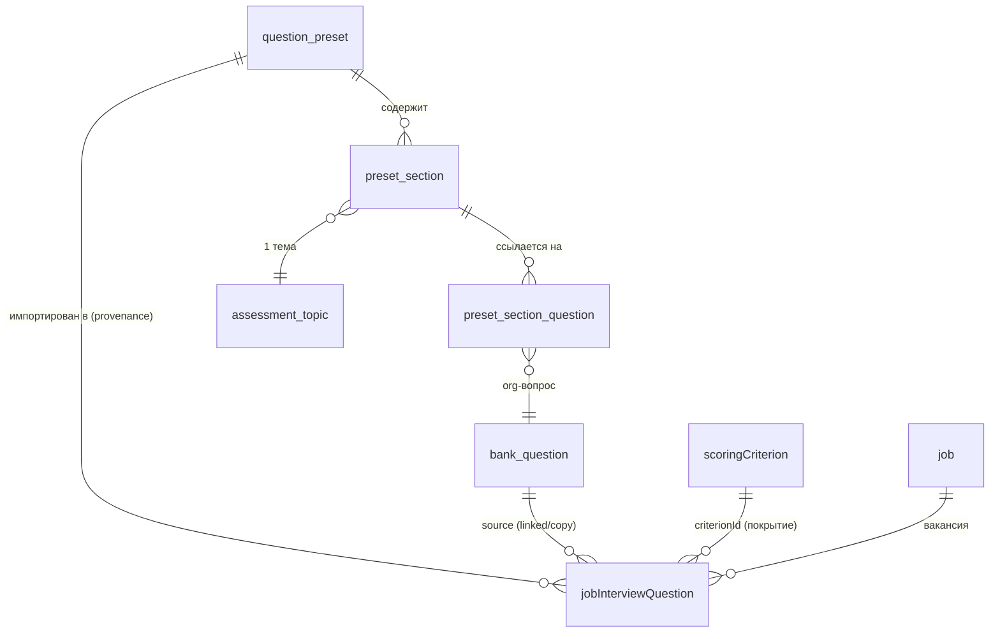
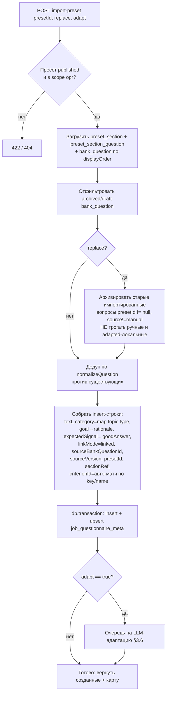
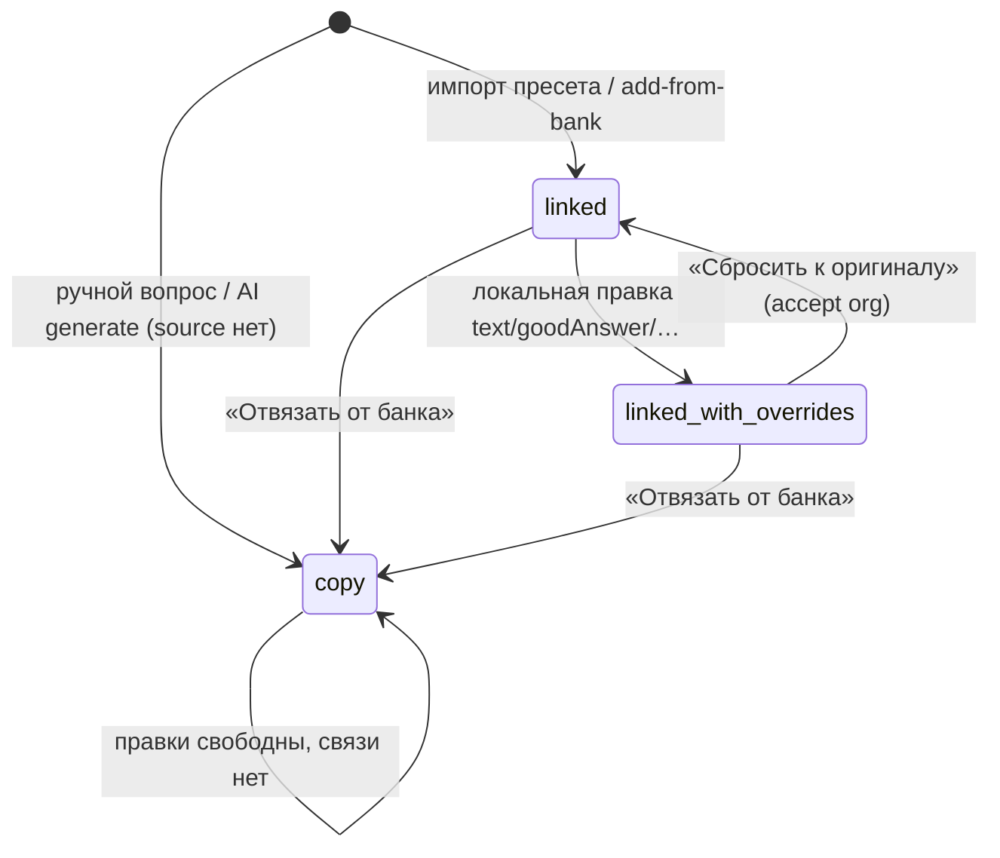
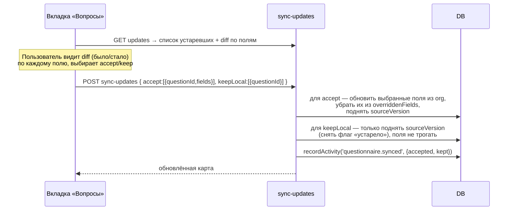

# ТЗ · Спринт 3 · Пресеты опросных карт (org) + Карта вопросов вакансии

> **Часть:** мастер-план `tz-questions-00-master-plan.md`
> **Зависит от:** Спринт 1 (`tz-questions-01-org-bank.md` — `bank_question`, `assessment_topic`, ресурс прав `questionBank`, `normalizeQuestion`); Спринт 2 (`tz-questions-02-care.md` — CARE-структура/`bank_question_probe`) — **опционально** (адаптация красивее с CARE, но работает и без него).
> **Даёт для:** Спринт 4 (`tz-questions-04-candidate-questionnaire.md` — карта вопросов вакансии становится источником повестки персонального опросника; `criterionId` наследуется в приоритеты).
> **Статус:** черновик на согласование

Документ описывает **Спринт 3** целиком: org-уровень пресетов опросных карт,
детерминированный импорт пресета в вакансию, один LLM-проход адаптации под
описание + бриф (расширение существующего генератора), режимы связи «вопрос ↔
org-источник», обработку обновлений org-версии без молчаливой перезаписи и
**матрицу покрытия критериев** (`criterion × question`).

---

## 3.1. Цель

Превратить существующую плоскую вкладку «Вопросы» вакансии
(`jobInterviewQuestion` + `generate.post.ts`) в **инструмент подготовки к
интервью на основе корпоративного стандарта**:

1. **Пресет опросной карты** (org) — переиспользуемый опубликованный шаблон:
   набор разделов (1 тема на раздел) со ссылками на `bank_question`. Собирается
   один раз методологом, тянется в любую вакансию.
2. **Карта вопросов вакансии** — результат импорта пресета в конкретную
   вакансию: разделы разворачиваются в `jobInterviewQuestion` **детерминированно**
   (0 токенов), затем при желании один LLM-проход **адаптирует формулировки под
   описание вакансии + бриф** (расширение `generateInterviewQuestions.ts`).
3. **Связь «вопрос ↔ критерий»** (`criterionId` FK на `scoringCriterion`) и
   **матрица покрытия**: какой критерий каким вопросом проверяется, где дыры.
4. **Наследование без сюрпризов**: вопрос вакансии помнит источник
   (`sourceBankQuestionId`), режим связи (`linkMode`) и список переопределённых
   полей (`overriddenFields`). Обновление org-вопроса → индикатор «доступно
   обновление» + diff + accept/keep-local. **Молчаливая перезапись запрещена.**

**Главная ценность:** рекрутёр открывает новую вакансию → «Выбрать пресет» →
получает готовую структурированную карту, привязанную к критериям оценки, с
подсветкой непокрытых критериев. Это фундамент, на который Спринт 4 навесит
персонализацию под кандидата.

**Граница детерминированно/LLM** (мастер-план §6):

| Действие | LLM? | Частота |
|---|---|---|
| Импорт пресета в вакансию (развернуть разделы→вопросы) | Нет (правила) | На вакансию |
| Адаптация карты под бриф+описание | **Да (1 проход)** | На вакансию, по кнопке |
| Добавление вопроса из Банка | Нет | Точечно |
| Синхронизация обновлений org-версии | Нет (diff — детерминированный) | По событию |
| Матрица покрытия | Нет (агрегатный SQL) | На открытие вкладки |

---

## 3.2. Термины

| Термин | Определение |
|---|---|
| **Пресет** (`question_preset`) | Опубликованная опросная карта org-уровня: именованный набор разделов. Версионируемый шаблон для вакансий. |
| **Раздел пресета** (`preset_section`) | Один блок пресета = **одна тема оценки** (`assessment_topic`) + цель + вес + вилка кол-ва вопросов + упорядоченный список ссылок на `bank_question`. |
| **Карта вопросов вакансии** | Материализация пресета в `jobInterviewQuestion` конкретной вакансии (существующая вкладка «Вопросы», расширенная). Не отдельная тяжёлая сущность — расширяем существующую таблицу + лёгкий мета-слой провенанса. |
| **Режим связи** (`linkMode`) | Как вопрос вакансии связан с org-источником: `linked` (живая ссылка, локальных правок нет), `copy` (снимок, связь разорвана), `linked_with_overrides` (ссылка есть, но часть полей переопределена локально). |
| **Переопределение** (`overriddenFields`) | Список полей вопроса вакансии, которые расходятся с org-источником (`['text','goodAnswer']`). Управляет тем, что показывает diff и что защищено от синхронизации. |
| **Матрица покрытия** | Таблица `критерий × вопрос`: какие критерии оценки (`scoringCriterion`) закрыты хотя бы одним вопросом, какие — «дыра» (0 вопросов). |
| **Провенанс** | Происхождение вопроса: из какого пресета (`presetId`), какого раздела (`sectionRef`), какой версии org-вопроса импортирован. |

---

## 3.3. Модель данных

Все новые таблицы — в `server/database/schema/app.ts` (новая секция после
Interview Questions bank, `app.ts:561-602`). Все org-scoped по `organizationId`,
паттерн 1:1 с существующими таблицами (`crypto.randomUUID()` pk, каскад на
`organization`, `created_at`/`updated_at`).

### Обзор новых сущностей



### `question_preset` — пресет опросной карты (org)

```
question_preset
  id              text pk
  organizationId  text notNull FK organization cascade
  code            text            -- "PRESET-0007" (уникален в орг, авто-генерация)
  name            text notNull    -- до 120 симв., "Backend Middle/Senior — стандарт"
  description     text            -- для чего пресет, когда применять
  interviewType   enum notNull    -- interviewStageEnum (БД `interview_stage`, из S1 + `full_cycle`, см. ниже)
  targetRoles     jsonb string[] default '[]'   -- под какие роли (совпадает по смыслу с bank_question.targetRoles)
  seniority       jsonb string[] default '[]'   -- junior|mid|senior|lead (свободный набор)
  isDefault       boolean default false          -- рекомендованный по умолчанию (0..1 на орг)
  status          enum notNull default 'draft'   -- presetStatusEnum: draft|published|archived
  version         int notNull default 1          -- инкремент при публикации новой версии
  ownerId         text FK user set-null
  createdById     text FK user set-null
  publishedAt     timestamp
  publishedById   text FK user set-null
  createdAt, updatedAt
  indexes:
    (organizationId),
    (organizationId, code) unique,
    (status),
    partial-unique (organizationId) where isDefault  -- не более одного isDefault на орг
```

`interviewType` использует **существующий** `interviewStageEnum` (БД-имя
`interview_stage`) из Спринта 1 (`org-bank §1.3`), расширенный значением
`full_cycle`: `screening | recruiter | hiring_manager | final | expert |
full_cycle`. Отдельный enum **не создаём** — значения S3
(`recruiter`/`hiring_manager`) семантически совпадали с этапом интервью S1, два
enum с одной семантикой давали бы путаницу и лишний маппинг.

> **Заметка:** переиспользуем `interview_stage`, отдельный enum убран — см.
> `tz-questions-90-cross-cutting.md §7c`. Значение `full_cycle` добавляется в
> S1-миграции (`0101`) через `ALTER`/расширение enum `interview_stage`; S3 просто
> ссылается на этот enum, своего `CREATE TYPE` для типа пресета не делает.

**Генерация `code`.** `code` — человекочитаемый идентификатор пресета вида
`PRESET-0007`, уникальный в пределах орг (индекс `(organizationId, code) unique`).
Генерируется сервером при создании черновика (клиент не задаёт): берётся текущий
максимальный порядковый номер среди `code` этой орг, инкрементируется, форматируется
с zero-pad (`PRESET-%04d`), присваивается в одной транзакции с insert; при гонке —
повтор на конфликте unique-индекса. Формат согласован с генерацией `bank_question.code`
из S1 (`org-bank §1.3`) — префикс различает сущность (`PRESET-` vs `Q-`).

`presetStatusEnum`: `draft | published | archived`. Тянуть в вакансию можно
**только `published`** (правило импорта, §3.5). Иммутабельность как в Спринте 1:
опубликованный пресет напрямую не редактируется — правка создаёт новую версию
(инкремент `version`, статус нового черновика; предыдущая опубликованная версия
остаётся источником для уже импортированных карт до явной синхронизации).

### `preset_section` — раздел пресета (1 тема)

```
preset_section
  id              text pk
  organizationId  text notNull FK organization cascade
  presetId        text notNull FK question_preset cascade
  topicId         text notNull FK assessment_topic restrict  -- 1 тема на раздел
  title           text notNull    -- отображаемый заголовок раздела (может отличаться от name темы)
  goal            text            -- что этим разделом выясняем в интервью
  weight          int notNull default 50   -- относительная важность раздела 0..100 (как scoringCriterion.weight)
  minQuestions    int default 0   -- минимально желаемое кол-во вопросов раздела (для валидации/подсказок)
  maxQuestions    int default 0   -- 0 = без ограничения
  displayOrder    int notNull default 0
  createdAt, updatedAt
  indexes: (organizationId), (presetId), (topicId)
```

- `topicId` c `onDelete restrict`: нельзя удалить тему, использованную в разделе
  пресета (как `bank_question.primaryTopicId` в Спринте 1, `org-bank §1.3`).
- `weight` — целое 0..100, тот же диапазон, что у `scoringCriterion.weight`
  (`app.ts:1084`), чтобы UI-слайдеры переиспользовались.
- `minQuestions/maxQuestions` — мягкие подсказки для валидации пресета и для
  адаптационного LLM-прохода (сколько вопросов на раздел просить).

### `preset_section_question` — ссылка раздела на вопрос банка

```
preset_section_question
  id              text pk
  organizationId  text notNull FK organization cascade
  sectionId       text notNull FK preset_section cascade
  bankQuestionId  text notNull FK bank_question restrict  -- только published-вопрос банка
  displayOrder    int notNull default 0
  isRequired      boolean default false   -- «ядро» раздела: не отфильтровывается при адаптации/усечении
  createdAt, updatedAt
  indexes:
    (organizationId),
    (sectionId),
    (bankQuestionId),
    (sectionId, bankQuestionId) unique   -- один и тот же вопрос не дублируется в разделе
```

- `bankQuestionId` c `onDelete restrict`: нельзя удалить/жёстко снести
  `bank_question`, на который ссылается пресет (soft-archive допустим — импорт
  отфильтрует архивные, §3.5).
- `isRequired` — вопрос-ядро раздела: детерминированный импорт всегда его тянет;
  адаптационный LLM-проход не имеет права его отбросить (только переформулировать).

### Расширение `jobInterviewQuestion` (существующая, `app.ts:569`)

Добавляем **6 колонок** (все nullable/с дефолтами → безопасно для существующих
строк). Существующие поля (`text`, `category`, `rationale`, `goodAnswer`,
`source`, `displayOrder`, `isArchived`) **не трогаем** — старый контур
(`generate.post.ts`, ручное добавление) работает без изменений.

```
jobInterviewQuestion (ДОБАВЛЯЕМ)
  sourceBankQuestionId  text FK bank_question set-null   -- откуда взят (null = чисто локальный/AI-вопрос)
  linkMode              enum notNull default 'copy'      -- questionLinkModeEnum: linked|copy|linked_with_overrides
  overriddenFields      jsonb string[] default '[]'      -- какие поля расходятся с org-источником
  criterionId           text FK scoring_criterion set-null  -- какой критерий проверяет этот вопрос (матрица покрытия)
  presetId              text FK question_preset set-null    -- provenance: из какого пресета импортирован
  sectionRef            text                                 -- provenance: id раздела пресета (preset_section.id) на момент импорта
  sourceVersion         int                                  -- версия bank_question на момент импорта (для diff обновлений)
```

`questionLinkModeEnum`: `linked | copy | linked_with_overrides`.

Пояснения по семантике (детально — §3.7):

| Поле | Значение |
|---|---|
| `sourceBankQuestionId` | FK на `bank_question`. `set-null`: если org-вопрос физически исчез, вопрос вакансии не удаляется, а «отвязывается» (эффективно становится `copy`). |
| `linkMode` | `copy` по умолчанию — сохраняет обратную совместимость: все текущие строки (AI/manual) без источника логически являются копиями. Импорт проставляет `linked`; локальная правка `linked`-вопроса переводит в `linked_with_overrides`. |
| `overriddenFields` | Подмножество `['text','rationale','goodAnswer','category']`. Пусто ⇔ вопрос дословно повторяет org-источник. Пополняется при правке `linked`/`linked_with_overrides`-вопроса. |
| `criterionId` | FK на `scoringCriterion` **этой же вакансии** (проверка scope на уровне API). `set-null`: удаление критерия обнуляет связь, вопрос остаётся. |
| `presetId` + `sectionRef` | Провенанс для группировки карты по разделам и для UI «этот вопрос из раздела X пресета Y». |
| `sourceVersion` | Снимок `bank_question.version` на момент импорта. Сравнение с текущей версией даёт сигнал «доступно обновление». |

Новые индексы на `jobInterviewQuestion`:
```
  index (source_bank_question_id)   -- обратный поиск «где используется org-вопрос» + sync
  index (criterion_id)              -- агрегаты матрицы покрытия
  index (preset_id)                 -- группировка карты по пресету
```

### Решение по обёртке `job_questionnaire` (обоснование выбора)

Мастер-план (§5, строка 192) помечает `job_questionnaire` как **опциональную**.
**Решение: НЕ заводим тяжёлую сущность `job_questionnaire`.** Обоснование:

- На уровне вакансии **уже есть** носитель карты — `jobInterviewQuestion` (список
  вопросов) + `jobQuestionPrompt` (1:1 к job, `app.ts:589`, хранит инструкцию
  генерации). Отдельная таблица-обёртка задублирует связь `job → набор вопросов`
  и потребует миграции существующих данных.
- «Один опросник на вакансию» (в отличие от «один опросник на **отклик**» в
  Спринте 4, мастер-план §3.7) — обёртка не даёт версионирования, ради которого
  её обычно заводят.

**Что заводим вместо неё** — лёгкий мета-слой провенанса пресета, 1:1 к job:

```
job_questionnaire_meta   -- лёгкий, только провенанс/состояние карты (1:1 к job)
  id              text pk
  organizationId  text notNull FK organization cascade
  jobId           text notNull FK job cascade
  presetId        text FK question_preset set-null   -- какой пресет импортирован (последний)
  presetVersion   int                                 -- версия пресета на момент импорта
  importedAt      timestamp
  importedById    text FK user set-null
  adaptedAt       timestamp                           -- когда прогонялась LLM-адаптация
  adaptationModel text                                -- provider/model адаптации (аудит)
  createdAt, updatedAt
  indexes: (jobId) unique, (organizationId), (presetId)
```

Это переиспользует паттерн `jobQuestionPrompt` (1:1 к job, `uniqueIndex(jobId)`,
`app.ts:600`). Провенанс живёт отдельно от 100500 строк вопросов; сами вопросы
несут свой `presetId`/`sectionRef` для группировки. Обёртка остаётся расширяемой
в Спринте 4 (снимок карты для персонального опросника), если понадобится.

---

## 3.4. Схемы и валидация (Zod)

По образцу `server/utils/schemas/interviewQuestion.ts` и
`server/utils/schemas/scoring.ts`. Новые файлы:

- `server/utils/schemas/questionPreset.ts`:
  - `createPresetSchema` / `updatePresetSchema` (name ≤120, `interviewType` —
    `z.enum` по значениям `interviewStageEnum` S1 + `full_cycle`,
    targetRoles/seniority — `z.array(z.string()).default([])`).
  - `presetSectionSchema` (title, goal, weight 0..100, min/max ≥0, topicId).
  - `presetSectionQuestionSchema` (bankQuestionId, displayOrder, isRequired).
  - `reorderSectionsSchema`, `reorderSectionQuestionsSchema` (по образцу
    `reorderInterviewQuestionsSchema`, `interview-questions/reorder.put.ts:15`).
- `server/utils/schemas/vacancyQuestionnaire.ts`:
  - `importPresetSchema` (`presetId`, `adapt: boolean` — гнать ли LLM-проход,
    `replace: boolean` — заменить существующую карту или дополнить).
  - `addFromBankSchema` (`bankQuestionIds: string[]`, опц. `criterionId`,
    `linkMode` default `linked`).
  - `syncUpdatesSchema` (`accept: [{ questionId, fields: string[] }]`,
    `keepLocal: [{ questionId }]`).
  - `linkCriterionSchema` (`criterionId | null`) — точечная привязка вопроса к
    критерию.

**Блокирующие правила публикации пресета** (по аналогии с публикацией вопроса,
`org-bank §1.4`):
1. `name` непустой, ≤120.
2. ≥1 раздел; в каждом разделе тема в статусе `active`.
3. Каждый раздел ссылается ≥1 на **опубликованный** `bank_question`
   (нельзя опубликовать пресет со ссылкой на черновик/архив банка).
4. `weight` разделов ∈ [0,100]; сумма весов не обязана = 100 (нормируется в UI).

**Предупреждения** (не блокируют): раздел без `goal`; `minQuestions` больше числа
привязанных вопросов; дублирующиеся темы в разных разделах одного пресета.

---

## 3.5. Импорт пресета в вакансию — детерминированный алгоритм (0 LLM)

Развернуть опубликованный пресет в `jobInterviewQuestion` вакансии **без единого
токена**. Логика — в `server/utils/questions/importPreset.ts` (чистая функция +
транзакция), вызывается из `POST .../import-preset` (§3.9).

### Алгоритм



### Правила разворачивания (детерминированные)

1. **Порядок:** разделы по `preset_section.displayOrder`, внутри — вопросы по
   `preset_section_question.displayOrder`. `displayOrder` итогового
   `jobInterviewQuestion` = сквозной сдвиг после текущего max (как
   `generate.post.ts:85`).
2. **Маппинг полей** `bank_question → jobInterviewQuestion`:
   - `text` ← `bank_question.text`.
   - `rationale` ← `bank_question.goal` (или `preset_section.goal` если у вопроса
     пусто).
   - `goodAnswer` ← `bank_question.expectedSignal` (`org-bank §1.3`).
   - `category` ← детерминированный маппинг `assessment_topic.type → interviewQuestionCategoryEnum`
     (таблица ниже; тип категории вакансии из `app.ts:42`).
   - `source` ← `'ai_generated'`? Нет — вводим смысл через `linkMode`; `source`
     оставляем `'manual'` по умолчанию enum, поскольку импорт — не AI-генерация.
     (Детерминированный импорт ≠ AI; `source` остаётся про способ появления
     текста, `linkMode` — про связь с org.)
   - `linkMode` ← `'linked'`, `overriddenFields` ← `[]`.
   - `sourceBankQuestionId`, `sourceVersion` ← `bank_question.id/version`.
   - `presetId`, `sectionRef` ← провенанс.
3. **Маппинг категории** `assessment_topic.type → interview_question_category`:

   | topic.type (Спринт 1) | interview_question_category |
   |---|---|
   | `professional`, `management` | `hard_skill` |
   | `soft_skill` | `soft_skill` |
   | `achievement_scale`, `career_logic` | `experience` |
   | `motivation`, `expectations` | `motivation` |
   | `value`, `culture` | `culture` |
   | `factcheck` | `risk_probe` |
   | `risk_zone` | `risk_probe` |
   | `custom`, прочее | `other` |

4. **Авто-привязка критерия** (`criterionId`): если у вакансии есть
   `scoringCriterion`, детерминированно матчим раздел↔критерий по нормализованному
   совпадению `assessment_topic.name`/`code` с `scoringCriterion.key`/`name`
   (через `normalizeQuestion` из S0, `org-bank §0.4`). Нет уверенного совпадения →
   `criterionId = null` (дыра, подсветится в матрице). **Никаких догадок LLM
   здесь** — только строковый матч.
5. **Дедуп** (`replace=false`): нормализованный `text` уже есть в карте →
   вопрос пропускается (как `generate.post.ts:84-93`), счётчик `skippedDuplicates`.
6. **`replace=true`:** архивируются (`isArchived=true`, не физическое удаление)
   ранее импортированные из пресета вопросы (`presetId IS NOT NULL AND
   source <> 'manual' AND overriddenFields = '[]'`). **Ручные вопросы и вопросы с
   локальными правками не трогаются** — принцип «не терять пользовательскую
   работу молча».
7. **Идемпотентность:** повторный импорт того же пресета без изменений не
   создаёт дублей (дедуп) и не архивирует уже актуальные `linked`-вопросы.
8. **Аудит:** `recordActivity({ resourceType:'jobQuestionnaire', action:'imported',
   resourceId: jobId, metadata:{ presetId, presetVersion, inserted, skipped } })`
   (паттерн `criteria/index.post.ts:53`).

**0 токенов** — весь §3.5 работает на SQL + чистых функциях.

---

## 3.6. Адаптация карты под бриф + описание — LLM-проход (расширение генератора)

Один осмысленный LLM-проход, переиспользующий существующую инфраструктуру
`generateInterviewQuestions.ts` (`server/utils/ai/generateInterviewQuestions.ts:71`)
и способ прокидывания брифа из `generate.post.ts:45-77`.

### Как бриф уже прокидывается (ground truth)

`generate.post.ts` уже загружает бриф и передаёт его в генератор:

```
generate.post.ts:45-47   → db.query.jobBrief.findFirst({ jobId, organizationId })
generate.post.ts:63-74   → brief: { hardMustHave, niceToHave, dealBreakers,
                            redFlagsToWatch, responsibilities, idealProfile,
                            teamContext, freeform }
generateInterviewQuestions.ts:52-65 → buildBriefBlock() собирает <бриф>…</бриф>
generateInterviewQuestions.ts:100    → блок вклеивается в prompt
```

Sprint 3 **не переписывает** этот механизм, а **добавляет режим адаптации**:
вместо генерации «с нуля» LLM получает **уже импортированные вопросы карты** и
переформулирует их под конкретную вакансию, сохраняя смысл и провенанс.

### Новая функция `adaptQuestionsToVacancy`

`server/utils/ai/adaptInterviewQuestions.ts` (по образцу
`generateInterviewQuestions.ts`, та же `loadAiConfig(orgId,{purpose:'analysis'})`,
те же `.catch().default()` + `wrapBareArray`-гарды):

- **Вход:** `{ jobTitle, jobDescription, brief, sections: [{ topicName, goal,
  questions: [{ id, text, isRequired }] }] }`.
- **Задача LLM:** для каждого вопроса вернуть `adaptedText` (переформулировка под
  контекст вакансии) + опц. уточнённый `goodAnswer`/`rationale`. **Запрещено:**
  удалять `isRequired`-вопросы, менять тему/категорию, изобретать требования
  вне брифа/описания (те же правила, что `generateInterviewQuestions.ts:92-99`).
- **Схема ответа** (устойчивая): `{ adapted: [{ sourceId, text, goodAnswer?,
  rationale? }] }` с `.catch()`-дефолтами; `wrapBareArray: items => ({ adapted: items })`.
- **Выход:** map `sourceId → adaptedFields`.

### Применение результата (идемпотентно, без потери ручного)

Логика в `server/utils/questions/applyAdaptation.ts`:

1. Матчинг по `sourceId` (id `jobInterviewQuestion`).
2. **Дедуп по нормализованному тексту** (`normalizeQuestion`): если адаптация
   выдала текст, дублирующий другой вопрос карты — пропуск.
3. **Сохранение ручного/отредактированного:** вопрос с `linkMode='copy'` или с
   `overriddenFields`, содержащими `'text'`, **не перезаписывается** адаптацией
   (человек уже вложился). `linked`-вопросы обновляются; их `linkMode` остаётся
   `linked` (адаптация — это «улучшенный импорт под вакансию», а не локальная
   ручная правка), но `job_questionnaire_meta.adaptedAt` фиксируется.
4. Идемпотентность: повторный прогон адаптации на уже адаптированной карте не
   создаёт дублей и не «дрейфует» бесконечно (дедуп + сравнение с текущим текстом,
   запись только при реальном изменении).
5. Rate-limit 10/мин (как `generate.post.ts:10-14`).

### Развилка «адаптация ↔ generate»

Существующий `POST .../generate` **остаётся** для генерации вопросов с нуля/поверх
(его не ломаем). Адаптация карты доступна двумя путями:
- флаг `adapt:true` в `import-preset` (импорт + сразу адаптация);
- отдельная кнопка «Адаптировать под вакансию» на вкладке → `POST
  .../adapt-questionnaire` (адаптация текущей карты без переимпорта).

---

## 3.7. Режимы связи + обработка обновлений org-версии

### Диаграмма переходов режимов связи



- **`linked`** — вопрос дословно повторяет org-источник. Правка любого из полей
  `text/rationale/goodAnswer/category` → поле добавляется в `overriddenFields`,
  `linkMode → linked_with_overrides`. (Реализуется в
  `[questionId].patch.ts`: логика рядом с существующим переключением
  `source → 'edited'`, `[questionId].patch.ts:30-33`.)
- **`linked_with_overrides`** — часть полей локальна, часть наследуется. Diff
  показывает только ненаследуемые (неоверрайд) поля.
- **`copy`** — связь разорвана (по кнопке «Отвязать» или авто-`set-null` при
  исчезновении источника). Обновления org не предлагаются.

### Обнаружение «доступно обновление»

Детерминированно, без LLM. Вопрос помечается «устарел», если:
```
linkMode IN ('linked','linked_with_overrides')
AND sourceBankQuestionId IS NOT NULL
AND bank_question.version > jobInterviewQuestion.sourceVersion
```
Агрегат считается в `GET .../coverage-matrix` (или отдельном `GET
.../updates`), возвращает список `{ questionId, sourceBankQuestionId,
fromVersion, toVersion, changedFields }`. `changedFields` — детерминированное
пофайловое сравнение текущего `bank_question` со снимком (сравниваем
`text/goal/expectedSignal` org-версии с тем, что в вопросе; для
`linked_with_overrides` — только ненаследуемые поля предлагаются к обновлению).

### Синхронизация — запрет молчаливой перезаписи (Definition of Done)

`POST .../sync-updates` принимает **явное решение по каждому вопросу/полю**:



Правила:
- **Никакой автоперезаписи.** Обновление применяется **только** к полям, явно
  перечисленным в `accept[].fields`.
- `keepLocal` не меняет содержимое, но поднимает `sourceVersion` до текущей →
  вопрос перестаёт мигать «устарел» (пользователь осознанно оставил своё).
- Принятие поля, которое было в `overriddenFields`, убирает его из override
  (поле снова наследуется); если override опустел → `linkMode → linked`.
- Каждая синхронизация пишется в аудит (`recordActivity`, паттерн
  `criteria/index.post.ts:53`) для трассируемости решений.

---

## 3.8. Матрица покрытия критериев — API + UI

### Идея

Пересечение двух списков вакансии: `scoringCriterion` (строки) × привязанные
`jobInterviewQuestion.criterionId` (ячейки). Показывает, **какой критерий каким
вопросом проверяется** и где **дыры** (критерий без единого вопроса).

### API — `GET /api/jobs/[id]/interview-questions/coverage-matrix`

Права: `job:['read']` (чтение карты) — согласовано с
`interview-questions/index.get.ts:11`. Возвращает агрегат (детерминированный SQL,
0 LLM):

```jsonc
{
  "criteria": [
    { "id":"cr_1","key":"backend_depth","name":"Глубина backend",
      "weight":80,"questionCount":3,
      "questionIds":["q1","q2","q7"] }
  ],
  "uncovered": [ { "id":"cr_5","key":"leadership","name":"Лидерство","weight":40 } ],
  "unlinkedQuestions": [ { "id":"q9","text":"…" } ],  // вопросы без criterionId
  "updatesAvailable": [ { "questionId":"q2","toVersion":4 } ], // из §3.7
  "hasCriteria": true
}
```

- `LEFT JOIN scoringCriterion ← jobInterviewQuestion ON criterionId`,
  агрегируем `count`/`array_agg` по критерию; строго org+job-scoped (оба условия
  в `WHERE`, как во всех хендлерах, напр. `criteria/index.get.ts:29-32`).
- `uncovered` = критерии с `questionCount = 0`.
- `unlinkedQuestions` = активные вопросы с `criterionId IS NULL`.

### Graceful empty-state (нет критериев у вакансии)

Если `scoringCriterion` вакансии пуст → `hasCriteria:false`, `criteria:[]`. UI
**не показывает пустую сетку**, а показывает активную заготовку (паттерн пустых
состояний Спринта 1, `org-bank §1.8`): «У вакансии ещё нет критериев оценки.
Матрица покрытия появится, когда критерии будут заданы» + кнопка **«Сгенерировать
критерии»**, ведущая на существующий поток `POST /api/jobs/[id]/criteria/generate`
(`criteria/generate.post.ts`) / вкладку AI-анализа. Никаких падений и пустых
таблиц.

### UI матрицы

- `UiCard` с компактной таблицей: строки — критерии (бейдж веса), ячейка —
  число покрывающих вопросов; клик по строке раскрывает вопросы.
- **Дыры подсвечены** `UiBadge tone="danger"` («Не покрыт»); слабое покрытие
  (1 вопрос) — `tone="warning"`; ok — `tone="success"`.
- Строка «Без привязки» для `unlinkedQuestions` с быстрым `UiSelect` привязки к
  критерию (`POST .../[questionId]/link-criterion`).

---

## 3.9. API endpoints

Соглашения проекта во всех хендлерах: `requirePermission` + скоуп по
`session.session.activeOrganizationId` + `requireJobInScope` для job-роутов
(`interview-questions/index.get.ts:11-15`), org+job в каждом `WHERE`, Zod-валидация
входа, `recordActivity` на мутациях.

### Пресеты (org) — `server/api/question-bank/presets/`

Ресурс прав — `questionBank` (заведён в Спринте 0, `org-bank §0.3`).

| Метод / путь | Право | Назначение |
|---|---|---|
| `GET    /api/question-bank/presets` | `questionBank:['view']` | Каталог (фильтры: `interviewType`, `status`, `targetRole`, `search`; превью структуры) |
| `POST   /api/question-bank/presets` | `questionBank:['create_draft']` | Создать черновик пресета |
| `GET    /api/question-bank/presets/[id]` | `questionBank:['view']` | Детально: разделы + вопросы + счётчики + превью |
| `PATCH  /api/question-bank/presets/[id]` | `questionBank:['edit_draft']` | Правка черновика (метаданные) |
| `POST   /api/question-bank/presets/[id]/publish` | `questionBank:['publish']` | Публикация (валидация §3.4; инкремент `version`) |
| `POST   /api/question-bank/presets/[id]/archive` | `questionBank:['archive']` | Soft-архив (с проверкой: не рвём импортированные карты — предупреждение) |
| `PUT    /api/question-bank/presets/[id]/sections` | `questionBank:['edit_draft']` | Bulk-замена разделов (по образцу bulk-anchors, `org-bank §1.6`) |
| `PUT    /api/question-bank/presets/[id]/sections/[sectionId]/questions` | `questionBank:['edit_draft']` | Bulk-замена ссылок раздела на вопросы банка |
| `PUT    /api/question-bank/presets/[id]/reorder` | `questionBank:['edit_draft']` | Порядок разделов (reorder-паттерн `reorder.put.ts`) |

> Публиковать/архивировать — только `publish`/`archive` (owner/admin по раскладке
> Спринта 1, `org-bank §1.7`). `member` создаёт/редактирует свои черновики.

**Пагинация GET-списков.** `GET /api/question-bank/presets` (каталог) — как и
прочие листинг-эндпоинты — поддерживает пагинацию `limit`/`offset` (дефолтный
`limit = 50`, максимальный `limit = 100`; при превышении — усечение до max) поверх
фильтров (`interviewType`, `status`, `targetRole`, `search`). Ответ возвращает
`{ items, total, limit, offset }`. Общий контракт пагинации — см.
`tz-questions-90-cross-cutting.md §11a`.

### Вакансия — `server/api/jobs/[id]/interview-questions/`

Мутации карты вакансии — право `job:['update']` (как весь существующий контур
вопросов, `index.post.ts:11`, `[questionId].patch.ts:12`, `reorder.put.ts:10`).
Чтение — `job:['read']`.

| Метод / путь | Право | Назначение |
|---|---|---|
| `POST   .../import-preset` | `job:['update']` | Детерминированный импорт пресета (§3.5); опц. `adapt`, `replace` |
| `POST   .../add-from-bank` | `job:['update']` | Добавить выбранные `bank_question` в карту (`linkMode='linked'`, дедуп) |
| `POST   .../adapt-questionnaire` | `job:['update']` + rate-limit | LLM-адаптация текущей карты под бриф+описание (§3.6) |
| `GET    .../coverage-matrix` | `job:['read']` | Матрица покрытия + `uncovered` + `updatesAvailable` (§3.8) |
| `GET    .../updates` | `job:['read']` | Список устаревших вопросов + diff по полям (§3.7) |
| `POST   .../sync-updates` | `job:['update']` | Применить accept/keep-local (§3.7, запрет молчаливой перезаписи) |
| `POST   .../[questionId]/link-criterion` | `job:['update']` | Привязать/отвязать `criterionId` (валидация: критерий той же вакансии) |
| `POST   .../[questionId]/unlink-source` | `job:['update']` | `linkMode → copy` (разорвать связь с банком) |

**Reuse:** существующий `POST .../generate` (`generate.post.ts`) не меняется — он
остаётся генерацией «с нуля». Адаптация — новый режим (§3.6), не конфликтует.

**Права — сводка Спринта 3:**
- Пресеты (org) → ресурс `questionBank` (`view`/`create_draft`/`edit_draft`/
  `publish`/`archive`).
- Мутации вопросов вакансии → `job:['update']`; чтение карты/матрицы →
  `job:['read']` (полная сводка прав — в `tz-questions-90-cross-cutting.md`).

---

## 3.10. UI

> **Design-system (обязательно, мастер-план §3.10):** только `Ui*`
> (`app/components/ui/`: `UiButton`, `UiInput`, `UiSelect`, `UiBadge`, `UiCard`,
> `UiModal`, `UiDrawer`, `UiSegmented`); табы `DetailTabs.vue`; тосты `useToast()`;
> подтверждения `useConfirm()`; токены `app/design/tokens.ts`. Reorder — нативный
> HTML5 DnD (паттерн `PropertySchemaEditor.vue:234-238`), сторонних DnD-библиотек
> в проекте нет. Никакого сырого `<button>`/`<input>` с инлайн-Tailwind.
> `UiBadge` tones: `neutral|brand|success|warning|danger|info|accent`
> (`UiBadge.vue:27`).

### Каталог пресетов (org)

Живёт в разделе **Настройки → Банк вопросов** (Спринт 1, `org-bank §1.8`), новый
подраздел **«Пресеты карт»** (`DetailTabs` рядом с «Вопросы»/«Темы»/«Методология
CARE»).

- `app/pages/dashboard/settings/question-bank/presets/index.vue` — каталог:
  плитки `UiCard` (или таблица через `UiSegmented` вид «Плитки/Таблица»). На
  карточке: имя, `interviewType`-бейдж, targetRoles, число разделов/вопросов,
  статус (`UiBadge`: draft/published/archived), пометка `isDefault`
  («Рекомендованный»), кнопка **«Использовать»** (открывает выбор вакансии или
  копирует presetId для импорта).
- `presets/[id].vue` — редактор пресета: список разделов (DnD-reorder), внутри
  раздела — выбор темы (`UiSelect` из `assessment_topic`), заголовок/цель/вес
  (`UiInput`/слайдер), вилка `min/max`, drawer «Добавить вопросы из банка»
  (поиск/фильтры по `bank_question`, чекбоксы, `isRequired`-тумблер). Публикация/
  архив — `UiButton` + `useConfirm`. **Превью структуры** — свёрнутый предпросмотр
  «как карта развернётся в вакансии».

### Вкладка вакансии «Вопросы» — усиления

Файл `app/pages/dashboard/jobs/[id]/questions.vue` (существующий, `:1-239`) —
дополняем **поверх** текущего UX (промпт-генерация, инлайн-правка, архив
остаются). Добавляем панель действий над списком:

- **«Выбрать пресет»** — `UiModal`/`UiDrawer` с каталогом опубликованных пресетов
  (превью + «Импортировать»); тумблеры `adapt` («Адаптировать под вакансию») и
  `replace` («Заменить текущие»).
- **«Добавить из Банка»** — `UiDrawer` с поиском по `bank_question` (фильтры:
  тема/тип/тег), мультивыбор, опц. привязка `criterionId` при добавлении.
- **«Синхронизировать»** — виден, когда `updatesAvailable.length > 0`; открывает
  **diff-модалку** (`UiModal`): по каждому устаревшему вопросу — было/стало по
  полям, чекбоксы accept, «Оставить своё» (§3.7). Никакой автоперезаписи.
- **«Адаптировать под вакансию»** — прогон LLM-адаптации текущей карты (§3.6),
  `UiButton :loading`, тост с числом обновлённых.
- **Матрица покрытия** — `UiCard` с таблицей (§3.8); дыры `UiBadge tone="danger"`;
  empty-state со «Сгенерировать критерии».

Бейджи режима связи на каждом вопросе (`UiBadge`):

| linkMode | Подпись | tone |
|---|---|---|
| `linked` | «Связан» | `info` |
| `copy` | «Копия» | `neutral` |
| `linked_with_overrides` | «С переопределениями» | `warning` |
| (устарел) | «Доступно обновление» | `danger` (dot/точка рядом со «Связан») |

Группировка списка — по разделам пресета (`presetId`/`sectionRef`), при их
отсутствии — существующая группировка по `category` (`questions.vue:62-68`).
Провенанс-подпись под вопросом: «Из пресета „…“ · раздел „…“».

### Composables

- `app/composables/useQuestionPresets.ts` — каталог/CRUD пресетов, разделы,
  публикация/архив (паттерн `useBankQuestions.ts` из Спринта 1).
- Расширить `app/composables/useInterviewQuestions.ts` (`:24-92`):
  `importPreset()`, `addFromBank()`, `adaptQuestionnaire()`, `coverageMatrix()`,
  `updates()`, `syncUpdates()`, `linkCriterion()`, `unlinkSource()` — все через
  тот же `guard()` (`useInterviewQuestions.ts:46-54`) и `refresh()`.
- `criterionId`, `linkMode`, `overriddenFields`, `presetId`, `sectionRef`,
  `sourceVersion` добавить в тип `InterviewQuestion`
  (`useInterviewQuestions.ts:7-19`).

### UX-детали

- Оптимистичные мутации с откатом + `toast.error` (как весь текущий контур,
  `questions.vue:83`).
- Diff-модалка: моноширинный «было/стало», зелёное/красное подсвечивание, ничего
  не применяется без явного чекбокса.
- Пустые состояния — активные заготовки (каталог пресетов пуст → «Создайте первый
  пресет из вопросов банка»; матрица без критериев → см. §3.8).

---

## 3.11. i18n

Единственная локаль — `i18n/locales/ru.json`. Новые блоки:
- `settings.questionBank.presets.*` — каталог/редактор пресетов.
- `dashboard.jobs.questions.presets.*`, `.coverage.*`, `.sync.*`, `.linkMode.*`
  (подписи «Связан/Копия/С переопределениями/Доступно обновление»),
  `.addFromBank.*`, `.adapt.*` — усиления вкладки вакансии.
- Вкладка вакансии переиспользует существующий блок
  `dashboard.jobs.questions.*` (`questions.vue`), дополняя его.

---

## 3.12. Миграция

`server/database/migrations/0103_question_presets.sql` (следующий индекс:
последняя применённая — `0100_candidate_created_by`; Спринт 1 занимает `0101`,
Спринт 2 — `0102`, Спринт 3 — **`0103`**) + запись в
`server/database/migrations/meta/_journal.json` (idx 103, `version "7"`,
`when` = epoch ms, `tag: "0103_question_presets"`, `breakpoints: true`) — по
образцу текущего журнала (`_journal.json`, idx 100).

Содержимое миграции (конвенции проекта — идемпотентные гарды, как в
`0085_interview_questions.sql`):

1. **Enums** (`DO $$ BEGIN CREATE TYPE … EXCEPTION WHEN duplicate_object THEN null`):
   `preset_status`, `question_link_mode`. **Не создаём** `preset_interview_type` —
   поле `interviewType` использует существующий `interview_stage` (S1). Значение
   `full_cycle` добавляется в S1-миграции `0101` (расширение enum `interview_stage`);
   S3 лишь ссылается на этот тип (см. `tz-questions-90-cross-cutting.md §7c`).
2. **Новые таблицы** (`CREATE TABLE IF NOT EXISTS`): `question_preset`,
   `preset_section`, `preset_section_question`, `job_questionnaire_meta` — с FK
   (`DO $$ … ADD CONSTRAINT … EXCEPTION WHEN duplicate_object`), партиал-уникальным
   индексом `isDefault` на орг, прочими индексами (§3.3).
3. **`ALTER TABLE job_interview_question`** — добавить 6 колонок
   (`ADD COLUMN IF NOT EXISTS`): `source_bank_question_id`, `link_mode`
   (DEFAULT `'copy'` NOT NULL — безопасно для существующих строк),
   `overridden_fields` (jsonb DEFAULT `'[]'`), `criterion_id`, `preset_id`,
   `section_ref`, `source_version` + FK на `bank_question`/`scoring_criterion`/
   `question_preset` (все `ON DELETE set null`) + 3 индекса.
4. `--> statement-breakpoint` между всеми операторами.
5. Реэкспорт новых таблиц/enums в `server/database/schema/index.ts`; drizzle-
   relations для `question_preset`/`preset_section`/`preset_section_question`
   (по образцу `scoringCriterionRelations`, `app.ts:1271`).

> Порядок: править `app.ts`, затем `drizzle-kit generate` (конвенция проекта),
> ревью сгенерированного SQL + записи журнала.

### Backfill существующих данных

S3 добавляет 6 колонок в `jobInterviewQuestion` (`sourceBankQuestionId`, `linkMode`,
`overriddenFields`, `criterionId`, `presetId`, `sectionRef`, а также `sourceVersion`).
Существующие строки — вопросы вакансий, созданные **до** банка (AI-генерация/ручные).
Решение по ним:

- **Оставляем как есть — standalone-копии.** Миграция проставляет только дефолты:
  `linkMode = 'copy'` (DEFAULT NOT NULL), `overriddenFields = '[]'`,
  `sourceBankQuestionId = NULL`, `criterionId = NULL`, `presetId = NULL`,
  `sectionRef = NULL`, `sourceVersion = NULL`. Логически это корректно: вопрос без
  org-источника — копия, что совпадает с семантикой `copy` (§3.7).
- **Автоматически к банку НЕ привязываем.** Надёжного матчинга «старый вопрос ↔
  `bank_question`» нет (тексты могли расходиться, банк мог не содержать аналога);
  автоматическая привязка создала бы ложные `linked`-связи и риск молчаливой
  перезаписи при синхронизации. Принцип «не терять/не искажать пользовательскую
  работу» (§3.5 п.6, §3.7).
- **Опционально later — обратный поток.** Ручная кнопка «Предложить в банк»
  (рекрутёр осознанно продвигает удачный вопрос вакансии в `bank_question`) —
  обратный поток, не входит в scope S3, фиксируется как расширение.
- **Отдельный data-backfill не требуется.** Достаточно дефолтов миграции
  (`ADD COLUMN … DEFAULT …`); отдельный `UPDATE`-скрипт по строкам не нужен.

---

## 3.13. Тесты

- **Unit — детерминизм импорта** (`importPreset.ts`): один и тот же пресет →
  идентичный набор `jobInterviewQuestion` (порядок, маппинг категории,
  provenance); повторный импорт без изменений не создаёт дублей; `replace=true`
  не трогает ручные/оверрайд-вопросы.
- **Unit — маппинг** `topic.type → category` (все ветки таблицы §3.5).
- **Unit — матрица покрытия**: `uncovered` при 0 вопросов на критерий;
  `unlinkedQuestions` при `criterionId=null`; `hasCriteria=false` на пустых
  критериях (empty-state).
- **Unit — sync diff** (§3.7): «доступно обновление» только при `version >
  sourceVersion` и `linkMode ∈ {linked, linked_with_overrides}`; `accept`
  меняет только выбранные поля и чистит `overriddenFields`; `keepLocal`
  поднимает `sourceVersion`, не трогая контент; **нет пути молчаливой
  перезаписи** (тест: без accept поле не меняется).
- **Unit — адаптация идемпотентна** (`applyAdaptation.ts`): дедуп по
  `normalizeQuestion`; `copy`/оверрайд-вопросы не перезаписываются.
- **Integration — публикация пресета** блокируется без разделов / со ссылкой на
  неопубликованный `bank_question` / с темой не `active` (§3.4).
- **Integration — link-criterion** отвергает `criterionId` из чужой вакансии.
- **Изоляция тенантов:** каталог пресетов, импорт, матрица покрытия, sync — ни
  один агрегат/список не течёт между организациями (org в каждом `WHERE`; особый
  контроль над агрегатным SQL матрицы, мастер-план §7.2).

---

## 3.14. Критерии готовности Спринта 3

- `question_preset` / `preset_section` / `preset_section_question` +
  `job_questionnaire_meta` заведены; `jobInterviewQuestion` расширена 6 полями;
  миграция `0103` применяется, существующий контур вопросов не сломан.
- Пресеты (org): CRUD черновиков, bulk-разделы/вопросы, публикация с валидацией,
  soft-архив, каталог с превью; права на `questionBank` разложены.
- **Детерминированный импорт** пресета в вакансию (0 токенов): разворачивает
  разделы→вопросы с `linkMode='linked'`, provenance, авто-матч `criterionId`;
  идемпотентен; `replace` бережёт ручное.
- **LLM-адаптация** карты под бриф+описание (расширение генератора, 1 проход):
  переиспользует прокидывание брифа (`generate.post.ts:45-77`), идемпотентна,
  не перезаписывает ручное/оверрайд.
- **Режимы связи** работают; обновление org-версии даёт индикатор + diff +
  accept/keep-local; **молчаливой перезаписи нет** (в DoD); синхронизация в аудите.
- **Матрица покрытия** (`criterion × question`) с подсветкой дыр и graceful
  empty-state (нет критериев → предложить сгенерировать).
- UI на `Ui*`: каталог пресетов, усиленная вкладка «Вопросы» (пресет/из банка/
  синхронизация/матрица/бейджи режима/diff-модалка); reorder — нативный DnD.
- i18n-подписи заведены; тесты (детерминизм импорта, матрица, sync diff,
  изоляция тенантов) зелёные.
