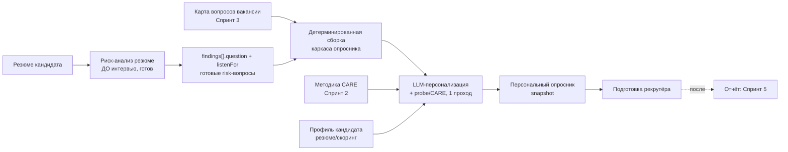

# ТЗ · Спринт 4 · Персональный опросник под кандидата (ядро ценности)

> **Часть:** мастер-план `tz-questions-00-master-plan.md`
> **Зависит от:** Спринт 1 (банк вопросов + BARS), Спринт 2 (методика CARE + промпт персонализации), Спринт 3 (карта вопросов вакансии); риск-движок (`resumeRisk`, уже готов)
> **Даёт для:** Спринт 5 (отчёт по интервью использует опросник + `answerNote`)
> **Статус:** черновик на согласование

Это **центральный спринт продукта**. Здесь рождается артефакт, ради которого строится
весь модуль: **персонализированный опросник под конкретного кандидата** с CARE/probe
структурой (образец — референс «Вопросы к интервью с коммерсом»), который рекрутёр
берёт на HR-интервью.

---

## 1. Цель и место в процессе

### 1.1. Цель
Собрать под конкретный отклик целевой опросник: релевантные вопросы вакансии
(из карты вакансии, Спринт 3) + **верификационные вопросы под выявленные риски
резюме** (из риск-движка), персонализированные под опыт кандидата, со структурой
**CARE + от общего к частному** и probe-уточнениями. Рекрутёр приходит на интервью,
зная **куда копнуть глубже** и **что верифицировать**.

### 1.2. Направление процесса (КРИТИЧНО — не перепутать)

Риски и опросник — **ДО** интервью. Отчёт — **ПОСЛЕ** (Спринт 5).



**Правило для разработчика:** генерация опросника **не** зависит от отчёта и **не**
дожидается интервью. Отчёт (Спринт 5) — потребитель опросника, не наоборот.

---

## 2. Что уже реализовано (строим поверх)

| Компонент | Статус | Где |
|---|---|---|
| Таблицы набора | Есть, **плоские** | `applicationQuestionSet` `app.ts:1965`, `applicationQuestionItem` `app.ts:1980` |
| Детерминированная сборка | Есть, **без LLM** | `server/utils/risk/buildCandidateQuestions.ts` (`assembleCandidateQuestions:50`) |
| Endpoint генерации | Есть | `server/api/applications/[id]/question-set/generate.post.ts` (0 LLM) |
| CRUD item'ов | Есть | `question-set/items/*` |
| UI набора | Есть, простой | `app/components/application/QuestionSet.vue`, `QuestionSetItem.vue` |
| Composable | Есть | `app/composables/useCandidateQuestions.ts` |
| Risk-вопросы | Есть, готовы | `resumeRisk.findingsJson.findings[].question/listenFor` (`assessRisk.ts:31-32`) |

**Что добавляем в Спринте 4:**
1. **probe/CARE-структуру** (вложенные уточнения) — расширяем `applicationQuestionItem`.
2. **LLM-персонализацию формулировок** поверх детерминированного каркаса — новый util.
3. **Приоритеты** (`must_ask/should_ask/optional`) и **бюджет интервью**.
4. **Snapshot-иммутабельность** + версионирование + баннер «данные устарели».
5. **Богатый UI** опросника (группировка, probe, экспорт) на `Ui*`.

> **Совместимость:** детерминированная сборка остаётся ядром (дёшево, воспроизводимо,
> risk-вопросы — 0 токенов). LLM-персонализация — **опциональный проход поверх**
> (кнопка «Персонализировать»), с graceful-деградацией до каркаса при отказе LLM.

---

## 3. Термины

| Термин | Определение |
|---|---|
| Опросник (question set) | Персональный набор вопросов под отклик (1 активный на отклик) |
| Item (вопрос опросника) | Основной вопрос; может иметь дочерние probe |
| Probe | Уточнение внутри элемента CARE (Context/Action/Result/Evaluate) |
| Origin | Источник вопроса: `from_job_bank` \| `risk_derived` \| `manual` \| `personalized` |
| Priority | `must_ask` \| `should_ask` \| `optional` |
| Snapshot | Иммутабельный слепок опросника на момент подтверждения |
| Каркас | Детерминированно собранный набор до LLM-персонализации |
| Персонализация | LLM-проход: адаптация формулировок под опыт кандидата + probe по CARE |

---

## 4. Модель данных

### 4.1. Расширение `applicationQuestionItem` (probe/CARE + приоритеты)

Текущие поля (`app.ts:1980-1999`): `text, listenFor, category, origin, sourceRef,
rationale, askStatus, answerNote, displayOrder`. **Добавляем:**

```
applicationQuestionItem  (расширение)
  parentItemId    text FK application_question_item set-null  -- probe → родительский item; null = основной вопрос
  careElement     enum careElementEnum nullable  -- для probe: context|action|result|evaluate; null у основного
  priority        enum itemPriorityEnum default 'should_ask'  -- must_ask|should_ask|optional
  topicId         text FK assessment_topic set-null  -- тема оценки (для группировки/BARS в отчёте)
  scaleId         text FK assessment_scale set-null  -- шкала интерпретации (наследуется из темы/вопроса)
  expectedEvidence jsonb string[] default '[]'  -- ожидаемые свидетельства
  greenFlags      jsonb string[] default '[]'
  redFlags        jsonb string[] default '[]'
  isPersonalized  boolean default false  -- прошёл ли LLM-персонализацию
  originalText    text  -- исходная формулировка до персонализации (для отката/diff)
  indexes: + (parentItemId)
```

`careElementEnum` — переиспользуем из Спринта 1 (`context|action|result|evaluate`).
`itemPriorityEnum` (новый): `must_ask | should_ask | optional`.

`origin` — расширяем существующий `candidateQuestionOriginEnum` значением
`personalized` (был `from_job_bank|risk_derived|manual`). Миграция enum — добавление
значения (`ALTER TYPE … ADD VALUE`).

> **Модель probe:** probe хранятся как дочерние `applicationQuestionItem` с
> `parentItemId` + `careElement`. Это соответствует решению Спринта 1 (probe —
> отдельная гибкая сущность). Основной вопрос: `parentItemId = null`,
> `careElement = null`. Сортировка: основные по `displayOrder`, probe внутри
> родителя по `displayOrder` + порядок CARE (context→action→result→evaluate).

### 4.2. Расширение `applicationQuestionSet` (snapshot/версии)

Текущие поля (`app.ts:1965-1978`): `status(draft|ready), basedOnResumeRiskId,
generatedAt, createdById`. **Добавляем:**

```
applicationQuestionSet  (расширение)
  version         int notNull default 1        -- номер версии опросника
  isSnapshot      boolean default false        -- подтверждённый иммутабельный слепок
  confirmedAt     timestamp                    -- когда подтверждён (snapshot)
  confirmedById   text FK user set-null
  sourceSnapshot  jsonb                        -- что видел генератор (см. ниже)
  personalizedAt  timestamp                    -- когда прошла LLM-персонализация
  personalizeModel text                        -- модель персонализации (аудит)
  isStale         boolean default false        -- источники обновились после генерации
  budgetMax       int default 15               -- бюджет интервью (макс. основных вопросов)
```

**`sourceSnapshot` (jsonb)** — трассировка воспроизводимости:
```json
{
  "resumeRiskId": "…", "resumeVersionId": "…", "resumeContentHash": "…",
  "jobQuestionsHash": "…",        // хэш карты вопросов вакансии на момент генерации
  "careMethodologyVersion": 3,    // версия методики CARE (Спринт 2)
  "personalizePromptVersion": 2,  // версия промпта персонализации (care_prompt)
  "model": "…", "provider": "…", "generatedAt": "ISO"
}
```

**Версионирование:**
- Обычный `generate`/`regenerate` работает с **черновой** версией (`isSnapshot=false`),
  сохраняя ручное (как сейчас, `generate.post.ts:94-105`).
- **Подтверждение** («Зафиксировать опросник»): создаёт snapshot (`isSnapshot=true`,
  `confirmedAt`), копирует items как иммутабельные. Последующий regenerate создаёт
  **новую версию** (`version+1`, `isSnapshot=false`), не трогая snapshot.
- **`isStale`**: фоновая/ленивая проверка — если `resumeRisk.contentHash`, карта
  вопросов вакансии или версия методики изменились после `generatedAt` → `isStale=true`
  → UI показывает баннер «Данные обновились → перегенерировать» (см. §8).

---

## 5. Сборка каркаса (детерминированно, расширяем существующее)

Файл `server/utils/risk/buildCandidateQuestions.ts` (`assembleCandidateQuestions:50`)
расширяем. Остаётся **без LLM**.

### 5.1. Источники
1. **Карта вопросов вакансии** (Спринт 3): `jobInterviewQuestion` (не архивные), с
   `topicId`/`criterionId`/`scaleIdOverride`, provenance из пресета.
2. **Risk-findings** текущей версии резюме: `findings[].question/listenFor/severity/
   issue` (готовы, `generate.post.ts:57-64`).
3. **Бюджет** и правила отбора (см. §5.3).

### 5.2. Алгоритм (расширение текущего)
```
1) Risk-derived (origin='risk_derived', priority='must_ask'):
   - берём findings с непустым question, сортировка по severity (high→low)
     [существующая логика :60-78]
   - category='verification', listenFor из finding, rationale=issue, topicId=null
     (или маппинг риска на тему — best-effort)
2) Bank/vacancy (origin='from_job_bank'):
   - N на категорию/тему (perBankCategory, существующая логика :81-102)
   - переносим topicId, criterionId, scaleId, expectedSignal→greenFlags
   - priority по правилам §5.3
3) Дедуп по normalizeQuestion (общий util из Спринта 0)
4) Бюджет: обрезаем до budgetMax ОСНОВНЫХ вопросов по приоритету
   (must_ask сохраняются всегда; optional режутся первыми)
5) Сортировка «от общего к частному»: мотивация/общие → компетенции → фактчек/риски
   (порядок тем/категорий), risk_probe и verification — ближе к концу блока темы
```

### 5.2.1. Стабильный `sourceRef` для risk-derived (фикс ревью №9)

**Проблема (тек. код):** `buildCandidateQuestions.ts:74` формирует
`sourceRef = 'finding:' + i`, где `i` — **индекс массива** findings. При новом
риск-прогоне (или сортировке findings по severity — новая high-severity в начало)
индексы сдвигаются → `sourceRef` указывает на другую находку → трассировка
«этот вопрос проверяет риск X» ломается, а regenerate не может сопоставить
сохранённое с новым findings.

**Фикс:** `sourceRef` должен быть **стабильным идентификатором находки**, не
позицией:
- Приоритетно — стабильный id находки, если риск-движок его даёт. Проверить
  `resumeRisk.findingsJson.findings[]`: есть ли поле `id`. Если нет —
- **Детерминированный хеш** содержания находки:
  `sourceRef = 'finding:' + sha1(normalizeQuestion(finding.question) + '|' +
  normalize(finding.issue ?? ''))` (усечённый до 12 символов). Хеш стабилен между
  прогонами при неизменном содержании находки и не зависит от порядка/индекса.
- Формат `sourceRef`: `finding:<hash>` для risk-derived; `bank:<bankQuestionId>`
  для банка (у банка уже стабильный id — используем его, не индекс).

**Влияние на regenerate/snapshot:** сопоставление «сохранённый ручной ответ ↔
новый вопрос» и дедуп ведём по `sourceRef` (стабильный) + `normalizeQuestion(text)`,
не по позиции. Это чинит и §4.2 (сохранение `answerNote` при regenerate), и
трассировку «вопрос → находка риска».

> Правка вносится в `assembleCandidateQuestions` (общий util, используется и в
> текущем детерминированном контуре). Покрыть unit-тестом: перестановка findings
> не меняет `sourceRef` одинаковых находок.

### 5.3. Правила приоритетов (детерминированные, до LLM)
- `is_required` вопрос вакансии → `must_ask`.
- Risk-derived (severity high/medium) → `must_ask`; low → `should_ask`.
- Критерий **не подтверждён/противоречив** скорингом → `must_ask`
  (вход скоринга — `application_score`, best-effort; если нет — пропускаем правило).
- Критерий **подтверждён высоким баллом** → понизить до `optional`
  (не тратим время интервью на очевидное).
- Пробел по критерию (нет данных) → `should_ask` (gap-probe).
- Остальное → `should_ask`.

> Правила скоринга — мягкие: если `application_score` отсутствует, приоритеты
> ставятся только по is_required/risk. Не блокируем генерацию отсутствием скоринга.

### 5.4. probe на этапе каркаса
Если у вопроса банка есть `bank_question_probe` (Спринт 2) — переносим их как
дочерние items (`parentItemId`, `careElement`). Для risk-derived probe на каркасе
нет (появятся при персонализации, §6). Это даёт рабочий опросник **даже без
LLM-персонализации** (каркас уже структурен).

---

## 6. LLM-персонализация (новый util, опциональный проход)

Файл `server/utils/ai/personalizeQuestionnaire.ts`. Один проход поверх каркаса.

### 6.1. Назначение
Превратить общие формулировки каркаса в **персональные** под опыт кандидата и
дополнить **probe по CARE**, следуя редактируемой методике CARE (Спринт 2).

Пример (из референса): каркас «Опыт крупных B2B-сделок?» →
персонализировано «Расскажите о самой сложной сделке в гос/квазигос-сегменте
(в резюме — DNS, Depo). Что делало её трудной и как прошли сложности?» + probe
Context/Action/Result/Evaluate.

### 6.2. Вход/выход
```
personalizeQuestionnaire(config, {
  candidateContext: { resumeText (усечён), keyFacts[], strengths[], riskSummary },
  scaffold: AssembledItem[],           // каркас из §5 (основные вопросы)
  careMethodology: { instruction, sufficiencyCriteria, probeRules },  // Спринт 2
  carePromptText: string,              // редактируемый промпт (care_prompt, Спринт 2)
  jobContext: { title, briefHighlights },
}) → PersonalizedItem[] {
  originalText, text (персонализ.), careProbes: [{careElement, text, sufficientSignal}],
  expectedEvidence[], greenFlags[], redFlags[]
}
```

- `loadAiConfig(orgId, { purpose: 'structuring' })` (или `analysis` — согласовать;
  `structuring` семантически точнее для переформулирования). Фолбэк на `analysis`.
- `generateStructuredOutput` с Zod-схемой, `.catch().default()`-гардами,
  `wrapBareArray`. Temperature низкая (0.2–0.3).
- **Промпт строится из редактируемой методики CARE** (Спринт 2, `care_prompt` kind
  `personalize_questionnaire`) — не хардкод. Дефолтный текст промпта — в Спринте 2.
- **risk-derived вопросы НЕ переписываются радикально** — их `question` уже
  выверен риск-движком; персонализация только добавляет probe и лёгкую адаптацию
  (сохранить смысл и `listenFor`). Флаг в промпте: «risk-вопросы не искажать».

### 6.3. Границы и безопасность
- Не выдумывать факты вне резюме; «недостаточно данных» предпочтительнее догадки.
- Не использовать чувствительные признаки (возраст/пол/национальность и т.п.).
- Не менять `origin`, `priority`, `topicId`, `criterionId`, `sourceRef` (структура —
  детерминированная; LLM трогает только формулировки и probe).
- **Graceful degradation:** при ошибке/таймауте LLM — оставляем каркас
  (`isPersonalized=false`), показываем toast «Персонализация недоступна, показан
  базовый опросник». Опросник всегда рабочий.
- Rate-limit endpoint (10/мин, как `interview-questions/generate.post.ts:10`).

### 6.4. Асинхронность
Персонализация — потенциально долгий LLM-вызов (много вопросов). Варианты:
- **MVP:** синхронный вызов с таймаутом (как `generateStructuredOutput` 300с,
  `provider.ts:402`) — приемлемо для одного отклика.
- **Рекомендуется:** pg-boss очередь `questionnaire-personalize` (шаблон
  `risk/worker.ts` + регистрация `server/plugins/queue.ts`) + SSE-прогресс
  (как `prompts/sandbox/[id]/test.post.ts`). Статус `personalizing` в UI.

Решение: заложить очередь (как риски), но допустить синхронный режим для малых
наборов. Флаг в ответе `generate` — `personalized: boolean`.

---

## 7. API

Все под `server/api/applications/[id]/question-set/`. `requirePermission` + скоуп по
`activeOrganizationId` + `requireApplicationInScope`.

- `GET    /question-set` — активная версия + items (дерево: основные + probe). `application:['read']` / `candidate:['read']`.
- `POST   /question-set/generate` — собрать/пересобрать **каркас** (детерминированно, как сейчас, расширенный §5). Body: `{ perBankCategory, budgetMax? }`. `application:['update']`.
- `POST   /question-set/personalize` — LLM-персонализация текущего каркаса (§6). Enqueue или синхронно. `application:['update']` + rate-limit.
- `POST   /question-set/confirm` — зафиксировать snapshot (§4.2). `application:['update']`.
- `GET    /question-set/versions` — список версий (snapshot + текущая). `application:['read']`.
- `POST   /question-set/items` — ручной item (осн. или probe через `parentItemId`). `application:['update']`.
- `PATCH  /question-set/items/[itemId]` — правка/askStatus/answerNote/priority/reorder. `application:['update']`.
- `DELETE /question-set/items/[itemId]` — удалить (каскад probe). `application:['update']`.
- `GET    /question-set/export` — экспорт (md/pdf) для оффлайн-интервью (см. §8).

> **Snapshot-инвариант:** любые мутации item'ов запрещены, если набор
> `isSnapshot=true` (409). Правка snapshot = создать новую версию (`regenerate` →
> `version+1`). Enforced в хендлерах.

---

## 8. UI/UX

> Всё на design-system (`Ui*`, токены `app/design/tokens.ts`, `useToast`,
> `useConfirm`, нативный DnD). Место — **карточка отклика**
> `app/pages/dashboard/applications/[id].vue`, где уже смонтирован
> `<ApplicationQuestionSet>` (`:470`) рядом с `<CandidateRiskCard>` (`:460`).

### 8.1. Расположение (страница одноколоночная, без табов)
Страница отклика — один скролл-столбец (`max-w-3xl`). Опросник остаётся блоком после
риск-карточки. Учитывая рост функциональности, **вводим локальный таб-бар внутри
блока опросника** (`DetailTabs`): «Опросник» · «Отчёт по интервью» (Спринт 5). Это
держит близость к рискам/интервью без превращения всей страницы в табы.

> Альтернатива (обсуждаемо в Спринте 5): отдельная вкладка отклика. В Спринте 4 —
> блок с внутренними табами.

### 8.2. Компонент `application/QuestionSet.vue` (расширение)
Состояния:
- **Пусто:** активная заготовка — «Сгенерировать опросник под кандидата»
  (`UiButton` primary). Если нет риск-прогона — подсказка «Сначала запустите
  риск-анализ» со ссылкой на `CandidateRiskCard` (риски ДО опросника, §1.2).
- **Каркас готов:** список с группировкой (см. 8.3), кнопки «Персонализировать»
  (`UiButton` с `loading`), «Зафиксировать», «Экспорт».
- **Персонализация идёт:** прогресс (SSE) или спиннер, `personalizing`.
- **Snapshot:** бейдж «Зафиксирован · v2 · 12.09» (`UiBadge` tone=info),
  read-only + кнопка «Новая версия».
- **Stale:** баннер `UiCard` tone=warning «Данные обновились → перегенерировать».

### 8.3. Группировка и структура вопроса
- **Верхний блок «Проверить (из рисков)»** — risk-derived вопросы (origin), с
  привязкой к факту риска (`rationale`), бейдж severity, `listenFor` рядом.
- **Далее по темам/категориям** (от общего к частному): мотивация → компетенции →
  фактчек. Заголовок темы + вес/бейджи.
- **Строка вопроса** (`QuestionSetItem.vue` расширить):
  - основной вопрос крупно; бейджи: `priority` (must/should/optional, tone),
    `origin` (AI/банк/риск/персон.), `careReady`;
  - **probe в 4 колонки/аккордеон CARE** (Context/Action/Result/Evaluate) —
    сворачиваемые; каждый probe с `sufficientSignal`;
  - `listenFor`, ожидаемые свидетельства, green/red флаги (сворнуто);
  - индикатор персонализации + «показать оригинал» (diff `originalText`↔`text`);
  - действия (ховер, `UiButton` ghost): asked/skipped, «краткий ответ»
    (`answerNote`, textarea), править, заменить, удалить, ↑/↓ (нативный DnD как
    `PropertySchemaEditor.vue:234`).
- **Отметки интервью:** чекбоксы `asked/skipped` + поле `answerNote` — заполняются
  во время/после интервью; в Спринте 5 могут автозаполняться из транскрипта.

### 8.4. Экспорт
- `md` (как референс «Вопросы к коммерсу») и `pdf` — для оффлайн-интервью и
  передачи в MyMeet как повестки. Печать через `window.print()` со стилями или
  серверный рендер. MVP — `md`/копирование; `pdf` — задел.

### 8.5. Composable `useCandidateQuestions.ts` (расширение)
Добавить: `personalize()`, `confirm()`, `versions`, `exportSet()`, обработку
`isStale`, дерево probe. Сохранить существующие `generate/addItem/updateItem/
deleteItem`.

---

## 9. Обработка «данные устарели» (isStale)

Источники, инвалидирующие опросник:
- Новая версия резюме / новый риск-прогон (`resumeRisk.contentHash` изменился).
- Изменилась карта вопросов вакансии (`jobQuestionsHash`).
- Активирована новая версия методики CARE (Спринт 2).

Механика: сравниваем `sourceSnapshot` с текущими значениями при загрузке
`GET /question-set` (лениво) → выставляем `isStale`. UI — баннер, кнопка
«Перегенерировать» (создаёт новую версию, сохраняя ручное). **Молча не мутируем.**

---

## 10. i18n
Блок `application.questionnaire.*` в `i18n/locales/ru.json` (расширить существующий
`application.questions.*` `ru.json:2311+`): заголовки групп, приоритеты, CARE-элементы,
кнопки (Персонализировать/Зафиксировать/Экспорт/Новая версия/Показать оригинал),
баннер устаревания, пустые состояния.

## 11. Миграция
`server/database/migrations/0104_candidate_questionnaire.sql` (+ journal idx 104,
tag `0104_candidate_questionnaire`):
- `ALTER TYPE candidate_question_origin ADD VALUE 'personalized'` (реальное имя enum
  из `app.ts:57`, БД-имя без суффикса `_enum`; идемпотентно).
- Новый enum: Drizzle `itemPriorityEnum`, БД-имя `item_priority` (БЕЗ суффикса
  `_enum` — по конвенции проекта, см. `tz-questions-90-cross-cutting.md §7a`).
- `ALTER TABLE application_question_item ADD COLUMN parent_item_id, care_element,
  priority, topic_id, scale_id, expected_evidence, green_flags, red_flags,
  is_personalized, original_text` (+ индекс `parent_item_id`).
- `ALTER TABLE application_question_set ADD COLUMN version, is_snapshot, confirmed_at,
  confirmed_by_id, source_snapshot, personalized_at, personalize_model, is_stale,
  budget_max`.
- Реэкспорт в `schema/index.ts`.

> `ADD VALUE` для enum нельзя в транзакции с использованием того же значения —
> отдельным statement-breakpoint, как принято в проекте.

## 12. Тесты
- Unit: `assembleCandidateQuestions` — приоритеты, бюджет-cap (must сохраняются,
  optional режутся), сортировка «от общего к частному», перенос probe банка,
  дедуп через общий util.
- Unit: **стабильность `sourceRef`** (§5.2.1) — перестановка порядка findings НЕ
  меняет `sourceRef` для одинаковых находок; regenerate сопоставляет ручные ответы
  по `sourceRef`, а не по индексу.
- Unit: Zod-схема персонализации (гарды, `wrapBareArray`), graceful degradation при
  невалидном ответе LLM (мок).
- Integration: regenerate сохраняет ручные item'ы и `answerNote` (регресс к
  существующему `generate.post.ts:94-105`); snapshot иммутабелен (мутация → 409);
  новая версия не затирает snapshot; `isStale` выставляется при смене contentHash.
- Integration: персонализация не меняет `origin/priority/topicId/sourceRef`.
- Изоляция тенантов: опросник/версии не текут между организациями.
- e2e: сгенерировать → персонализировать → зафиксировать → отметить asked/answerNote.

## 13. Критерии готовности
Каркас собирается детерминированно (risk-вопросы из `findings[]`, 0 токенов) с
приоритетами и бюджетом; probe/CARE-структура (вложенные items) отображается;
LLM-персонализация формулировок + probe работает опциональным проходом с
graceful-деградацией; risk-вопросы не искажаются; snapshot-иммутабельность +
версионирование + баннер «данные устарели»; ручная правка/отметки/`answerNote`
сохраняются при regenerate; экспорт `md`; UI на `Ui*` с группировкой и CARE-probe;
направление процесса соблюдено (риски→опросник→интервью); миграция применяется;
тесты зелёные; существующий контур не сломан.
