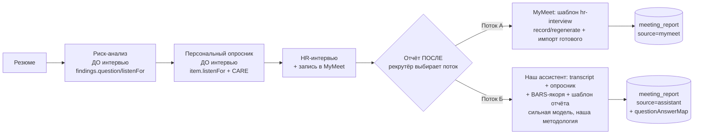
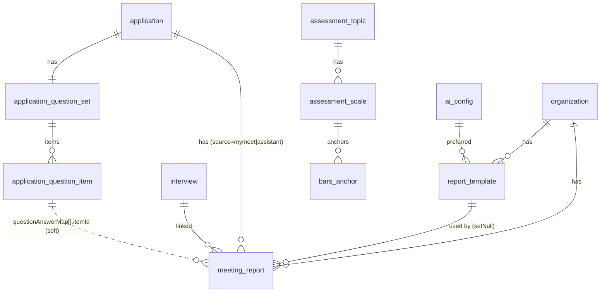

# ТЗ · Спринт 5 · MyMeet-связка + два потока отчётов + библиотека шаблонов отчётов

> **Часть:** мастер-план `tz-questions-00-master-plan.md`
> **Зависит от:** Спринт 4 (персональный опросник — источник повестки и матчинга
> «вопрос ↔ ответ»), Спринт 1 (темы оценки + BARS-якоря — каркас интерпретации
> отчёта), Спринт 2 (методология CARE — `listenFor`/probe-структура в item'ах).
> **Standalone-инфраструктура MyMeet уже есть** и НЕ переписывается: MCP-клиент,
> хранение ключа, очередь импорта, `meeting_report`, карточка на странице интервью.
> **Даёт для:** замыкание контура (пост-интервью артефакт рядом с опросником),
> качество отчётов выше слабых отчётов MyMeet.
> **Статус:** черновик на согласование

Этот спринт — **надстройка над уже работающим MyMeet-импортом**. Мы не строим
интеграцию с нуля: MCP-клиент (`server/utils/mymeet/mcp.ts`), org-хранение
зашифрованного ключа (`account.ts`), очередь `mymeet-import` (`worker.ts`) и
таблица `meeting_report` (`app.ts:2031`) уже в проде. Спринт добавляет: **второй
поток генерации отчёта нашим ассистентом**, **библиотеку шаблонов отчёта** и
**расширение MCP-клиента** до нужных tools MyMeet.

---

## 5.1. Цель

Замкнуть контур «резюме → риск → опросник → интервью → **отчёт**». Дать рекрутёру
**два потока получения отчёта по интервью на выбор**:

- **Поток А (MyMeet):** MyMeet сам анализирует запись по шаблону `hr-interview`
  (candidate evaluation: strengths / concerns / key answers). Мы запрашиваем
  анализ и **импортируем готовый отчёт**. Это расширение уже существующего импорта.
- **Поток Б (наш ассистент):** мы берём **транскрипт** из MyMeet
  (`mymeet_get_transcript`), **персональный опросник** отклика (item'ы с
  `listenFor` + CARE-структурой), **BARS-якоря тем** (Спринт 1) и **выбранный
  шаблон отчёта** (org-библиотека), и генерируем отчёт через
  `loadAiConfig(purpose:'analysis')` **более сильной моделью** по **нашей
  методологии**. Результат качественнее слабых отчётов MyMeet, потому что: (а) на
  входе не только запись, но и подготовленная повестка + якоря интерпретации; (б)
  можно выбрать модель сильнее той, что крутит MyMeet.

Отчёт **живёт рядом с опросником в карточке ОТКЛИКА** (`applications/[id].vue`), а
не только на странице интервью, потому что для рекрутёра единица работы — отклик, и
опросник (повестка) и отчёт (результат) должны быть в одном месте.
`meeting_report` уже связан и с `interviewId`, и с `applicationId`
(`app.ts:2034-2035`) — денормализация под это уже заложена.

### Библиотека шаблонов отчётов (org)

Несколько **именованных** шаблонов отчёта на уровне организации (напр.
«Стандартный», «Для руководителей», «Скрининг-звонок»), один помечен **активным по
умолчанию** (`isDefault`) — рекрутёр генерит отчёт **без обязательного выбора**
шаблона. Редактируют **только owner/admin**. Подраздел живёт **рядом с CARE** в
разделе «Банк вопросов». Тестируются через существующую песочницу
(`promptSandbox`, `app.ts:3081`).

### Границы scope (что этот спринт НЕ делает)

- **Не делаем** проведение интервью, ручное выставление баллов по BARS, калибровку
  интервьюеров — это вне scope (мастер-план §8). BARS в отчёте — **каркас
  интерпретации в промпте**, а не UI выставления оценок.
- **Не делаем** live-discovery MCP и не используем реальный ключ при проектировании
  — дизайн строится по README MyMeet. Точные input/output-схемы tools **сверяются с
  `docs/TOOLS.md` MyMeet на этапе реализации** (см. §5.6, врезка).
- **Не строим** пул MCP-соединений — сохраняем паттерн «open → call → close» на один
  вызов (`mcp.ts:32-44`).

---

## 5.2. Направление процесса (ВАЖНО: риски — ДО, отчёт — ПОСЛЕ)

Направление строго однонаправленное. Риск-анализ и опросник — **подготовка ДО
интервью**; отчёт — **пост-интервью артефакт**. Это фиксируется в UI и логике: до
интервью кнопка отчёта неактивна/скрыта, отчёт требует наличия записи/транскрипта.



Оба потока пишут в одну таблицу `meeting_report`, различаясь полем `source`
(`mymeet` | `assistant`). Поток Б дополнительно заполняет `questionAnswerMap`
(матчинг «вопрос ↔ ответ»).

### Два потока — сравнение

```mermaid
flowchart TD
    subgraph A[Поток А — MyMeet]
      A1[record_meeting/regenerate_template<br/>template=hr-interview] --> A2[poll get_meeting_status<br/>processing→processed]
      A2 --> A3[get_meeting_report<br/>strengths/concerns/key answers]
      A3 --> A4[импорт в meeting_report<br/>source=mymeet]
    end
    subgraph B[Поток Б — наш ассистент]
      B1[get_transcript<br/>speakers+timestamps] --> B2[собрать вход:<br/>opросник+BARS+шаблон]
      B2 --> B3[generateInterviewReport.ts<br/>loadAiConfig analysis, сильная модель]
      B3 --> B4[отчёт по темам + evidence<br/>+ questionAnswerMap + risks]
      B4 --> B5[импорт в meeting_report<br/>source=assistant]
    end
```



---

## 5.3. Термины

| Термин | Определение |
|---|---|
| Поток А (MyMeet) | Отчёт формирует MyMeet по шаблону `hr-interview`; мы импортируем готовый |
| Поток Б (наш ассистент) | Отчёт генерирует наш ИИ из транскрипта + опросника + BARS + шаблона |
| Шаблон отчёта (`report_template`) | Именованный org-шаблон промпта генерации отчёта; один `isDefault` |
| BARS-якорь | Поведенческий якорь балла шкалы темы (Спринт 1); в отчёте — каркас интерпретации, НЕ ручная оценка |
| `questionAnswerMap` | Матчинг «вопрос опросника ↔ ответ/evidence из транскрипта» (поток Б) |
| `hr-interview` | Встроенный шаблон анализа MyMeet (strengths/concerns/key answers) |
| Транскрипт | Полная расшифровка со спикерами и таймкодами (`mymeet_get_transcript`) |
| Отчёт MyMeet (report) | AI-саммари MyMeet: key points, action items, decisions (БЕЗ транскрипта) |
| discovery | Прогон `tools/list` для получения реальных имён MCP-tools (кэш в `last_tools_json`) |
| Матчинг вопрос↔ответ | Сопоставление item'а опросника ответу кандидата из транскрипта (часть генерации потока Б) |

---

## 5.4. Что уже реализовано в MyMeet (ground truth — строим ПОВЕРХ)

Проверено по коду. **Не переделываем**, расширяем.

| Слой | Статус | Где (file:line) |
|---|---|---|
| MCP-клиент `withClient` (open→call→close, без пула) | Готов | `server/utils/mymeet/mcp.ts:32-44` |
| `listMymeetTools` (tools/list), `callMymeetTool` (tools/call) | Готов | `mcp.ts:47-60` |
| `resolveToolName` (резолв имени по подстрокам-кандидатам) | Готов | `mcp.ts:66-73` |
| `TOOL_CANDIDATES` — **только 3 бакета** (listMeetings/getReport/getTranscript) | **Расширяем** | `mcp.ts:76-80` |
| `extractToolContent` (text + structuredContent, JSON-фолбэк) | Готов | `mcp.ts:83-97` |
| Транспорт `StreamableHTTPClientTransport` → `https://mcp.mymeet.ai/mcp`, `Authorization: Bearer` | Готов | `mcp.ts:24,33-34` |
| Org-хранение ключа (AES-256-GCM), upsert/get JIT/disconnect | Готов | `server/utils/mymeet/account.ts:10-41` |
| Очередь `mymeet-import` (pg-boss), `enqueueMymeetImport`, `runMymeetImportJob` | **Расширяем** | `server/utils/mymeet/worker.ts:18-153` |
| Регистрация воркера (batch=1, team=2) | Готов | `server/plugins/queue.ts:162-180` |
| API connect/disconnect/status/test/meetings | Готов | `server/api/mymeet/*` |
| Импорт-эндпоинт (link + enqueue, upsert по org+externalMeetingId) | **Расширяем** | `server/api/interviews/[id]/import-mymeet.post.ts` |
| Чтение отчёта интервью | **Дополняем откликом** | `server/api/interviews/[id]/meeting-report.get.ts` |
| Таблица `meeting_report` (interviewId + applicationId + status + transcript + reportJson) | **Расширяем** | `server/database/schema/app.ts:2031-2054` |
| Таблица `mymeet_account` (+ `lastToolsJson` кэш discovery) | Готов | `app.ts:2017-2028` |
| enum `meetingReportStatusEnum` = `importing|completed|failed` | **Расширяем** | `app.ts:65` |
| Карточка отчёта (link-диалог, поллинг импорта до терминала) | **Переиспользуем/расширяем** | `app/components/interview/MeetingReportCard.vue` |
| Composables `useMymeet` + `useInterviewMeetingReport` | **Расширяем** | `app/composables/useMymeet.ts` |
| Zod-схемы MyMeet | **Дополняем** | `server/utils/schemas/mymeet.ts` |
| AI-инфра: `loadAiConfig(purpose:'analysis')`, `generateStructuredOutput`, `streamStructuredOutput` | Переиспользуем | `server/utils/ai/loadConfig.ts:16-77`, `provider.ts:367,537` |
| Паттерн фонового LLM-воркера (upsert running→completed/failed, кэш-гард) | Образец для потока Б | `server/utils/risk/worker.ts:72-207` |
| Паттерн LLM-генерации со схемой + `.catch().default()` + `wrapBareArray` | Образец | `server/utils/ai/generateInterviewQuestions.ts:71-115` |

**Вывод:** транспорт, ключ, очередь, таблица, карточка и поллинг работают. Новая
работа — (1) **добить резолв tools** до нужного набора; (2) **поток Б** (наш
генератор отчёта + матчинг вопрос↔ответ); (3) **библиотека шаблонов отчёта**; (4)
**перенос отчёта в карточку отклика** и разбивка на два потока.

### Реальные факты MyMeet MCP (из официального README)

> Endpoint `https://mcp.mymeet.ai/mcp`, auth `Authorization: Bearer <api-key>`.
> **11 tools.** Read: `mymeet_list_meetings` (scope: `mine|workspace`),
> `mymeet_get_meeting_status` (`new→queued→processing→processed/failed`),
> `mymeet_get_meeting_report` (AI-саммари: key points, action items, decisions —
> **без транскрипта**), `mymeet_get_transcript` (полный транскрипт со спикерами и
> таймкодами), `mymeet_search_meetings`, `mymeet_download_meeting`
> (`md`/`json` inline, `pdf`/`docx` — URL). Write: `mymeet_record_meeting`
> (schedule/start recording, принимает `template`), `mymeet_rename_meeting`,
> `mymeet_regenerate_template` (переанализ по другому шаблону), `mymeet_update_summary`,
> `mymeet_delete_meeting`. **11 шаблонов анализа**, включая **`hr-interview`**
> (candidate evaluation: strengths, concerns, key answers). Ресурс
> `mymeet://templates` перечисляет шаблоны.

> ⚠️ **Точные имена и input/output-схемы tools сверяются с `docs/TOOLS.md` MyMeet и
> прогоном `tools/list` (кэш в `mymeet_account.last_tools_json`) на этапе
> реализации.** Ниже мы проектируем `TOOL_CANDIDATES` по README; `resolveToolName`
> устойчив к вариациям имён (`mcp.ts:66-73`).

---

## 5.5. Модель данных

Схема в `server/database/schema/app.ts`. Всё org-scoped по `organizationId`.

### 5.5.1. `report_template` — библиотека шаблонов отчёта (org)

**Развилка: отдельная таблица или переиспользовать `care_prompt` (Спринт 2)?**

Спринт 2 вводит редактируемую методику/промпты (в мастер-плане — `care_methodology`,
в тексте задачи — «care_prompt kind»). Возникает вопрос: не сделать ли шаблон отчёта
просто ещё одним «kind» той же таблицы промптов?

**Решение: отдельная таблица `report_template`.** Обоснование:

1. **Семантика библиотеки с `isDefault`.** Отчётов **несколько именованных**, ровно
   один активен по умолчанию (partial-unique на org). У методики CARE — иная
   кардинальность (одна версионируемая методика на org). Смешивать «библиотеку с
   default» и «единственную версионируемую методику» в одной таблице — источник
   путаницы и хрупких partial-unique-условий с дискриминатором `kind`.
2. **Разный жизненный цикл.** CARE-методика — часть промпта структурирования
   вопросов (влияет на генерацию вопросов). `report_template` — часть промпта
   генерации **отчёта** (пост-интервью). Разные потребители, разные права-действия
   (`manage_care` vs `manage_reports`), разная валидация.
3. **Разные поля.** Отчёту нужны `isDefault`, `kind` (тип шаблона — стандартный /
   для руководителей), потенциально предпочитаемая модель. Методике — версии текста
   методики. Общей эволюции у них нет.
4. **Симметрия с уже принятыми решениями.** В Спринте 1 мы сознательно не сворачивали
   разные сущности в одну «ради экономии таблиц» (напр. `bars_anchor` отдельно от
   `assessment_scale`). Тот же принцип: явная модель важнее.

При этом обе таблицы **используют один и тот же тест-харнесс** (`promptSandbox`) и
одинаковый паттерн «editable prompt text». Дублирования логики нет — переиспользуем
песочницу.

```
report_template
  id              text pk
  organizationId  text notNull FK organization cascade
  name            text notNull            -- «Стандартный», «Для руководителей» (до 120)
  description     text                    -- когда применять этот шаблон
  kind            enum notNull default 'standard'  -- reportTemplateKindEnum (см. ниже)
  promptText      text notNull            -- тело промпта генерации отчёта (наша методология)
  preferredAiConfigId text FK ai_config set-null   -- опц. предпочитаемый провайдер (иначе дефолт 'analysis')
  isDefault       boolean default false   -- ровно один активный по умолчанию на org
  isActive        boolean notNull default true  -- soft-выключение без удаления
  version         int notNull default 1   -- инкремент при правке (иммутабельность истории)
  createdById     text FK user set-null
  updatedById     text FK user set-null
  createdAt, updatedAt
  indexes: (organizationId),
           partial-unique (organizationId) where isDefault AND isActive,
           (organizationId, isActive)
```

`reportTemplateKindEnum` (БД-имя `report_template_kind`): `standard | executive |
screening | technical | custom`. Дефолт — `kind='standard'` (не `default`). Значения
enum — см. `tz-questions-90-cross-cutting.md §7a/§7c`.

**Правила:**
- Ровно один `isDefault` среди активных на org (partial-unique). Смена default —
  атомарно (снять со старого, поставить новому в транзакции).
- Нельзя выключить (`isActive=false`) шаблон, который сейчас `isDefault` — сперва
  назначить другой default (валидация в PATCH/set-default).
- Правка `promptText` инкрементит `version` (аудит «каким шаблоном сгенерирован
  отчёт» — через `meeting_report.reportTemplateId` + `templateVersion`).
- `preferredAiConfigId` опционален; если null или устарел — `loadAiConfig` берёт
  дефолт `analysis` (fallback уже реализован, `loadConfig.ts:34,67-71`).

> **Сид по умолчанию (миграция):** при применении миграции для каждой org с
> активной подпиской создаётся один `report_template` `name='Стандартный'`,
> `kind='standard'`, `isDefault=true` с базовым `promptText` (см. §5.8, DEFAULT
> system-prompt). Так рекрутёр может генерить отчёт «из коробки» без ручной
> настройки. Идемпотентно (`ON CONFLICT DO NOTHING` по partial-unique).

### 5.5.2. Расширение `meeting_report` (`app.ts:2031`)

Добавляем поля (существующие НЕ трогаем):

```
meeting_report (+ новые поля)
  source            enum notNull default 'mymeet'  -- reportSourceEnum (БД `report_source`): mymeet|assistant
  reportTemplateId  text FK report_template set-null   -- поток Б: каким шаблоном сгенерирован
  templateVersion   int                             -- снапшот версии шаблона (аудит)
  templateName      text                            -- денорм. имя (аудит, если шаблон изменят/выключат)
  reportMarkdown    text                            -- поток Б: собранный отчёт в markdown (для рендера/экспорта)
  questionAnswerMap jsonb                           -- поток Б: матчинг вопрос↔ответ (см. тип ниже)
  generatedByModel  text                            -- фактическая модель (responseModel), телеметрия
  aiProvider        text                            -- provider ('analysis'-конфига)
  usageInputTokens  int
  usageOutputTokens int
  mymeetTemplate    text                            -- поток А: какой шаблон MyMeet запрошен (hr-interview)
```

`reportSourceEnum` (Drizzle-alias) → БД-имя `report_source`: `mymeet | assistant`.
Значения enum — см. `tz-questions-90-cross-cutting.md §7a/§7c`.

Расширяем `meetingReportStatusEnum` (`app.ts:65`):
`importing | completed | failed | **generating**`.
- `importing` — поток А тянет готовый отчёт из MyMeet (как сейчас).
- `generating` — поток Б генерирует наш отчёт.
- `completed` / `failed` — общие терминальные.

**`questionAnswerMap` — тип jsonb** (массив; `$type<QuestionAnswerMatch[]>`):

```ts
interface QuestionAnswerMatch {
  itemId: string          // applicationQuestionItem.id (трассировка к опроснику)
  questionText: string    // снапшот текста вопроса (устойчиво к правкам item'а)
  topicId: string | null  // тема оценки item'а (для группировки/BARS)
  matched: boolean        // нашёлся ли ответ в транскрипте
  answerText: string      // краткий пересказ ответа кандидата (или '' если not matched)
  evidence: string[]      // дословные цитаты из транскрипта (со спикером/таймкодом, если есть)
  barsValue: string | null   // значение шкалы темы по BARS-якорям ("1".."5"/"verified"/null)
  barsRationale: string   // почему такой якорь (по поведению в ответе)
  confidence: 'low' | 'medium' | 'high'  // уверенность матчинга
}
```

> **Иммутабельность/аудит:** `questionText`/`templateName`/`templateVersion` — это
> **снапшоты** на момент генерации. Item'ы опросника или шаблон могут потом
> измениться — отчёт остаётся воспроизводимым артефактом решения (принцип snapshot
> из Спринта 4).

### 5.5.3. Связи

- `meeting_report.reportTemplateId` → `report_template` (set-null: удаление шаблона
  не убивает отчёт, снапшот `templateName`/`templateVersion` сохраняется).
- `questionAnswerMap[].itemId` → `applicationQuestionItem.id` (мягкая ссылка в jsonb,
  без FK; трассировка). Опционально: поток Б **пишет `answerNote` обратно** в
  `applicationQuestionItem` (`app.ts:1992`) для matched-item'ов **с достаточной
  уверенностью** — автозаполнение повестки результатом (флаг `writeBackAnswers`, по
  умолчанию on; ставит `askStatus='asked'`, `answerAutoFilled=true`). Это действие под
  защитой (порог confidence, пометка, undo, snapshot-guard) — см. §5.8.4a.

### 5.5.4. Расширение `applicationQuestionItem` (write-back-метки)

Для безопасного write-back (§5.8.4a) расширяем `applicationQuestionItem`
(`app.ts:1965-1999`) двумя nullable-полями (совместимо с S4, существующие items не
ломаются):

```
application_question_item (+ новые поля)
  answerAutoFilled  boolean notNull default false  -- answerNote проставлен ИИ (не человеком)
  answerConfidence  enum                            -- уровень уверенности матча: low|medium|high (null для ручных)
```

- `answerAutoFilled=true` ставится только при автозаполнении из отчёта; ручной ввод
  рекрутёра всегда сбрасывает флаг в `false` (правка = «человек подтвердил/переписал»).
- `answerConfidence` — снапшот уверенности матча на момент write-back (для UI-бейджа и
  фильтрации при массовом undo). Использует тот же набор значений, что
  `QuestionAnswerMatch.confidence` (`low|medium|high`); отдельный enum не заводим —
  реиспользуем те же строковые значения (валидация Zod на уровне API).
- Оба поля затрагивают только items **не-снапшот** наборов; при
  `applicationQuestionSet.isSnapshot=true` write-back запрещён (§5.8.4a п.4), поля
  остаются в дефолте.



---

## 5.6. Расширение MyMeet MCP-клиента

Файл `server/utils/mymeet/mcp.ts`. Сохраняем всё, добавляем бакеты и
высокоуровневые функции. **Паттерн open→call→close без пула не меняем.**

### 5.6.1. Новые бакеты `TOOL_CANDIDATES` (`mcp.ts:76-80`)

```ts
export const TOOL_CANDIDATES = {
  // существующие
  listMeetings:  ['list_meetings', 'meetings', 'list_recordings', 'recordings'],
  getReport:     ['get_meeting_report', 'get_report', 'report', 'get_meeting', 'meeting'],
  getTranscript: ['get_transcript', 'transcript'],
  // новые (Спринт 5) — по README MyMeet
  getMeetingStatus:   ['get_meeting_status', 'meeting_status', 'status'],
  searchMeetings:     ['search_meetings', 'search'],
  downloadMeeting:    ['download_meeting', 'download', 'export_meeting'],
  recordMeeting:      ['record_meeting', 'record', 'start_recording', 'schedule_meeting'],
  regenerateTemplate: ['regenerate_template', 'regenerate', 'reanalyze', 'apply_template'],
} as const
```

> После первого реального discovery точные имена (`mymeet_get_meeting_status` и т.д.)
> можно **захардкодить первым элементом** каждого бакета — `resolveToolName` берёт
> первое совпадение. Кэш имён — `mymeet_account.last_tools_json` (`app.ts:2021`),
> виден в `/api/mymeet/status`.

### 5.6.2. Высокоуровневые функции

Каждая: `resolveToolName` из discovery → `callMymeetTool` → `extractToolContent`.
Все принимают `apiKey` (JIT из `getMymeetApiKey`) и `tools: McpTool[]` (передаём
уже полученный список, чтобы не дёргать `tools/list` на каждый вызов внутри одной
джобы — как в текущем `worker.ts:82`).

```ts
// Статус подготовки записи: new→queued→processing→processed/failed
export async function getMeetingStatus(apiKey, tools, meetingId): Promise<{
  status: 'new'|'queued'|'processing'|'processed'|'failed'|'unknown', raw: unknown
}>

// Поиск встреч (для link-диалога/автопривязки по названию/дате)
export async function searchMeetings(apiKey, tools, query): Promise<McpMeeting[]>

// Скачать отчёт/материалы (md/json inline, pdf/docx → URL) — для экспорта
export async function downloadMeeting(apiKey, tools, meetingId, format: 'md'|'json'|'pdf'|'docx'):
  Promise<{ inline?: string, url?: string, raw: unknown }>

// Запустить/запланировать запись с шаблоном анализа (поток А)
export async function recordMeeting(apiKey, tools, opts: { title?, template?: string, ... }):
  Promise<{ meetingId: string, raw: unknown }>

// Переанализировать существующую запись другим шаблоном (поток А: hr-interview)
export async function regenerateTemplate(apiKey, tools, meetingId, template: string):
  Promise<{ ok: boolean, raw: unknown }>
```

Аргументы tools передаём «best-effort» несколькими ключами-синонимами, как уже
делает `worker.ts:104` (`{ meeting_id, id }`), пока схемы не сверены с `TOOLS.md`.
Значения нормализуем через существующие `pickString`/`pickNumber` (`worker.ts:47-60`).

### 5.6.3. Кэширование discovery

Не меняем: после `listMymeetTools` пишем `{ tools }` в `mymeet_account.lastToolsJson`
+ `lastCheckedAt` (как `worker.ts:84-86`, `test.post.ts:25-27`). Все новые
высокоуровневые функции работают с уже загруженным `tools`.

---

## 5.7. Поток А — импорт готового отчёта MyMeet (расширение)

Расширяем существующий импорт до **явного запроса анализа `hr-interview`** и
**поллинга статуса**. Сейчас `runMymeetImportJob` просто тянет report/transcript
(`worker.ts:72-146`) — этого мало, если по встрече ещё не построен нужный шаблон.

Новый payload очереди `mymeet-import` (расширяем `MymeetImportPayload`,
`worker.ts:20-24`):

```ts
interface MymeetImportPayload {
  organizationId: string
  meetingReportId: string
  externalMeetingId: string
  source: 'mymeet'                 // явный поток А
  requestTemplate?: string         // 'hr-interview' — запросить анализ перед импортом
}
```

Алгоритм `runMymeetImportJob` (поток А, расширение):

1. `apiKey = getMymeetApiKey(org)`; если нет — `fail('MyMeet не подключён')`
   (как `worker.ts:75-79`).
2. `tools = listMymeetTools(apiKey)`; кэшируем в `last_tools_json`
   (как `worker.ts:82-86`).
3. **Если `requestTemplate` задан** (напр. `hr-interview`):
   - `getMeetingStatus`: если `processed` и отчёт по нужному шаблону уже есть →
     сразу к шагу 5.
   - иначе `regenerateTemplate(externalMeetingId, 'hr-interview')` (переанализ
     существующей записи нужным шаблоном). Если запись ещё не создана в MyMeet —
     `recordMeeting({ template: 'hr-interview' })`.
4. **Поллинг статуса** внутри джобы (bounded): цикл `getMeetingStatus` с backoff
   (3s→6s, cap по `expireInSeconds`), пока не `processed`/`failed`. Так как джоба
   pg-boss с `retryLimit:3` (`worker.ts:30-36`), долгий анализ переживает рестарт: на
   `processing` кидаем `throw` → повторная попытка позже (idемпотентность по
   `singletonKey: mymeet-import:<reportId>`).
5. `getMeetingReport(externalMeetingId)` → извлекаем summary/title/duration/
   participants (как `worker.ts:103-112`). Опционально `getTranscript` (для потока Б
   позже — но в потоке А транскрипт не обязателен).
6. `db.update(meeting_report)`: `status='completed'`, `source='mymeet'`,
   `mymeetTemplate='hr-interview'`, `reportJson`, `summary`, `title`, `importedAt`
   (как `worker.ts:120-132`, добавив новые поля).
7. Ошибки → `fail(...)` + `throw` (для retry), как `worker.ts:142-145`.

Регистрация воркера не меняется (`queue.ts:174-178`), payload обратносовместим
(старые джобы без `source` трактуем как `mymeet`).

---

## 5.8. Поток Б — генерация нашего отчёта

Новый util `server/utils/ai/generateInterviewReport.ts` (по образцу
`generateInterviewQuestions.ts` + устойчивость `generateStructuredOutput`).

### 5.8.1. Вход

```ts
interface GenerateInterviewReportInput {
  transcript: string                       // из mymeet_get_transcript (speakers+timestamps)
  jobContext: { title: string, brief?: BriefContext | null }   // из вакансии/брифа
  candidateContext?: { summary?: string, riskSummary?: string } // опц. риск-саммари (ДО интервью)
  questionnaire: Array<{                    // applicationQuestionItem'ы активного набора
    itemId: string
    text: string
    listenFor: string | null               // CARE «что слушать» (Спринт 2)
    category: string                        // candidate_question_category
    topicId: string | null                 // тема оценки (Спринт 1)
    careElement?: string | null            // context|action|result|evaluate (probe)
  }>
  barsAnchorsByTopic: Array<{               // BARS-якоря на темы опросника (Спринт 1)
    topicId: string
    topicName: string
    scaleName: string
    scaleType: string                       // numeric_5|verify_3|...
    anchors: Array<{ value: string, anchorText: string,
                     positiveExamples: string[], negativeExamples: string[] }>
  }>
  reportTemplatePromptText: string         // report_template.promptText (наша методология)
}
```

Сборка входа — **детерминированная** (в API/воркере до LLM): вытянуть активный
`applicationQuestionSet` + item'ы (`app.ts:1965-1999`), их темы и BARS-якоря
(Спринт 1), риск-саммари (Спринт 3, опц.), транскрипт (MyMeet), текст шаблона.

### 5.8.2. Zod-схема выхода (с гардами)

По принципу `generatedQuestionsSchema` (`generateInterviewQuestions.ts:21-28`):
каждое поле с `.catch().default()`, массивы через `wrapBareArray`.

```ts
const reportSchema = z.object({
  summary: z.string().catch('').default(''),                 // общий вывод (без решения!)
  overallImpression: z.enum(['strong','mixed','weak','insufficient_data'])
                       .catch('insufficient_data').default('insufficient_data'),
  sections: z.array(z.object({                               // по темам оценки
    topicId: z.string().nullable().catch(null).default(null),
    topicName: z.string().catch('').default(''),
    findings: z.string().catch('').default(''),              // разбор по якорям
    barsValue: z.string().nullable().catch(null).default(null),
    barsRationale: z.string().catch('').default(''),
    evidence: z.array(z.string()).catch([]).default([]),     // цитаты из транскрипта
  })).catch([]).default([]),
  questionAnswers: z.array(z.object({                        // матчинг вопрос↔ответ
    itemId: z.string().catch('').default(''),
    questionText: z.string().catch('').default(''),
    topicId: z.string().nullable().catch(null).default(null),
    matched: z.boolean().catch(false).default(false),
    answerText: z.string().catch('').default(''),
    evidence: z.array(z.string()).catch([]).default([]),
    barsValue: z.string().nullable().catch(null).default(null),
    barsRationale: z.string().catch('').default(''),
    confidence: z.enum(['low','medium','high']).catch('low').default('low'),
  })).catch([]).default([]),
  risksVerified: z.array(z.object({                          // верификация рисков ДО-интервью
    risk: z.string().catch('').default(''),
    verdict: z.enum(['confirmed','refuted','insufficient_data'])
               .catch('insufficient_data').default('insufficient_data'),
    evidence: z.array(z.string()).catch([]).default([]),
  })).catch([]).default([]),
  recommendedNextSteps: z.array(z.string()).catch([]).default([]),
})
```

`wrapBareArray`: `items => ({ sections: items })` (или явно — если модель вернёт
плоский список секций).

### 5.8.3. DEFAULT system-prompt (русский, встроенный) — сид `report_template`

Текст ниже — тело `promptText` дефолтного шаблона «Стандартный» (сидируется
миграцией, §5.5.1). Он **не хардкодится в код** — живёт как редактируемый шаблон;
код лишь подставляет данные. Здесь приведён как отправная точка методологии.

```
Ты — старший HR-эксперт. Твоя задача — составить объективный отчёт по HR-интервью
на основе ТРАНСКРИПТА встречи, ПЕРСОНАЛЬНОГО ОПРОСНИКА (повестки), которую готовил
рекрутёр, и BARS-ЯКОРЕЙ тем оценки (поведенческая шкала интерпретации ответов).

ЖЕЛЕЗНЫЕ ПРАВИЛА (нарушение недопустимо):
1. Ты интерпретируешь ответы кандидата СТРОГО по поведенческим якорям (BARS) тем.
   BARS — это каркас интерпретации, а не твоя личная шкала. Для каждой темы
   сопоставь наблюдаемое поведение кандидата описанию якоря соответствующего балла.
2. НЕ ВЫДУМЫВАЙ. Любой вывод подкрепляй ДОСЛОВНОЙ цитатой из транскрипта (evidence).
   Если цитаты нет — вывода нет.
3. «НЕДОСТАТОЧНО ДАННЫХ» предпочтительнее догадки. Если тема/вопрос не раскрыты в
   транскрипте — ставь matched=false, barsValue=null, verdict=insufficient_data.
   Это нормальный и ценный результат, а не провал.
4. HUMAN-IN-THE-LOOP: ты НЕ принимаешь решение о найме и не выставляешь итоговый
   вердикт «брать/не брать». Ты готовишь материал для решения рекрутёра.
5. Не оценивай по защищённым признакам (возраст, пол, национальность, семья и т.п.).
6. Разбор веди ПО ТЕМАМ опросника (от общего к частному, структура CARE:
   Context/Action/Result/Evaluate). Для каждого вопроса опросника найди ответ
   кандидата, оцени по якорям темы, приведи evidence.
7. Проверь риски, выявленные ДО интервью (если переданы): подтвердились ли они
   ответами кандидата (confirmed/refuted/insufficient_data) с цитатами.

ФОРМАТ: верни структуру по схеме (summary, overallImpression, sections[],
questionAnswers[], risksVerified[], recommendedNextSteps[]). summary — сжатый
фактический вывод БЕЗ решения о найме.
```

Данные подставляются в `prompt` (не в system), блоками в тегах, как в
`generateInterviewQuestions.ts:100`:
`<опросник>…</опросник>`, `<bars-якоря>…</bars-якоря>`, `<транскрипт>…</транскрипт>`,
`<риски-до-интервью>…</риски-до-интервью>`, `<вакансия/бриф>…`.
Транскрипт обрезается по бюджету (§5.8.3a).

### 5.8.3a. Token-budget отчёта (стратегия при большом транскрипте)

Вход отчёта = **транскрипт** (может быть очень большим — часовое интервью это десятки
тысяч токенов) + **опросник** + **BARS-якоря** + **текст шаблона**. Транскрипт легко
переполняет контекст модели, поэтому — явная стратегия бюджета:

1. **Оценка бюджета (перед вызовом).** Берём лимит контекста выбранной модели (из
   `ProviderConfig`/конфига `analysis`; при отсутствии — консервативный дефолт, напр.
   32k токенов), вычитаем резерв под ответ (`maxOutputTokens`) и служебный оверхед
   (system-prompt + railguards). Остаток — бюджет на блоки `prompt`. Оценка длины —
   грубая (символы/4 ≈ токены), с запасом.

2. **Приоритизация при превышении.** Блоки имеют строгий приоритет; урезаем **снизу**:
   - **Всегда полностью** (высокий приоритет, не режем): **опросник**, **BARS-якоря**,
     **текст шаблона**, риск-саммари. Это каркас интерпретации — без него отчёт
     бессмысленен, а объём этих блоков предсказуемо мал.
   - **Транскрипт — режем/чанкуем** (низкий приоритет по объёму, но носитель фактов):
     если не влезает целиком — отбираем **релевантные фрагменты**:
     - по **спикер-сегментам**: приоритет репликам **кандидата** (ответы важнее
       реплик интервьюера); сегментация по спикеру уже есть в транскрипте MyMeet
       (speakers+timestamps);
     - **ближе к вопросам**: сегменты, лексически близкие к тексту/`listenFor`
       вопросов опросника (простое пересечение нормализованных токенов, без LLM),
       ранжируются выше; берём топ-сегменты до заполнения бюджета транскрипта;
     - сохраняем таймкоды/спикера в отобранных фрагментах (для evidence-цитат).

3. **Fallback при сильном переполнении.** Если даже приоритетный отбор не влезает —
   **чанкование транскрипта**: несколько проходов (map по чанкам → частичные
   `questionAnswers`/`sections`) с последующей детерминированной склейкой по `itemId`
   (reduce), либо — минимально — одна генерация по топ-K сегментам с пометкой в
   `summary` «отчёт по неполному транскрипту (усечён по бюджету)». Деградация явная,
   не тихая.

4. **Практично.** Для типичного интервью транскрипт влезает целиком — стратегия
   срабатывает только на длинных записях. Порог символов транскрипта (напр. ≤ 40k при
   32k-контексте) держим конфигурируемой константой в `generateInterviewReport.ts`.

### 5.8.4. Вызов и сборка `meeting_report`

- `loadAiConfig(org, { purpose: 'analysis', preferId: reportTemplate.preferredAiConfigId })`
  (`loadConfig.ts:25`) → **сильная модель** (analysis-дефолт обычно мощнее
  interactive/structuring).
- `generateStructuredOutput(config, { system: reportTemplatePromptText + railguards,
  prompt: dataBlocks, schema: reportSchema, schemaName: 'InterviewReport',
  wrapBareArray, temperature: 0.1 })` (`provider.ts:367`). Recovery
  (`extractJsonPayload`) уже встроен — устойчивость к слабым провайдерам.
- **Детерминированная сборка результата** (после LLM, в коде):
  - `reportMarkdown` — собираем из `sections`/`questionAnswers` шаблонно (стабильный
    рендер, тестируемый на детерминизм сборки — §5.11).
  - `questionAnswerMap` = `object.questionAnswers` (после сверки `itemId` с реальными
    item'ами; неизвестные itemId отбрасываем, не найденные вопросы помечаем
    `matched=false`).
  - `summary` = `object.summary`; `generatedByModel = responseModel`;
    `usageInput/OutputTokens = usage`.
- `db.update(meeting_report)`: `status='completed'`, `source='assistant'`,
  `reportTemplateId`, `templateVersion`, `templateName` (снапшоты), `reportMarkdown`,
  `questionAnswerMap`, `summary`, `reportJson=object` (полный), `generatedByModel`,
  `aiProvider`, токены, `importedAt=now`.
- **Write-back (опц., флаг):** для matched-item'ов **с достаточной уверенностью**
  `db.update(applicationQuestionItem)` `answerNote=answerText`, `askStatus='asked'`,
  `answerAutoFilled=true`, `answerConfidence=<уровень>` (`app.ts:1991-1992` + новые
  поля §5.5.4). Правила безопасности — см. §5.8.4a.

### 5.8.4a. Безопасный write-back ответов (обязательно)

Write-back заполняет повестку (`applicationQuestionItem`) результатом матчинга — это
удобно, но опасно: ИИ-матчинг может ошибиться, а молчаливая перезапись подготовленного
опросника нарушает принцип «не терять/не искажать работу рекрутёра». Поэтому write-back
жёстко ограничен правилами.

1. **Порог confidence.** Каждый матч «вопрос ↔ ответ» несёт `confidence`
   (`low | medium | high`, §5.5.2 `QuestionAnswerMatch`). Write-back в
   `answerNote`/`askStatus` происходит **только** при `confidence >= порога** (по
   умолчанию порог — `medium`, т.е. записываем `medium`/`high`). Низкая уверенность
   (`low`) → **не пишем** в item, оставляем в `questionAnswerMap` как «не сопоставлено
   уверенно» (item не мутируется). Так автозаполняются только надёжные ответы.

2. **Пометка автозаполнения.** Все автозаполненные `answerNote` помечаются флагом
   `answerAutoFilled=true` + бейдж в UI **«Автозаполнено ИИ — проверить»**
   (`UiBadge tone="warning"`). Рекрутёр видит, что это черновик ИИ, и
   подтверждает/правит. Ручные `answerNote` (проставленные человеком) остаются
   `answerAutoFilled=false` и **не перезаписываются** write-back'ом.

3. **Undo (откат).** Возможность отката автозаполнения:
   - **массово** — кнопка «Очистить автозаполненные» в блоке отчёта: `UPDATE … SET
     answerNote='', askStatus=<исходный>, answerAutoFilled=false WHERE
     answerAutoFilled=true` в рамках набора;
   - **точечно** — per-item «Сбросить» на автозаполненном ответе.
   Достаточно хранить флаг `answerAutoFilled`: очистка возвращает поле в пустое/исходное
   состояние; ручные ответы не затрагиваются (фильтр по флагу).

4. **Snapshot-guard.** Если набор опросника зафиксирован
   (`applicationQuestionSet.isSnapshot=true`, слепок из Спринта 4) — write-back
   **запрещён (409 Conflict)**. Зафиксированный опросник иммутабелен: отчёт создаёт
   **отдельную** запись `meeting_report` (+ `questionAnswerMap`), но **не мутирует**
   items снапшота. Проверку делаем перед любым `UPDATE applicationQuestionItem`; при
   `isSnapshot` — пропускаем write-back целиком (отчёт всё равно генерируется, просто
   без обратной записи в повестку).

5. **Структура `questionAnswerMap`.** Каждый матч хранит
   `{ itemId, questionText, topicId, answerText, evidence, barsValue, barsRationale,
   matched, confidence }` (см. §5.5.2). `confidence` — обязательное поле матча,
   именно оно управляет порогом write-back (п.1). Это единственный источник правды по
   тому, что было сопоставлено; item'ы мутируются производно и только под правилами
   1–4.

**Итог:** отчёт всегда генерируется; write-back — вспомогательное действие под
защитой (порог уверенности + пометка + undo + snapshot-guard), не разрушающее
подготовленный опросник.

### 5.8.5. Фон + SSE-прогресс

Генерация долгая → **фон через pg-boss**, по образцу риск-воркера
(`risk/worker.ts`). Новая очередь `interview-report`:

```ts
export const INTERVIEW_REPORT_QUEUE = 'interview-report'
interface InterviewReportPayload {
  organizationId: string
  meetingReportId: string      // предсозданная строка со status='generating'
  applicationId: string
  interviewId: string | null
  externalMeetingId: string
  reportTemplateId: string | null
  writeBackAnswers?: boolean
}
```

- `enqueueInterviewReport` — как `enqueueMymeetImport` (`worker.ts:26-45`):
  `retryLimit`, `singletonKey: interview-report:<reportId>`, `expireInSeconds` больше
  (генерация + возможный поллинг транскрипта).
- Воркер `processInterviewReportJob` (batch), `runInterviewReportJob`: upsert
  `generating`→`completed`/`failed` (паттерн `risk/worker.ts:96-207`). Внутри:
  получить транскрипт (`getTranscript`; если `status != processed` — poll/`throw` для
  retry), собрать вход, вызвать `generateInterviewReport`, записать.
- Регистрация в `server/plugins/queue.ts` (по образцу `queue.ts:162-180`):
  `createQueue` + `boss.work(INTERVIEW_REPORT_QUEUE, { batchSize:1, teamSize:2 },
  processInterviewReportJob)`.
- **SSE-прогресс (опция):** эндпоинт `GET /api/applications/[id]/interview-report/stream`
  (`text/event-stream`), эмитит фазы `transcript`→`generating`→`assembling`→`done`.
  UI-фолбэк — поллинг (карточка уже умеет, `MeetingReportCard.vue:52-69`).

---

## 5.9. API

Именование под существующие конвенции. Каждый хендлер: `requirePermission` +
org-scope по `activeOrganizationId` (как везде в проекте).

### 5.9.1. Право `manage_reports`

**Развилка:** новое действие ресурса `questionBank` или переиспользовать
`manage_care`? **Рекомендуем отдельное действие `manage_reports`** — библиотека
отчётов и методика CARE редактируются схожими ролями, но это разные артефакты;
гранулярность позволит позже дать recruiter-у отчёты без CARE (или наоборот). В
`shared/permissions.ts` (`atsStatements`, `:30`) расширяем ресурс `questionBank`
(вводится Спринтом 1):

```ts
questionBank: [
  'view', 'create_draft', 'edit_draft', 'publish', 'archive',
  'manage_topics', 'manage_care',      // Спринты 1-2
  'manage_reports',                     // Спринт 5 — библиотека шаблонов отчёта
],
```

Раскладка: owner/admin — `manage_reports`; member/hiringManager — нет
(read-only на шаблоны через `view`). **Генерация отчёта** по отклику — под
`interview:['update']` (как import-mymeet, `import-mymeet.post.ts:22`), т.к. это
операция над интервью/откликом, не над org-библиотекой.

### 5.9.2. `report_template` CRUD (org)

- `GET    /api/question-bank/report-templates` — список активных (+ фильтр `kind`,
  `includeInactive`); `questionBank:['view']`.
- `POST   /api/question-bank/report-templates` — создать; `manage_reports`.
- `GET    /api/question-bank/report-templates/[id]` — детально; `view`.
- `PATCH  /api/question-bank/report-templates/[id]` — правка (инкремент `version` при
  смене `promptText`); `manage_reports`.
- `POST   /api/question-bank/report-templates/[id]/set-default` — сделать активным по
  умолчанию (атомарно снять со старого); `manage_reports`.
- `POST   /api/question-bank/report-templates/[id]/toggle-active` — soft вкл/выкл
  (запрет выключить текущий default); `manage_reports`.

Валидация — Zod `server/utils/schemas/reportTemplate.ts`: `name` (1..120),
`promptText` (непустой, ≤ 20000), `kind` enum, `preferredAiConfigId` ∈ org.

**Пагинация.** `GET /api/question-bank/report-templates` поддерживает `limit`/`offset`
(дефолтный `limit = 50`, максимальный `100`) поверх фильтров (`kind`, `includeInactive`),
ответ `{ items, total, limit, offset }`. Общий контракт пагинации — см.
`tz-questions-90-cross-cutting.md §11a`. `GET /api/mymeet/meetings` уже пагинируется
**на стороне MyMeet-tool** (`mymeet_list_meetings`/`mymeet_search_meetings` принимают
курсор/страницу): наш эндпоинт пробрасывает параметры страницы MyMeet и не делает
собственной серверной пагинации поверх (§11a — пометка про делегирование во внешний
источник).

### 5.9.3. Генерация/чтение отчёта по отклику

- `POST /api/applications/[id]/interview-report/generate`
  Body: `{ source: 'mymeet'|'assistant', reportTemplateId?, interviewId?, externalMeetingId?, writeBackAnswers? }`.
  Действие: `interview:['update']` + rate-limit (как `import-mymeet.post.ts:9-13`).
  Логика:
  - org-scope + отклик ∈ org (как `import-mymeet.post.ts:34-41`).
  - `isMymeetConnected(org)` иначе 422 (`import-mymeet.post.ts:29-31`).
  - upsert `meeting_report` (unique org+externalMeetingId, `import-mymeet.post.ts:44-70`),
    `applicationId`+`interviewId` денорм., `source`.
  - `source='mymeet'` → `status='importing'` + `enqueueMymeetImport({ ..., source:'mymeet',
    requestTemplate:'hr-interview' })`.
  - `source='assistant'` → `reportTemplateId` = переданный или **дефолтный активный**
    (если null); `status='generating'` + `enqueueInterviewReport(...)`.
  - Возврат `{ meetingReportId, source, status }`.
- `GET  /api/applications/[id]/interview-report` — **последний отчёт по отклику**
  (оба source), `interview:['read']`. По образцу
  `interviews/[id]/meeting-report.get.ts:26-29`, но фильтр по `applicationId`.
- `GET  /api/applications/[id]/interview-report/stream` — SSE-прогресс (опция, §5.8.5).
- **Существующие эндпоинты интервью не трогаем** (`interviews/[id]/import-mymeet.post.ts`,
  `meeting-report.get.ts`) — обратная совместимость страницы интервью.

### 5.9.4. Тест шаблона отчёта через песочницу

Переиспользуем `promptSandbox` (`app.ts:3081`) и её SSE-тест
(`server/api/prompts/sandbox/[id]/test.post.ts`). В редакторе шаблона кнопка
«Проверить» создаёт/обновляет sandbox-запись из `promptText` шаблона и гоняет тест
на выбранной конфигурации (owner/admin). Отдельного эндпоинта не заводим.

---

## 5.10. UI (только `Ui*`)

> **Design-system (обязательно):** `UiButton`, `UiInput`, `UiSelect`, `UiBadge`,
> `UiCard`, `UiModal`, `UiDrawer`, `UiSegmented` (`app/components/ui/`). Табы —
> `DetailTabs.vue`. Тосты — `useToast()`. Подтверждения — `useConfirm()`. Токены —
> `app/design/tokens.ts`. Никакого сырого `<button>/<input>` с инлайн-Tailwind
> (правило `plan-ui-unification.md`). Существующая карточка
> `MeetingReportCard.vue` содержит raw-диалог (`:140-164`) и raw-`<button>`
> (`:147`) — при переносе в отклик **мигрируем на `UiModal` + `UiButton`**.

### 5.10.1. Редактор библиотеки шаблонов (подраздел «Банк вопросов», рядом с CARE)

Страница `app/pages/dashboard/settings/question-bank/report-templates.vue`
(в под-навигации раздела рядом с «Методология CARE», мастер-план §3, п.3):

- **Список** — `UiCard` на шаблон: имя, `kind`-бейдж (`UiBadge`), бейдж
  `По умолчанию` (tone=success) у default, `Выключен` у inactive; действия
  «Редактировать», «Сделать по умолчанию», «Вкл/Выкл» (`useConfirm`).
- **Редактор** — `UiDrawer`: `name` (`UiInput`), `kind` (`UiSelect`),
  `description`, `promptText` (textarea с токен-классами / `UiTextarea` если заведён),
  `preferredAiConfigId` (`UiSelect` из ai-config'ов org), «Проверить в песочнице»
  (SSE, §5.9.4). Автосохранение черновика с текст-индикатором (паттерн Спринта 1).
- **Пустое состояние** — активная заготовка «Создайте первый шаблон отчёта»
  (шаблон «Стандартный» уже сидирован, так что обычно список непустой).
- Composable `app/composables/useReportTemplates.ts` — список/CRUD/set-default/test.

### 5.10.2. Блок «Отчёт по интервью» в карточке отклика

В `app/pages/dashboard/applications/[id].vue` — новый блок **сразу под**
`ApplicationQuestionSet` (`:468-474`), т.е. отчёт рядом с опросником (единая колонка,
без вкладок — как весь этот экран). Компонент
`app/components/application/InterviewReportBlock.vue`:

- **Guard направления:** если по отклику нет интервью/записи — показываем «Отчёт
  появится после интервью» (риски/опросник — ДО, отчёт — ПОСЛЕ, §5.2).
- **Выбор потока** — `UiSegmented`: `MyMeet` | `Наш ассистент`.
- **Выбор шаблона** (только для «Наш ассистент») — `UiSelect`, **дефолтный
  предвыбран** (не обязателен).
- **Выбор встречи** — при отсутствии привязки: `UiModal` со списком встреч
  (`useMymeet().listMeetings` / `searchMeetings`), миграция raw-диалога
  `MeetingReportCard.vue:140-164` на `UiModal`.
- **Кнопка «Сгенерировать»** (`UiButton`) → `POST …/interview-report/generate`.
- **Состояния** — `importing`/`generating` с поллингом (переиспользуем
  `pollUntilDone`, `MeetingReportCard.vue:52-69`) или SSE (§5.8.5); `failed` с
  `errorMessage`; `completed` — рендер.
- **Рендер результата (поток Б):**
  - `summary` + `overallImpression`-бейдж.
  - **Секции по темам** (`UiCard` на тему): `findings`, `barsValue` как `UiBadge`
    (значение якоря), `evidence` — сворачиваемые цитаты.
  - **Матчинг вопрос↔ответ** (`questionAnswerMap`): список item'ов опросника с
    `matched`-индикатором, `answerText`, `barsValue` **badge**, цитаты; not-matched —
    tone=warning «Недостаточно данных».
  - **Риски (verified)**: verdict-бейджи (confirmed/refuted/insufficient_data).
  - Ссылка на **источник в MyMeet** (`sourceUrl`/`downloadMeeting` URL,
    `ExternalLink`).
- **Рендер результата (поток А):** summary MyMeet + strengths/concerns/key answers из
  `reportJson`, ссылка на источник (как текущая карточка, но в `UiCard`).
- **Переиспользование:** извлечь общий рендер в
  `app/components/interview/MeetingReportView.vue`, использовать и в
  `MeetingReportCard.vue` (страница интервью), и в `InterviewReportBlock.vue`
  (отклик). Карточка интервью остаётся (`interviews/[id].vue:771`), но переиспользует
  общий рендер и получает переключатель потока.

### 5.10.3. Composables (`app/composables/`)

- Расширить `useMymeet.ts`: `searchMeetings`, `downloadMeeting`, `getMeetingStatus`.
- `useApplicationInterviewReport(applicationId)` — по образцу
  `useInterviewMeetingReport` (`useMymeet.ts:65-89`): `report`, `status`,
  `generate({source, reportTemplateId?, ...})`, `refresh`, поллинг/SSE.

---

## 5.11. Права, i18n, Миграция, Тесты, Критерии готовности

### 5.11.1. Права

| Роль | report_template | Генерация отчёта |
|---|---|---|
| owner | все (`manage_reports`) | да (`interview:update`) |
| admin | все (`manage_reports`) | да |
| member (recruiter) | `view` (read-only) | да (`interview:update`) |
| hiringManager | `view` | нет (`interview:read` только) |

Видимость подраздела «Шаблоны отчётов» — только при `questionBank:['view']`
(иначе не показывать, паттерн Спринта 1). Кнопки правки — только при
`manage_reports` (`usePermission`).

### 5.11.2. i18n

Единственная локаль — `i18n/locales/ru.json`. Новые блоки:
`settings.questionBank.reportTemplates.*` (редактор библиотеки),
`applications.interviewReport.*` (блок отклика: выбор потока/шаблона, состояния,
секции, BARS-бейджи, «недостаточно данных»), расширение `interview.mymeet.*`
(regenerate, статусы, поток). Все подписи — через `t(...)`, без хардкод-строк в
шаблонах (в текущей карточке уже так, `MeetingReportCard.vue`).

### 5.11.3. Миграция

`server/database/migrations/0105_interview_reports.sql` (следующий индекс) + запись в
`meta/_journal.json` (idx 105). Операторы:
- `CREATE TYPE` (идемпотентно, `DO $$ … EXCEPTION WHEN duplicate_object`):
  `report_template_kind`, `report_source` (Drizzle-alias `reportSourceEnum`); **`ALTER TYPE
  meeting_report_status ADD VALUE IF NOT EXISTS 'generating'`**.
- `CREATE TABLE IF NOT EXISTS report_template` (+ индексы, partial-unique
  `where is_default AND is_active`).
- `ALTER TABLE meeting_report ADD COLUMN IF NOT EXISTS` — все новые поля (§5.5.2):
  `source` (default `'mymeet'` для обратной совместимости), `report_template_id` FK
  set-null, `template_version`, `template_name`, `report_markdown`,
  `question_answer_map` jsonb, `generated_by_model`, `ai_provider`,
  `usage_input_tokens`, `usage_output_tokens`, `mymeet_template`.
- `ALTER TABLE application_question_item ADD COLUMN IF NOT EXISTS` — метки write-back
  (§5.5.4): `answer_auto_filled` boolean (default `false` NOT NULL), `answer_confidence`
  text/enum (`low|medium|high`, nullable). Безопасно для существующих items S4.
- **Сид** дефолтного `report_template` на каждую org (idempotent, §5.5.1).
- `--> statement-breakpoint` между операторами; реэкспорт таблицы/enum'ов в
  `server/database/schema/index.ts`. Генерация через `drizzle-kit generate` после
  правки `app.ts`, ручная сверка SQL и журнала (конвенция Спринта 1, §1.10).

### 5.11.4. Тесты

- **Unit — резолв новых tools:** `resolveToolName` находит
  `getMeetingStatus/searchMeetings/downloadMeeting/recordMeeting/regenerateTemplate`
  на fixture-списках (реальные + вариативные имена), устойчив к отсутствию
  (`null` → discovery-подсказка).
- **Unit — детерминизм сборки отчёта:** при **фиксированном** LLM-object
  `reportMarkdown` и `questionAnswerMap` собираются детерминированно (сборка после
  LLM — чистая функция; тестируем маппинг без вызова модели).
- **Unit — Zod `reportSchema`:** гарды `.catch().default()` не роняют парсинг на
  битом/частичном JSON; `wrapBareArray` оборачивает голый массив секций.
- **Unit — Zod `reportTemplate`:** `promptText` непустой/лимит; `kind` enum;
  partial-unique `isDefault` (один default среди активных на org).
- **Integration — set-default атомарен:** назначение нового default снимает старый;
  нельзя выключить текущий default.
- **Integration — состояния поллинга:** `importing`/`generating`→`completed`/`failed`;
  на `processing` MyMeet джоба ретраится (idемпотентность по `singletonKey`).
- **Integration — генерация:** `POST …/generate source=assistant` создаёт
  `meeting_report(status=generating, source=assistant, reportTemplateId)` и джобу;
  `source=mymeet` — `importing` + `requestTemplate='hr-interview'`.
- **Изоляция тенантов:** `report_template` и `meeting_report` не текут между org
  (все запросы org-scoped); `questionAnswerMap[].itemId` не разрешается в чужой
  отклик.
- **Обратная совместимость:** существующий импорт интервью (страница интервью)
  работает как прежде; старые джобы без `source` трактуются как `mymeet`.

### 5.11.5. Критерии готовности Спринта 5

MCP-клиент резолвит **все нужные tools** (status/search/download/record/regenerate)
поверх существующих 3, с кэшем discovery; **поток А** запрашивает `hr-interview`,
поллит статус и импортирует готовый отчёт; **поток Б** генерирует отчёт из
транскрипта + опросника + BARS-якорей + шаблона сильной моделью, заполняет
`questionAnswerMap` (матчинг вопрос↔ответ) с BARS-значениями и evidence и (опц.)
пишет `answerNote` обратно в опросник; **библиотека `report_template`** (CRUD,
ровно один `isDefault`, kind, версии, тест через песочницу, owner/admin) работает и
доступна подразделом рядом с CARE; **отчёт живёт рядом с опросником в карточке
отклика** (выбор потока `UiSegmented`, предвыбор дефолтного шаблона, рендер секций/
evidence/матчинга с BARS-бейджами, ссылка на источник MyMeet); направление процесса
соблюдено в UI (отчёт — только ПОСЛЕ интервью); фон+поллинг/SSE; права разложены
(`manage_reports`); UI на `Ui*` (raw-диалог мигрирован); миграция `0105` применяется;
тесты зелёные; существующий контур MyMeet и страница интервью не сломаны.

> **Флаг реализации:** точные имена и input/output-схемы MyMeet-tools подтвердить по
> `docs/TOOLS.md` MyMeet и прогону `tools/list` (кэш `mymeet_account.last_tools_json`)
> перед финализацией `TOOL_CANDIDATES` и аргументов вызовов.
